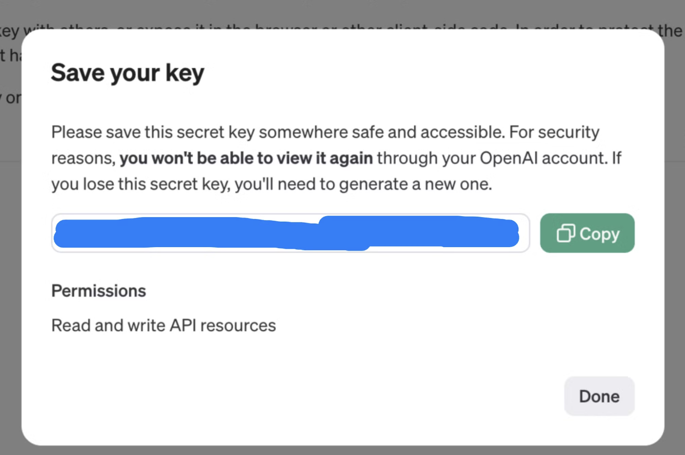

### 3주차 과제

> continue 설치,설정, 주요기능 오버뷰

목차

- [“Continue” 소개](#continue-소개)
  - [Continue 란?](#continue-란)
- [설치](#설치)
  - [Vscode](#vscode)
  - [**JetBrains**](#jetbrains)
- [기초 설정](#기초-설정)
  - [API key 발급받기](#api-key-발급받기)
  - [Billing 결제 수단 추가](#billing-결제-수단-추가)
- [주요 기능](#주요-기능)
  - [Chat : 채팅 기능](#chat--채팅-기능)
    - [사용해보기](#사용해보기)
  - [Autocomplete : 자동 완성 기능](#autocomplete--자동-완성-기능)
    - [사용해보기](#사용해보기-1)
  - [Edit : 코드 수정 기능](#edit--코드-수정-기능)
    - [사용해보기](#사용해보기-2)
  - [Actions : 단축키 액션 기능](#actions--단축키-액션-기능)
    - [사용해보기](#사용해보기-3)

---

# “[Continue](https://docs.continue.dev/)” 소개

## Continue 란?

Continue는 VS Code와 JetBrains IDE에서 작동하는 오픈 소스 AI 코드 어시스턴트로, 개발자들이 더 빠르고 효율적으로 코드를 작성하고 수정할 수 있도록 돕는 도구이다. AI의 도움을 받아 코드 작성, 이해, 수정 등의 작업을 효율적으로 처리할 수 있게 해준다.

Continue는 채팅, 자동 완성, 코드 수정, 액션 기능을 지원하며, 다양한 AI 모델과 연결하여 이러한 기능을 사용할 수 있다.

# [설치](https://docs.continue.dev/getting-started/install)

## [Vscode](https://marketplace.visualstudio.com/items?itemName=Continue.continue)

## **JetBrains**

`cmd/ctrl + ,` 을 누른 후, 설정에서 'Plugins' 항목을 선택하고 'Continue'를 검색하여 설치할 수 있다.

설치가 완료되면 “Get started using our API keys” 버튼을 눌러 깃허브 sign in 을 해준다.

# 기초 설정

설치를 완료하고 나면 Free trial 상태인 것을 볼 수 있다.

Continue 설치 후에는 무료 체험 모드로 시작된다. 무료 체험에서는 채팅 기능을 50회, 자동 완성 기능을 2,000회까지 사용할 수 있으므로, 추가로 사용하려면 OpenAI API 키를 발급받아야 한다.

## API key 발급받기

ChatGPT를 모델로 사용할 것이므로 [OpenAI 사이트](https://platform.openai.com/api-keys)에서 API key를 발급받아준다.

시크릿 키는 이 페이지를 벗어나면 다시 볼 수 없으므로, 따로 메모장 같은 곳에 기록해둔다.

`Add Chat model` 버튼을 클릭하거나 `config.json` 파일을 열어 생성한 API를 넣어준다.

API 키를 설정한 모델에서 Free trial이 사라진 것을 확인할 수 있다.

## [Billing 결제 수단 추가](https://platform.openai.com/settings/organization/billing/overview)

해외결제가 되는 카드를 등록해준다. 최소 단위인 5 달러로 세팅해주고 자동 결제는 off로 둔다.

# [주요 기능](https://docs.continue.dev/getting-started/overview)

## [Chat](https://docs.continue.dev/chat/how-to-use-it) : 채팅 기능

- 지정한 모델을 기반으로 채팅을 통해 코드에 관한 질문을 주고 받으며 이에 대한 이해 돕는 기능이다.

### 사용해보기

1. 질문하고 싶은 코드를 하이라이트 한다
2. 키보드 단축키 `shift+Cmd+L` 을 누르면 input에 자동으로 해당 코드가 옮겨진다
   _~~Cmd+L 가 먹히지 않음~~_
3. 코드에 관해 하고 싶은 질문을 한다

## [Autocomplete](https://docs.continue.dev/autocomplete/how-to-use-it) : 자동 완성 기능

- 코드 작성하는 동안, 한 줄 또는 여러 줄의 코드를 자동으로 완성하는 기능을 제공한다.
- `Tab` 키를 눌러 자동 완성된 코드를 쓸 수 있다. 이를 통해 개발 속도를 높일 수 있다.

### 사용해보기

## [Edit](https://docs.continue.dev/edit/how-to-use-it) : 코드 수정 기능

- 현재 작업 중인 IDE를 벗어나지 않고, 코드를 수정할 수 있는 기능이다.
- 수정하고 싶은 코드를 하이라이트 한 후, 수정 방향을 지시하면 이를 기반으로 코드 수정 사항을 제시해준다.
- 제시된 수정 사항을 수용하거나 거절할 수 있다.

### 사용해보기

1. 수정하고 싶은 코드를 하이라이트한다.

1. `*~~Cmd+I` 가 먹히지 않아서~~\* `shift+Cmd+L` 로 코드를 input에 옮긴 후 `/edit` 키워드를 입력한다. 키워드 뒤에 수정하고 싶은 내용을 작성한다.

2. 제시된 내용을 바탕으로 수정사항을 수용할지 말지 결정한다.

## [Actions](https://docs.continue.dev/actions/how-to-use-it) : 단축키 액션 기능

- 자주 사용하는 기능이나 반복적인 작업을 단축키로 설정하여 실행할 수 있도록 하는 기능이다.

### 사용해보기

1. **Slash `/` command**

- 액션을 트리거 할 수 있는 가장 흔한 방법이다.
- 슬래쉬를 통해 내장된 명령어 목록을 확인할 수 있다.
  - **edit**: 코드 수정
  - **comment**: 주석 추가/제거
  - **share**: 코드 공유
  - **cmd**: 명령줄 명령어 실행
  - **commit**: Git 커밋
  - **test**: 코드 테스트 실행

1. **Prompt files**

- `.prompt` file 을 통해 커스텀 슬래쉬 명렁어를 생성할 수 있다

1. 워크스페이스 최상단에 `.prompts/` 폴더를 생성한다
2. slash command에서 쓸 이름으로 prompt 파일을 생성한다
   ex: `test.prompt` ⇒ `/test`
