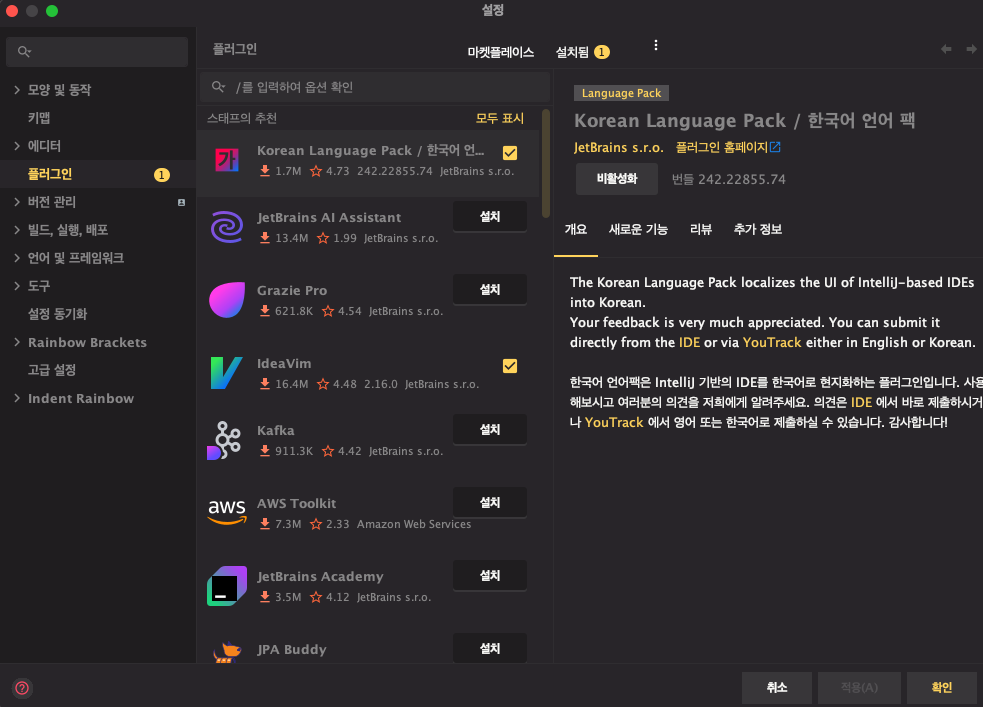
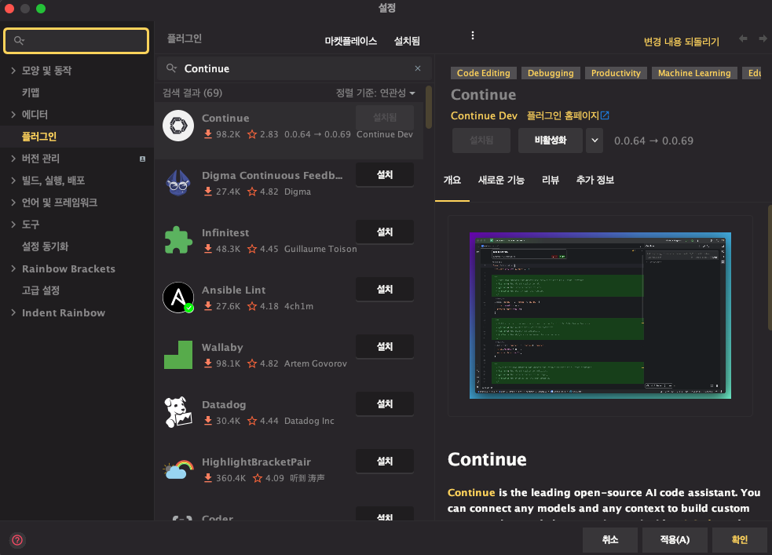
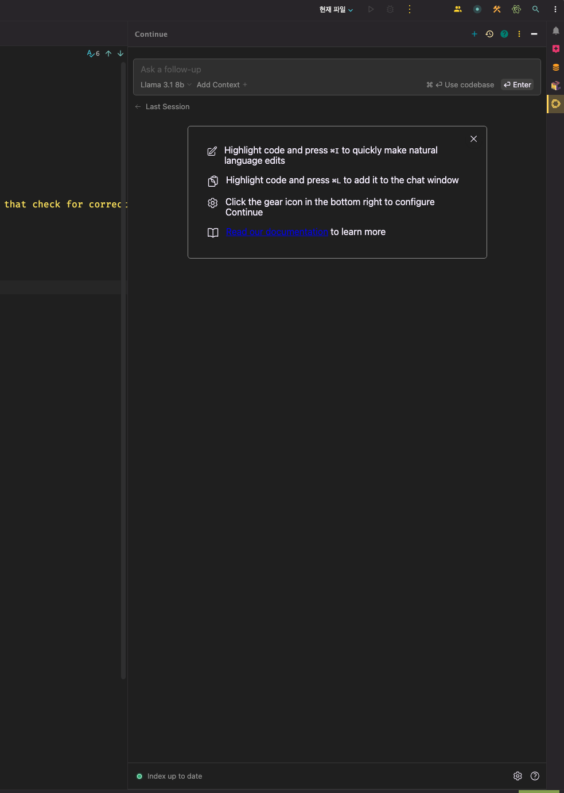
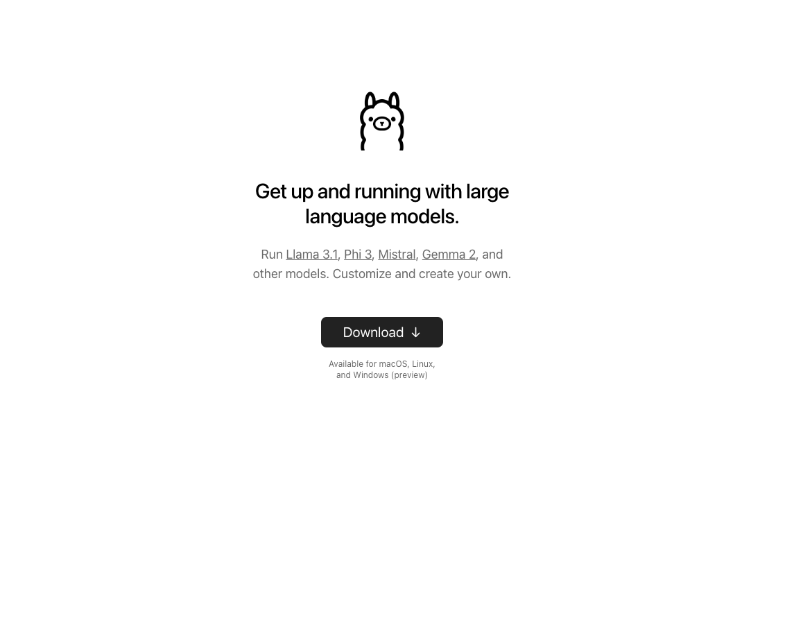
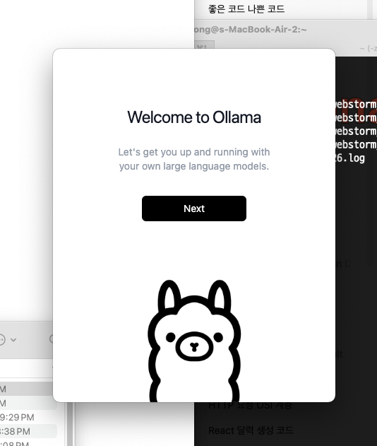
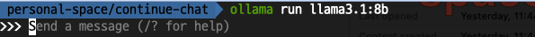
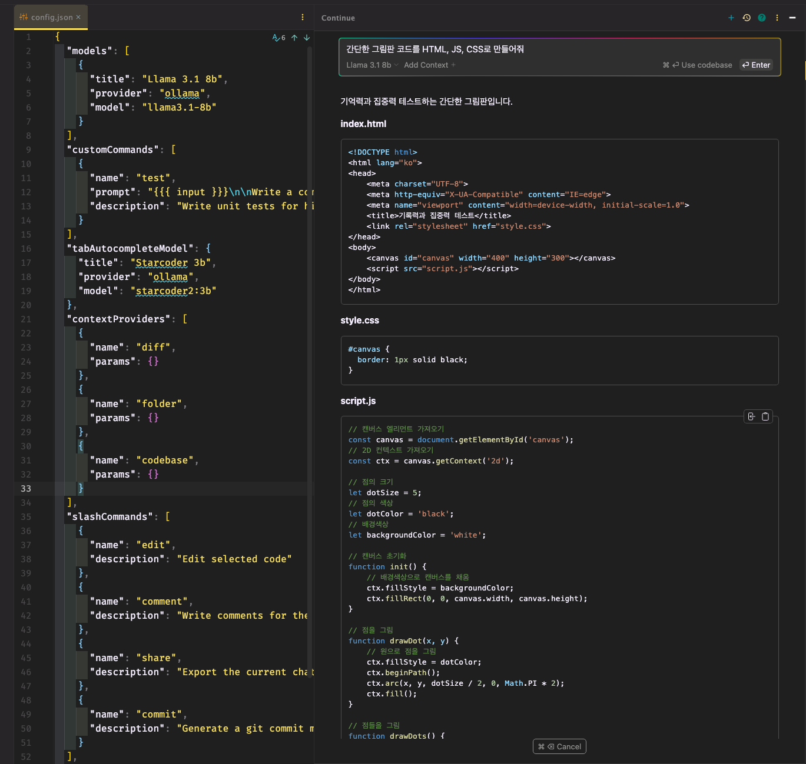

##### 들어가며
Continue는 오픈소스 기반의 AI 코드 어시스턴트입니다. 현재 MS의 VSCode와 Jetbrains의 Intellj에서 플러그인 형식으로 다운받고 실행할 수 있습니다.

이번 문서에서는 IntelliJ와 Ollama를 활용하여 Continue를 실행시켜보겠습니다.

###### 실행 환경
- Device: Macbook Air M2
- OS: MacOS 15.0
- Ram: 16GB
##### IntelliJ에 Continue 설치하기
먼저 `cmd + ,`를 통해 설정 화면에 들어가서 플러그인 탭을 선택합니다.



검색 창에 Continue를 입력하고 설치를 진행합니다.


설치가 완료되면 우측 상단에 Continue 마크가 표시되며 클릭 시 Continue의 Chat 기능을 위한 별도의 탭이 나타납니다.


하지만 위 상태로는 Continue의 Chat 기능을 활용할 수 없습니다. 별도의 LLM 서비스를 연동시켜야 정상적으로 Chat 기능을 활용할 수 있습니다.
Chat 기능 활용을 위해 Continue가 지원하는 LLM 중 하나인 Ollama를 활용해보겠습니다.
##### Ollama 설치하기
링크를 통해 Ollama의 홈페이지에 접속합니다. [Ollama 다운로드 링크](https://ollama.com)


다운로드 된 파일을 실행시켜 설치를 진행합니다.


##### Olaama 실행하기
설치가 정상적으로 진행되었다면 터미널을 열고 `ollama run llama3.1:8b`를 입력합니다.


터미널을 통해 바로 ollama와 대화할 수 있습니다.


##### Continue Config 수정하기
이제 Continue와 로컬에서 실행 중인 ollama를 연결 시키기 위해 Continue의 Config 파일을 아래와 같이 수정합니다.
```json
{  
  "models": [  
    {  
      "title": "Llama 3.1 8b",  
      "provider": "ollama",  
      "model": "llama3.1-8b"  
    }  
  ],  
  // ...
}
```
##### Chat 기능 활용해보기
앞서 확인한 Continue의 Chat 탭에 질문을 넣어 답변이 정상적으로 생성되는 것을 확인할 수 있습니다.

