##### 들어가며
Continue는 오픈소스 기반의 AI 코드 어시스턴트입니다. 현재 MS의 VSCode와 Jetbrains의 Intellj에서 플러그인 형식으로 다운받고 실행할 수 있습니다.

이번 문서에서는 IntelliJ와 Ollama를 활용하여 Continue를 실행시켜보겠습니다.

###### 실행 환경
- Device: Macbook Air M2
- OS: MacOS 15.0
- Ram: 16GB

##### IntelliJ에 Continue 설치하기
먼저 `cmd + ,`를 통해 설정 화면에 들어가서 플러그인 탭을 선택합니다.

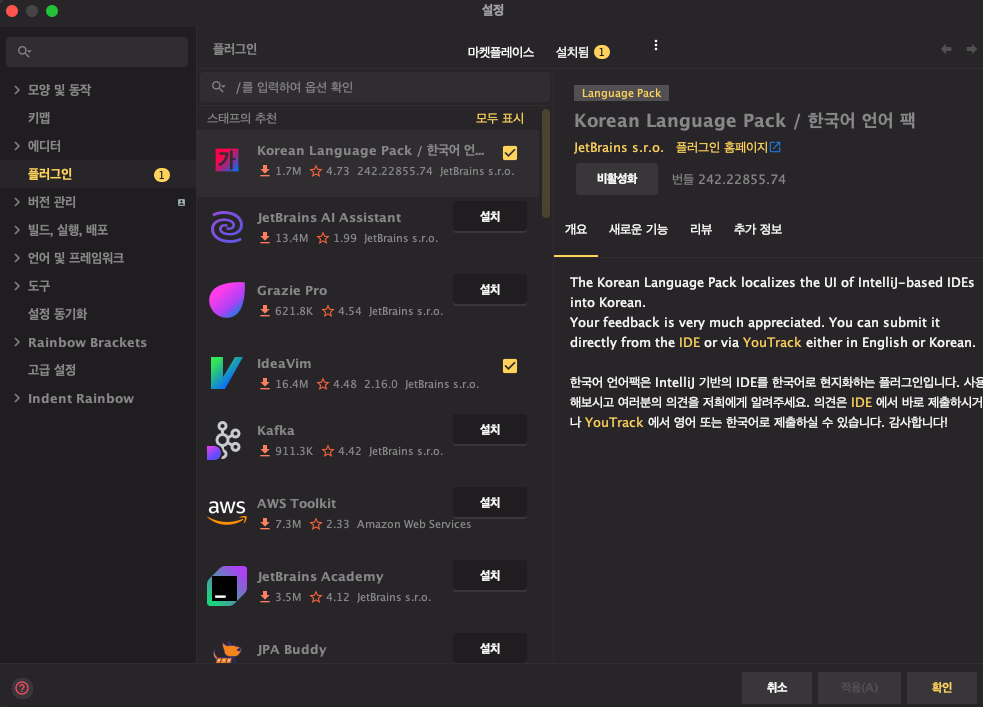


검색 창에 Continue를 입력하고 설치를 진행합니다.

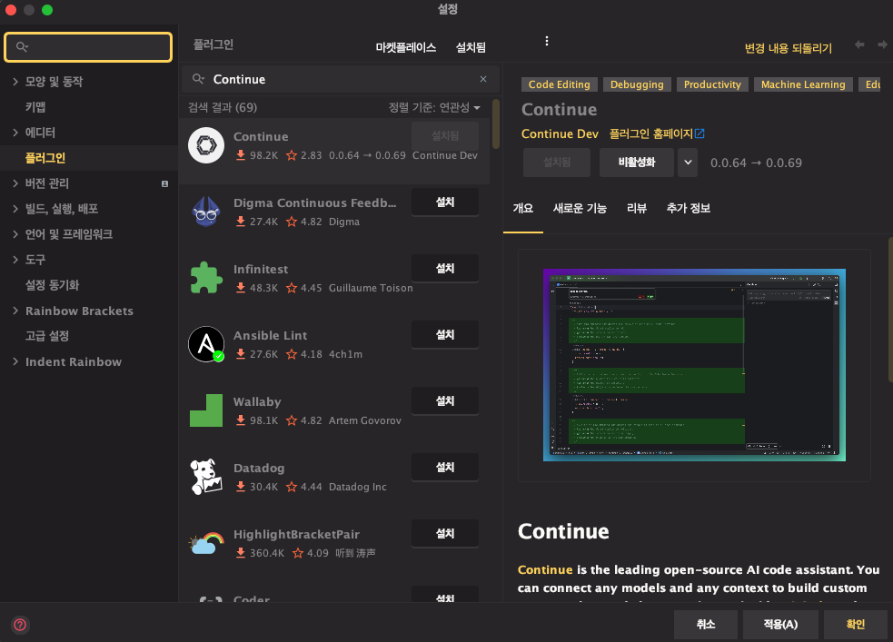

설치가 완료되면 우측 상단에 Continue 마크가 표시되며 클릭 시 Continue의 Chat 기능을 위한 별도의 탭이 나타납니다.

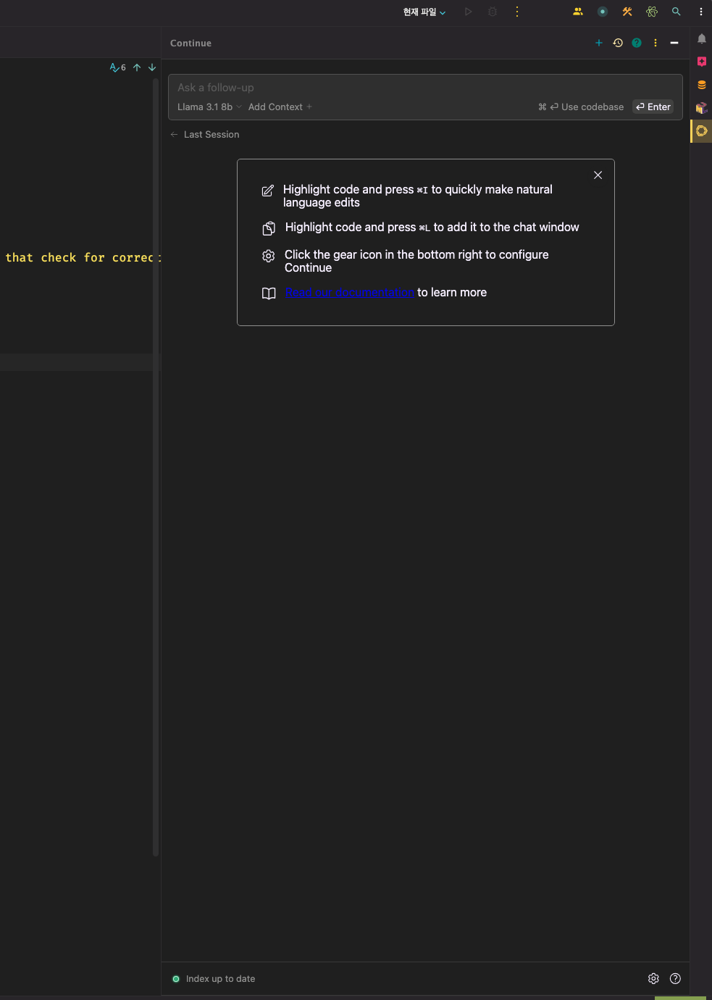

하지만 위 상태로는 Continue의 Chat 기능을 활용할 수 없습니다. 별도의 LLM 서비스를 연동시켜야 정상적으로 Chat 기능을 활용할 수 있습니다.
Chat 기능 활용을 위해 Continue가 지원하는 모델 중 하나인 Ollama를 활용해보겠습니다.

##### Ollama 설치하기
링크를 통해 Ollama의 홈페이지에 접속합니다. ([Ollama 다운로드 링크](https://ollama.com))


다운로드 된 파일을 실행시켜 설치를 진행합니다.


##### Olaama 실행하기
설치가 정상적으로 진행되었다면 터미널을 열고 `ollama run llama3.1:8b`를 입력합니다.

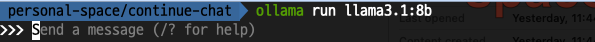

터미널을 통해 바로 ollama와 대화할 수 있습니다.


##### Continue Config 수정하기
이제 Continue와 로컬에서 실행 중인 ollama를 연결 시키기 위해 Continue의 Config 파일을 아래와 같이 수정합니다.
```json
{  
  "models": [  
    {  
      "title": "Llama 3.1 8b",  
      "provider": "ollama",  
      "model": "llama3.1-8b"  
    }  
  ],  
  // ...
}
```
##### Chat 기능 활용하기
Chat 기능은 우리가 흔히 알고있는 ChatGPT와 같이 AI와 대화를 주고 받을 수 있는 기능입니다.

앞서 확인한 Continue의 Chat 탭에 질문을 넣으면 AI가 해당 질문에 대한 대답을 반환합니다. 

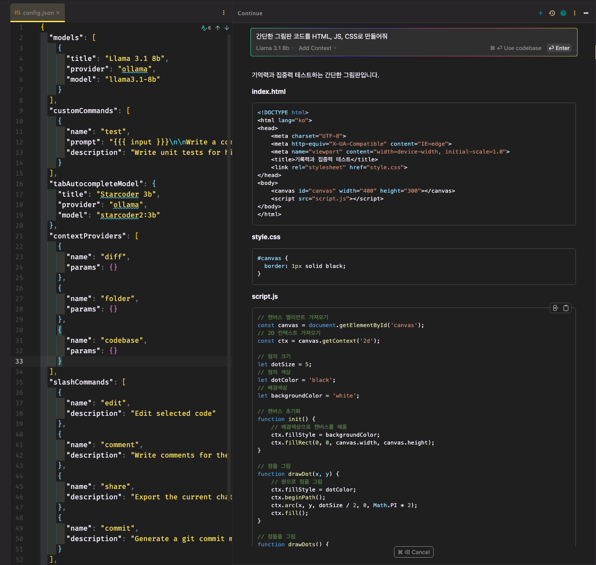

##### Edit 기능 활용하기
수정하고 싶은 코드를 선택한 뒤 `cmd + i`를 누르면 대화창이 나옵니다.

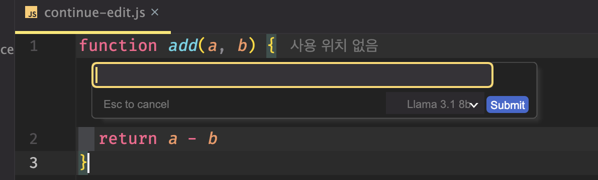

대화창에 원하는 수정 방식을 작성하면 AI가 수정된 코드를 반환합니다. 

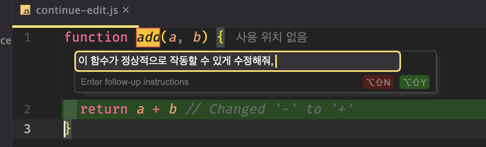

##### Actions 기능 활용해보기
Actions 기능은 단축어 기능과 유사합니다. 특정 동작을 바로 실행시킬 수 있습니다. 

임의의 코드블록을 드래그한 뒤 `cmd + l`을 누르면 우측 Continue 탭에서 Actions 기능을 위한 별도의 화면이 나타납니다. 

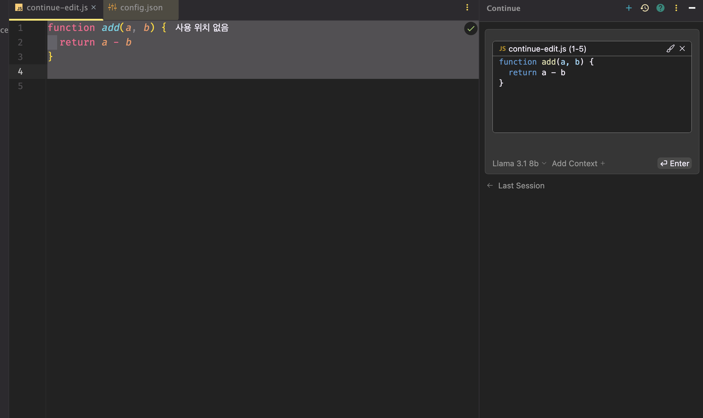

'/'를 타이핑하여 원하는 액션을 선택하고 실행시키면 AI가 액션을 실행합니다. 

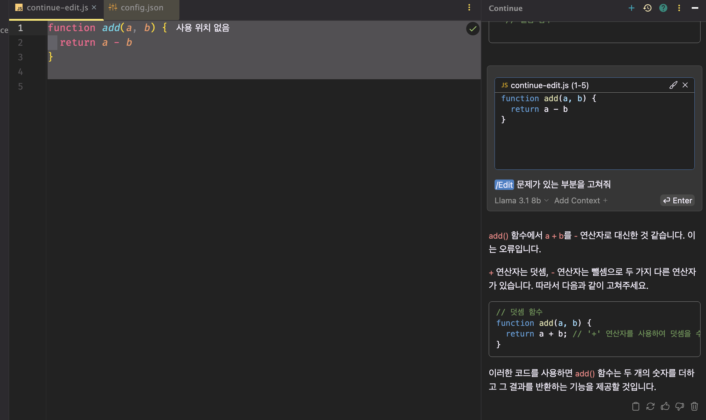

##### Autocomplete 기능 활용하기
Continue는 Autocomplete를 사용하기 위한 모델로 `StarCoder2-3b`를 추천하고 있습니다. 

터미널을 열고 `ollama run starcoder2:3b`을 입력하여 모델을 실행합니다.

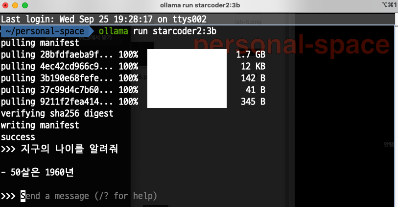

IDE 우측하단의 Continue 아이콘을 클릭하여 `Continue Autocomplete` 옵션이 활성화 되어있는지 확인합니다.

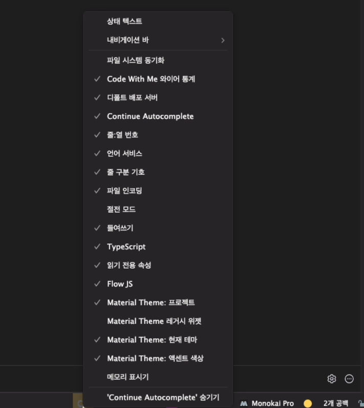

이제 `tab` 키를 통해 AI가 제공하는 자동완성 기능이 작동하는 것을 확인할 수 있습니다. 

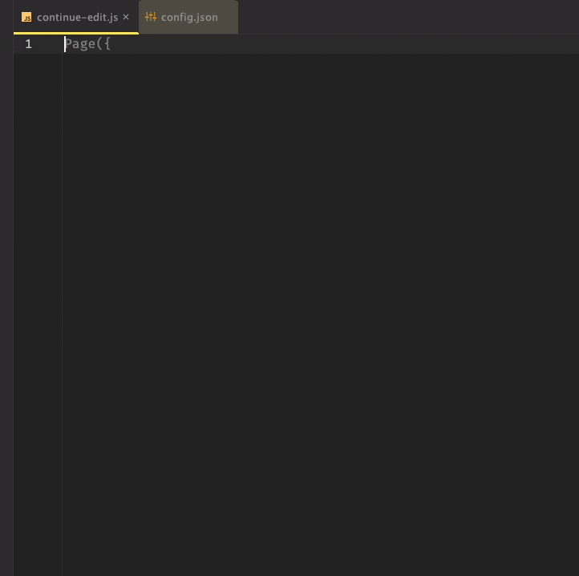
