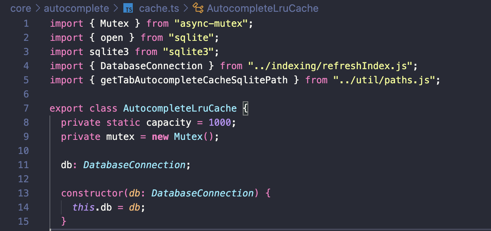

<!-- [auto] how it works ~ how to customize -->

## Continue Autocomplete - How it works

### Timing : Too many Request를 줄이는 전략
1. `debounce`
  - 입력이 끝난 후 일정 시간이 흐른 후에야 autocomplete task가 실행됩니다.
  - 기본은 350ms 입니다. 즉, 키 입력 350ms 이후 autocomplete task가 실행됩니다.
  - `debounceDelay: int` 옵션으로 제어할 수 있습니다.
2. `caching`
  - 경량 데이터베이스인 `sqlite3`에 autocomplete 결과를 캐싱하는 전략입니다.
    - 
  1. autocomplete task 이후, 프롬프트의 prefix를 key로 설정해 답변을 `cache` 테이블에 저장합니다.
    ```ts
    // core/autocomplete/cache.ts
      await this.db.run(
        "INSERT INTO cache (key, value, timestamp) VALUES (?, ?, ?)",
        prefix,
        completion,
        Date.now(),
      );
    ```
  2. 동일한 요청을 보내기 전, cache 테이블에 저장된 결과를 확인해 사용합니다.
    ```ts
    const result = await this.db.get(
      "SELECT key, value FROM cache WHERE ? LIKE key || '%' ORDER BY LENGTH(key) DESC LIMIT 1",
      prefix,
    );
    ```
    - 쿼리 해석: `prefix`로 시작하는 모든 결과를 고려하되, 가장 key가 긴 결과 1개를 읽습니다.
  - `useCache: bool` 옵션으로 제어할 수 있습니다.

### Filtering : 불완전한 LLM 응답을 보완하는 전략
- LLM은 쓸만한 outcome을 출력하지만 항상 Instruction을 지키지는 않습니다.
- 그래서 `continue`에서는 LLM outcome을 regex 수준으로 필터링하고 사용합니다. 
    ```ts
    // core/autocomplete/completionProvider.ts
    // ...
      const outcome = await this.getTabCompletion(token, options, llm, input);

      if (!outcome?.completion) {
        return undefined;
      }

      // Filter out unwanted results
      if (isOnlyPunctuationAndWhitespace(outcome.completion)) {
        return undefined;
      }
    // ...
    ```
    ```ts
    // core/autocomplete/filter.ts
    // 구둣점(...)하고 whitespace만 있는지 필터링하는 함수
    export function isOnlyPunctuationAndWhitespace(completion: string): boolean {
      const punctuationAndWhitespaceRegex = /^[^\w\d\}\)\]]+$/;
      return punctuationAndWhitespaceRegex.test(completion);
    }
    ```
- 또, LLM별 이상한 버릇을 직접 교정하기도 합니다.
- 예를 들어, CodeLlama가 가진 버릇으로 첫 줄에 2칸 들여쓰기를 하는 경우에 잘라버리는 코드입니다.
    ```ts
    // core/autocomplete/lineStream.ts

    /**
     * Removes leading indentation from the first line of a CodeLlama output.
     * @param {LineStream} lines - The input stream of lines.
     * @yields {string} Lines with the first line's indentation fixed if necessary.
     */
    export async function* fixCodeLlamaFirstLineIndentation(lines: LineStream) {
      let isFirstLine = true;

      for await (const line of lines) {
        if (isFirstLine && line.startsWith("  ")) {
          yield line.slice(2);
          isFirstLine = false;
        } else {
          yield line;
        }
      }
    }
    ```

## Continue Autocomplete - How to customize
- `config.json`의 `tabAutocompleteOptions` 을 통해 autocomplete를 제어할 수 있습니다.
- 기본 옵션은 다음과 같습니다.
```ts
export const DEFAULT_AUTOCOMPLETE_OPTS: TabAutocompleteOptions = {
  disable: false,
  useCopyBuffer: false,
  useFileSuffix: true,
  maxPromptTokens: 1024,
  prefixPercentage: 0.85,
  maxSuffixPercentage: 0.25,
  debounceDelay: 350,
  multilineCompletions: "auto",
  slidingWindowPrefixPercentage: 0.75,
  slidingWindowSize: 500,
  maxSnippetPercentage: 0.6,
  recentlyEditedSimilarityThreshold: 0.3,
  useCache: true,
  onlyMyCode: true,
  useOtherFiles: true,
  useRecentlyEdited: true,
  recentLinePrefixMatchMinLength: 7,
  disableInFiles: undefined,
  useImports: true,
};
```
- `multilineCompletions` 
  - 옵션을 통해 multi-line으로 출력할지(`always`) single-line만 출력할지(`never`) outcome length를 정할 수 있습니다.
- `disableInFiles`
  -  파일 확장자 별로 autocomplete를 비활성화할지 여부를 결정할 수 있습니다.
  - `"disableInFiles": ["*.md", "*.json"]`: .md, .json 파일에서는 autocomplete를 사용하지 않습니다.
