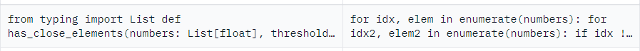

# LLM, LLM 벤치마크, LLM 선택 가이드

# LLM (Large Language Model)

: 대용량의 데이터 셋(매개변수)를 통해 인간의 언어를 이해하고 생성할 수 있는 대규모 딥러닝 언어 모델

- 주 작업 : 자연어 처리 (NLP / 우리가 쓰는 일상 언어를 이해하고 생성할 수 있는 작업) 작업을 수행
    - 자연어 처리 (NLP, Natural Language Processing)
    : 사람들이 사용하는 일상 언어의 의미, 문법, 문맥 등을 컴퓨터가 이해할 수 있는 형식으로 바꾸고 그 의미를 분석하는 과정

### CodeLLM이란?

: 일반적인 LLM의 개념을 코드 생성과 자동 완성에 특화한 모델

- 다양한 프로그래밍 언어의 코드를 학습해 개발자들에게 코드 자동완성, 버그 수정, 코드 리팩토링, 코드 설명 등의 도움을 줌
- CodeLLM의 주요 기능
    - 코드 자동 완성 (Autocomplete) : 작성 중인 코드의 맥락을 이해하고 맞는 코드를 자동 제안
    - 코드 생성 : 자연어로 설명된 요구사항에 맞는 전체 코드 생성
    - 디버깅 지원 : 코드의 오류를 찾아 수정하거나 코드의 문제점을 분석
    - 다양한 언어 지원 : 여러 프로그래밍 언어에 대해 지원

### 양자화(Quantization)

양자화는 모델의 파라미터를 더 적은 비트로 표현하여 모델 크기를 줄이고 추론 속도를 향상시키는 기법이다.

INT4와 INT8은 정수형 데이터 타입으로, 양자화에서 중요한 역할을 한다.

- **INT4(4-bit Integer)**
    - 매우 적은 비트 수로 가중치와 활성화를 저장하므로, 메모리 사용량과 연산 복잡도를 극도로 줄일 수 있다. 그러나 정밀도가 낮기 때문에 일부 경우 모델의 정확도가 떨어질 수 있다. 보통 극도로 경량화된 모델이나 엣지 디바이스에서 사용된다.
- **INT8(8-bit Integer)**
    - INT4에 비해 더 많은 비트 수를 사용하므로, 상대적으로 더 높은 정확도를 유지하면서도 메모리 사용량과 연산 속도를 줄일 수 있다.
- **F1 점수** : 정밀도와 재현율의 조화 평균으로, 불균형한 데이터셋에서 모델의 성능을 평가.
- **모델 크기** : 양자화 후 모델의 크기를 측정하여, 메모리 사용량 및 배포 용이성 평가.

# LLM 벤치마크

: LLM을 다양한 작업에서 성능을 평가하기 위해 사용하는 표준화된 테스트 모음
(다양한 상황의 데이터셋을 준비하고 모델이 문제를 읽고 내놓는 답을 평가하는 방법)

### 1. HumanEval

- **코드 생성 능력을 평가하는 벤치마크**로, 자연어 프롬프트와 테스트 케이스로 구성되어 있다.

모델이 문제에 대한 코드를 작성하고, 주어진 테스트 케이스를 통해 그 정확성을 평가하는 방식이다.

ex. 자연어 프롬포트(좌) > 예상 결과(우)

- 평가 지표로는 pass@1를 주로 사용한다.

<aside>
💡

pass@k는 k번 내에 맞추는 횟수를 의미하고, 따라서 pass@1는 한 번에 맞추는 횟수를 의미한다.

</aside>

- 원래는 Python 코드만 가능했으나, **MutliPL-E**를 통해 다양한 버전이 추가되어 Java, C++ 등의 18개의 언어에도 적용가능하다.

### 2. MBPP

MBPP는 974개의 Python 프로그래밍 문제로 구성되어 있으며 각 문제는 프롬포트와 입출력 예시, 예시 코드로 이루어져 있다. 

HumanEval과 마찬가지로 Pass@1 지표를 주로 사용한다. 문제는 간단한 리스트 조작부터 재귀와 같은 응용 문제까지 다양하게 구성되어, code LLM의 실제 코딩 문제 해결 능력을 평가한다.

### 3. EvalPlus

EvalPlus는 HumanEval과 MBPP를 확장한 벤치마크로, 더 많은 테스트 케이스를 포함하여 모델의 성능을 정밀하게 평가한다. 이 벤치마크는 복잡한 상황에서의 성능을 검증할 수 있어 유용하다. 그러나 기존 벤치마크와 유사한 문제들이 많아 차별성이 떨어질 수 있으며, 평가 과정이 복잡해 결과 해석이 어려울 수 있다.

### 4. CodeXGLUE

CodeXGLUE는 코드 생성, 요약, 검색 등 다양한 코드 관련 작업을 평가하는 포괄적인 벤치마크 세트이다.

이 벤치마크는 여러 프로그래밍 언어와 작업을 포함하여 모델의 다각적인 성능을 평가할 수 있는 장점이 있다. 그러나 태스크의 다양성으로 인해 특정 작업에 집중하기 어렵고, 각 태스크의 난이도 차이가 결과 해석을 복잡하게 만들 수 있다.

### **5. CRUXEval**

코드 추론, 이해 및 실행 능력을 평가하는 벤치마크이다.

주로 파이썬을 기반으로 800개의 함수와 입력-출력쌍을 사용해 모델이 주어진 입력에 대해 올바른 출력을 생성하는 능력을 테스트한다.

입력 예측 (CRUXEval-I)과 출력 예측 (CRUXEval-O)의 두가지 작업으로 구성되어 코드 추론과 실행의 정확성을 평가하는데 사용된다.

- 입력 예측 (CRUXEval-I) : 함수의 출력이 주어졌을 때 입력을 예측하는 작업
- 출력 예측 (CRUXEval-O) : 입력이 주어졌을 때 올바른 출력을 생성하는 작업

### 6.  APPS

APPS는 고급 프로그래밍 문제를 포함하는 벤치마크로, 복잡한 문제 해결 능력을 평가한다. 다양한 난이도의 문제를 제공하여 모델이 실질적인 코딩 작업에 얼마나 잘 대응하는지를 확인할 수 있다. 하지만 상대적으로 문제 수가 적어 특정 모델의 특성을 과소 평가할 수 있으며, 문제에 따라 일관성 있는 성능 평가가 어려울 수 있다.

# LLM 선택 가이드

## **공통**

1. 가격
2. 양자화
    - 모델 크기
    - F1 점수
3. 코딩 성능
    1. HumanEval
    
     대표적으로 Python 언어에 대해서 아래 자료들을 종합한 결과, Continue에서 사용가능한 모델 중 **DeepSeek-Coder-V2-Instruct**가 성능이 높을 것으로 예상된다. 이외에도 DeepSeek-Coder-33b-instruct, CodeLlama-70b-Instruct, Phind-CodeLlama-34B-v2를 고려해볼 수 있다.
    
    - 사이트에 따라 벤치마크 값이 다르게 나타나기 때문에 여러 대시보드를 확인하여 종합적인 판단이 필요한 것 같다.
    
    
    
    
    

## Chat

코딩 성능 외에도 chat에서 중요한 부분은 **한국어를 이해하는 자연어 처리 능력**이다. 이를 위해 일반적으로 LLM 모델의 한국어 처리 능력을 판단하기 위해서는 KMMLU을 주로 사용하지만, Ko-HellaSwag 지표를 사용한다.

그러나, codeLLM의 chat에서는 한국어의 전반적인 내용을 이해하는 것이 아니라 코드 작성에 특화된 대화만 가능하면 되므로, **논리 구조 파악 능력과 문제 해결 능력에 초점을 둔 지표**를 보는 것을 추천한다.

**Ko-IFEval**

- 정보 추출 모델의 능력을 평가하기 위한 지표로 지시사항 이행 척도를 판단하기 위한 중요한 기준이다.
    
    주어진 텍스트에 대해 모델이 필요한 정보를 정확히 추출했는지를 확인하며, 정밀도, 재현율, F1 점수 등을 통해 성능을 평가한다.
    

**Ko-GSM8k**

- GSM8k 벤치마크의 한국어 버전으로, 수학 문제 해결 능력을 평가한다. 이 지표는 모델이 수학적 문제를 얼마나 잘 이해하고 해결하는지를 측정한다.
    
    모델이 문제를 이해하고 올바른 정답을 도출하는 과정을 평가하며, 정답률을 통해 모델의 성능을 측정한다.
    

**KorNAT-SVA**

- 한국어 문장의 구조적 이해를 평가하는 지표로, 모델이 주어진 문장의 의미를 얼마나 잘 분석하고 이해하는지를 측정한다.
    
    이 벤치마크는 문장의 구조적 요소와 의미 간의 관계를 파악하는 능력을 평가하며, 자연어 처리 모델의 언어 이해 능력을 강조하는 데 중점을 둔다.
    
    
    

## Autocomplete

### Autocomplete 기능이란?

: 코드를 입력하는 동안 인라인에서 코드 제안을 하는 기능

- Continue에서는 FIM 형식을 사용한 LLM으로 autocomplete를 제안하는데 사용한다.
- LLM을 선택하고 싶을 때는 config.json에서 `tabAutocompleteModel` 부분을 수정해서 사용한다.
    
    `tabAutocompleteOption`을 통해 multilineCompletions 등의 옵션을 설정할 수도 있다.
    

### FIM (Fill-In-the-Middle)

: 코드 파일의 prefix(앞부분)과 suffix(뒷부분)을 제공하고 그 사이에 무엇이 들어갈지 예측하도록 설계하는 기법

- OpenAI의 논문 ‘Efficient Training of Language Models to Fill in the Middle’에서 처음 소개되었다.
- 모델이 3B(30억개)의 상대적으로 적은 파라미터를 가진 모델도 좋은 성능을 발휘할 수 있다.
- 동작 원리 :
    
    문서를 prefix, middle, suffix의 세 부분으로 나누고, 훈련 시 텍스트의 앞과 뒤를 사용해 중간을 예측하도록 한다. 
    
- 장점
    - 기존 언어모델이 왼쪽에서 오른쪽으로 이해하고 예측하는 모델보다 높은 정확도를 보인다.
    - 기존 모델과 결합하는데 추가 비용이 거의 들지 않는다.

### Continue의 추천 모델 / 지원 모델

> Continue에서는 기본적으로 Mistral의 Codestral을,
로컬에서 실행하고 싶을 경우 Starcoder2-3B를 Ollama와 함께 사용할 것을 추천하고 있다.
> 
> 
> [Continue 공식 깃허브 내 autocomplete의 templates.ts](https://github.com/continuedev/continue/blob/d2bc6359e8ebf647892ec953e418042dc7f8a685/core/autocomplete/templates.ts) 를 통해 Autocomplete에서 지원하는 LLM 모델을 확인할 수 있다.
> 
- Codestral : Mistral AI에서 개발한 코드 생성 및 자동 완성 모델
    - model size : Codestral-22B / Mamba-Codestral-7B
    - 비용 : 연구 & 비상업적 목적의 경우 무료로 사용가능하나 상업적 이용시 추가 비용 발생 가능
- StableCode : Stability AI에서 제공하는 오픈소스 모델
    - model size : stable-code-3b
    - 비용 : 무료
- Starcoder2 : BigCode 프로젝트에서 개발한 코드 생성 모델
    - model size : starcoder2-15b / starcoder2-7b / starcoder2-3b
    - 비용 : 일부 버전은 무료로 사용 가능하나 상업적 이용, 클라우드 기반 서비스 등을 사용할 경우 비용 발생 가능
- CodeLlama : Meta에서 개발한 코드 전용 LLM
    - model size : Phind-CodeLlama-34B / CodeLlama-13B / CodeLlama-7B
    - 비용 : 일부 버전은 무료로 사용 가능하나 상업적 이용, 클라우드 기반 서비스 등을 사용할 경우 비용 발생 가능
- DeepSeek Coder : 코드 자동완성과 검색에 특화된 코드 전용 LLM
    - model size : deepseek-coder-33B / deepseek-coder-6.7B
    - 최근 deepseek-coder-v2 출시 (토큰수에 따라 비용 발생)
    DeepSeek-Coder-V2-Lite-Instruct의 경우 15.7B의 사이즈를 가짐
    - 비용 : 무료로 사용가능하나 상업적 이용시 추가 비용 발생 가능
- GPT 계열 모델 : OpenAI에서 개발된 범용 대형 언어 모델
    - **Codex**는 GPT-3 기반으로 코드 생성에 특화되어 있다.
    - FIM 방식에 대한 직접적인 지원은 공식적으로 언급되진 않았으며, 코드의 앞부분을 입력 받아 나머지를 생성하는 방식이 주로 사용된다.
    - 비용 : 사용한 토큰 수에 따라 결정 (상업적 이용 시에는 더 높은 비용 발생 가능)

### Autocomplete 기능에 GPT-4와 같은 대형 모델을 사용하지 않는 이유

- 전문성 부족
    
    GPT-4와 같은 모델은 일반적인 자연어 처리 작업에 강점을 갖고 있지만 코드 자동 완성이나 FIM 작업을 위해 훈련된 모델은 아니기에 코드 완성에 필요한 구체적인 문맥 이해와 최적화된 프롬프트 형식에서 약점이 존재한다.
    
- Latency 문제
    
    대형 모델의 경우 파라미터 수가 매우 많고 복잡하기 때문에 응답 시간이 느릴 수 있다. 실시간 빠른 응답이 중요한 자동완성 작업에서는 상대적으로 무겁고 응답시간이 길어질 수 있어서 실용적이지 않다.
    
    - Continue 공식 문서에 따르면 최신 자동완성 모델들은 대부분 10B (10억) 파라미터 이하이며, 파라미터가 초과한다고 하더라도 성능이 크게 개선되진 않는다고 한다.
    - 대형 모델이 아니더라도 자동완성이 느릴 경우 더 작은 빠른 모델을 사용할 것을 권장한다.
    (3B 모델이 동작하지 않을 경우 deepseek-coder:1.3b-base 사용해볼 것을 권장)

⇒ Codetral, StarCoder2와 같은 코드 자동완성에 최적화된 모델들은 상대적으로 작은 크기지만 코드 완성을 위해 맞춤형으로 훈련되었기 때문에 작업 정확도와 속도면에서 더 나은 성능을 보인다.

### Autocomplete 기능에 필요한 요소

- FIM 형식 지원, 성능 (위치의 앞 뒤 내용을 바탕으로 추론하는 능력)
- 응답 속도 (Latency, 자동완성 제안이 표시되는데 걸리는 시간)와 모델 크기
- 정확도 (제안된 코드의 정확성)
- 맥락 이해도 (커서 주변의 코드 맥락을 이해하고 적절한 제안을 제공하는 능력)
- 다양성 (다양한 프로그래밍 언어와 문법을 처리하는 능력)
- 자원 효율성 (메모리와 CPU, GPU 사용량)

### Autocomplete 모델 선택 가이드

- FIM 능력을 판단하는 벤치마크 중에서는 SAFIM (Syntax-Aware Fill-in-the-Middle)이 존재한다.
    
    하지만 2022년 4월부터 2023년 1월까지 제출된 코드에서 추출된 결과만을 반영하고 있기 때문에 2024년 5월 출시된 Codestral의 정보는 포함하고 있지 않아, 선택 가이드 기준으로 사용하기 적합하지 않다고 판단했다.
    
    
    
- CodeStral 공식 홈페이지를 확인해보면, 경쟁 Code 자동완성 특화 LLM들과 여러개의 벤치마크들을 기준으로 비교한 표가 존재해 해당 내용을 기준으로 선정했다.
    
    
    
    
    
    
    
    - Context Length (맥락 길이) : 모델이 한번에 처리할 수 있는 텍스트 또는 코드 길이
        - 긴 맥락을 처리할 수 있는 모델은 더 복잡한 코드 구조나 더 많은 정보를 기반으로 코드를 생성할 수 있으며, 긴 코드 완성 작업에서 유리하다.
    - RepoBench : 실제 코드 저장소에서 다양한 코드 생성 작업(코드 주석 달기, 함수 완성, 리팩토링 등) 을 평가하는 벤치마크이다.
    - Spider : SQL 쿼리 생성을 위한 벤치마크로, 자연어 질의를 기반으로 SQL 쿼리를 생성하는 모델의 성능을 평가한다.
    - HumanEvalFIM : HumanEval 벤치마크의 확장판으로 FIM 작업을 평가한다.
- 선택 가이드
    - Continue의 추천대로 클라우드 서비스를 이용할 것인가, 로컬 환경에서 이용할 것인가에 따라 전자의 경우 Codestral을, 후자의 경우 CodeLlama를 사용하는 것이 적합할 것으로 보인다.
    - 자동완성 LLM을 선택할 때는 FIM 지원 여부, Latency, 모델의 크기와 정확도 등을 살펴보는 것이 좋다.
    - Codestral 출시 이후 236B의 크기에 달하지만 FIM을 지원하는 DeepSeek-Coder-V2가 출시되었다. 따라서 코드 자동완성 특화 LLM의 최신 소식을 확인해보고 추후 다른 LLM 모델도 조건에 맞다면 적용해보는 것을 추천한다.
        
        
        

## Embedding

### 1. 임베딩 모델(Embeddings model)이란

임베딩 모델은 텍스트, 코드 등의 데이터를 고정된 크기의 밀집 벡터(dense vector)로 변환하는 기계학습 모델이다. 이러한 벡터는 원본 데이터의 의미론적 특성을 수치화하여 표현한다.

**1-1. 임베딩 모델의 주요 특징**

- **차원 축소**: 고차원의 데이터(텍스트, 코드 등)를 저차원의 벡터로 변환
- **의미 보존**: 유사한 입력은 벡터 공간에서도 가까운 위치에 매핑
- **효율적 처리**: 벡터화된 데이터는 기계학습 알고리즘이 효율적으로 처리 가능

**1-2. 임베딩 모델의 활용**

- **유사도 검색**: 코드나 문서에서 유사한 내용 찾기
- **분류**: 코드의 기능이나 버그 유형 분류
- **추천**: 관련 코드나 문서 추천
- **시각화**: 고차원 데이터의 2D/3D 시각화

**1-3. 코드 임베딩의 특수성**

일반 텍스트 임베딩과 달리, 코드 임베딩은 다음과 같은 특별한 고려사항이 있다.

- **구문적 특성**: 프로그래밍 언어의 문법과 구조 고려
- **Semantic 정보**: 변수명, 함수명 등의 의미론적 정보 포착
- **실행 컨텍스트**: 코드의 실행 흐름과 의존성 관계 반영

**1-4. Continue에서 임베딩 모델**

Continue에서 임베딩(벡터로 변환)은 인덱싱하는 동안 처리된 다음, 데이터베이스에 저장한 후 `@codebase`를 사용해 코드베이스에 대한 유사도 검색을 수행한다.

### 2. 비교할 임베딩 모델 선정

Continue 문서에서 추천하는 7개 모델과 직접 조사했을 때 같이 비교해보면 좋을 것 같은 모델을 추가로 선정해 보았다.

| No. | 모델 | 선정 이유 |
| --- | --- | --- |
| 1 | Voyage AI의 voyage-code-2 | [Continue 문서](https://docs.continue.dev/customize/model-types/embeddings#voyage-ai)에서 (가장) 추천됨 |
| 2 | Ollama의 nomic-embed-text | [Continue 문서](https://docs.continue.dev/customize/model-types/embeddings#ollama)에서 추천됨 |
| 3 | Transformers.js의 all-MiniLM-L6-v2 | [Continue 문서](https://docs.continue.dev/customize/model-types/embeddings#transformersjs-currently-vs-code-only)에서 추천됨 (기본값) |
| 4 | Text Embeddings Inference | [Continue 문서](https://docs.continue.dev/customize/model-types/embeddings#text-embeddings-inference)에서 추천됨 |
| 5 | Open AI의 text-embedding-3-large | [Continue 문서](https://docs.continue.dev/customize/model-types/embeddings#openai)에서 추천됨 |
| 6 | Cohere의 embed-english-v3.0 | [Continue 문서](https://docs.continue.dev/customize/model-types/embeddings#cohere)에서 추천됨 |
| 7 | Gemini의 models/text-embedding-004 | [Continue 문서](https://docs.continue.dev/customize/model-types/embeddings#gemini)에서 추천됨 |
| 8 | Upstage의 solar-embedding-1-large-query | [한국어 임베딩 벤치마크 Repo](https://github.com/Marker-Inc-Korea/AutoRAG-example-korean-embedding-benchmark)에서 추천됨 |

### 3. 비교 기준 선정

**3-1. 코드 벤치마크**

임베딩 모델의 코딩 능력 벤치마크는 모델이 코드 관련 작업에서 얼마나 효율적으로 임베딩을 생성하고 코드의 의미를 잘 파악하는지를 평가하는 기준이다.

- **벤치마크 결과**
    - 8개 모델의 벤치마크를 직접 확인할 수 있는 방법을 찾지 못해서 GPT와 Claude에게 결과를 산출해달라고 요청했다.
    - [벤치마크 결과 확인 | [Continue] 임베딩 모델 선택가이드](https://velog.io/@sjmh0507/Continue-%EC%9E%84%EB%B2%A0%EB%94%A9-%EB%AA%A8%EB%8D%B8-%EC%84%A0%ED%83%9D%EA%B0%80%EC%9D%B4%EB%93%9C#3-1-3-%EB%B2%A4%EC%B9%98%EB%A7%88%ED%81%AC-%EA%B2%B0%EA%B3%BC1)
- **선택 가이드**
    - 전반적으로 OpenAI의 text-embedding-3-large가 코딩 능력이 좋다.
    - Gemini models/text-embedding-004도 코딩 능력이 좋고 멀티모달을 지원하는 특성이 있다.
    - 하지만, 위 2개 모델은 비용이 많이 들고 API 의존성이 높다. 따라서 대규모 엔터프라이즈 개발에서는 위 2개 모델을 사용할 수 있을 것이다.
    - Voyage AI의 voyage-code-2도 성능이 상위권이다. 하지만 비용은 OpenAI나 Gemini 보다 적게 들어서 규모가 작은 개발에 적합해 보인다.
    - Text Embeddings Inference도 성능이 상위권이다. 개별 서버에서 TEI 서비스를 호스팅하고 있을 때 적합하다.

**3-2. 모델 크기**

| 모델 | 모델 크기 | 비고 |
| --- | --- | --- |
| OpenAI text-embedding-3-large | 공개되지 않음 | API로만 제공되어 정확한 모델 크기는 알 수 없음 |
| Gemini text-embedding-004 | 공개되지 않음 | API로만 제공되어 정확한 모델 크기는 알 수 없음 |
| Voyage AI voyage-code-2 | 공개되지 않음 | API로만 제공 |
| Ollama nomic-embed-text | 560MB | 오픈소스, 로컬 실행 가능 |
| Transformers.js all-MiniLM-L6-v2 | 92MB | 가장 작은 모델 사이즈, 브라우저에서도 실행 가능 |
| Text Embeddings Inference | ~400MB | Rust 기반 최적화로 빠른 추론 속도 |
| Cohere embed-english-v3.0 | 공개되지 않음 | API로만 제공 |
| Upstage solar-embedding-1-large-query | ~1.5GB | 한국어 특화 모델 |

**3-2-1. 모델 크기별 분류**

작은 크기의 모델은 적은 리소스를 요구하고, 큰 모델은 성능이 더 좋지만 그만큼 더 많은 리소스가 필요하다.

- **경량 모델 (100MB 미만)**
    - **Transformers.js all-MiniLM-L6-v2**
        - 사이즈: 92MB
        - 특징: 브라우저 실행 가능, 빠른 로딩
        - 활용: 클라이언트 사이드 임베딩, 리소스 제한 환경
- **중간 크기 모델 (100MB-1GB)**
    - **Text Embeddings Inference**: ~400MB
    - **Ollama nomic-embed-text**: 560MB
        - 특징: 로컬 실행 가능, 준수한 성능
        - 활용: 온프레미스 환경, 개인 개발 환경
- **대형 모델 (1GB 이상)**
    - **Upstage solar-embedding-1-large-query**: ~1.5GB
        - 특징: 높은 성능, 한국어 특화
        - 활용: 서버 사이드 임베딩, 대규모 프로젝트
- **비공개 사이즈 (API 전용)**
    - OpenAI text-embedding-3-large
    - Gemini text-embedding-004
    - Voyage AI voyage-code-2
    - Cohere embed-english-v3.0
        - 특징: API를 통한 접근만 가능
        - 활용: 클라우드 기반 서비스

**3-2-2. 선택 가이드**

- **리소스 제약 환경**
    - 제한된 메모리: Transformers.js 추천
    - 중간 수준 리소스: Ollama 또는 Text Embeddings Inference
- **온프레미스 요구사항**
    - 완전 독립 환경: Ollama, Text Embeddings Inference
    - 높은 성능 필요: Upstage (리소스 충분 시)
- **클라우드/API 기반**
    - 리소스 제약 없음: OpenAI, Gemini
    - 비용 고려 필요: API 호출 횟수에 따른 요금

## Rerank

### Continue에서 Rerank는 어떻게 사용되는가?

- continue customize의 한 종류인 Context Provider 기능에 사용되며, 그 중에서도 특히 @codebase나 @folder 기능에 사용된다.
    
    
    
- 이때, @codebase의 세팅에서 re-ranking을 사용할지 안할지 선택가능하다.
    
    n-final로 활용할 정보의 수를 선택하고 re-ranking을 통해 할지 안할지 선택가능하다.
    
    ⇒ re-ranker 모델은 조금 더 적합한 정보를 찾는 데에 쓰인다고 보면 된다.
    

### @codebase란?

workspace를 context로 활용하는 개념으로, 자신이 기존에 사용하던 파일들 'all-MiniLM-L6-v2'모델을 활용하여 인덱스를 벡터DB화 하고, 해당 정보를 활용하여 답변을 주는 RAG 시스템을 말한다.

- 활용법
    1. 코드 베이스에 대한 분석 및 질문
    2. 기존 샘플을 활용한 질문
    3. @folder를 통한 특정 스페이스에 대한 질문
- 비추천
    
    1. 코드베이스의 모든 파일을 확인해야 할 때는 사용하는 것을 추천하지 않는다.
    
    ex)foo함수가 사용된 모든 곳을 알려줘 or 코드 베이스를 검토하고 철자 오류를 찾아줘.
    
    - RAG는 관련성이 높은 일부 정보를 포착하는 것이 주 목적이기에 전체를 파악하는 것은 RAG 시스템을 활용하는 올바른 방식이 아니기 때문이다.
    
    ⇒ 따라서 전역 검색 도구나 정적 분석 도구가 적합
    
    2. 리팩토링
    
    - 리팩토링을 위해서는 코드에 전반적인 이해가 필요하다. 하지만, RAG시스템은 주요 정보를 뽑아내는 과정에서 일부 정보들의 연결성이 희미해질 수밖에 없고 때문에 올바른 리팩토링이 불가능할 확률이 높다.

### Reranker에게 필요한 요소

**0. 비용**

**1. 문맥파악능력** (long-context에 대한 이해)

: 주석, 함수명, 변수명 등이 인덱싱할 때의 주요 요소일 것이기 때문이다.

**2. 속도** (low dimensionality와 low latency 중시)

: retriever가 찾아낸 자료를 전부 파악하여 순위를 매기기 때문에 속도가 중요하다.

**3. 코딩 능력**

: 결국 codebase 활용은 대부분 해당 context를 활용한 코드 수정 요청일 확률이 높기 때문이다.

**4. 한국어 능력**

: 한국인인 우리가 사용하니 다국어 능력도 중요한 요소이다. 다만 코드는 결국 영어로 작성되기 때문에 chat보다는 그다지 중요하지 않다.

### Reranker 모델 추천 가이드

- 기본적으로 continue 공식 문서에서는 voyage AI의 **rerank-1** 추천한다.
    
    속도가 빠르며, 다국어 지원하며, 임베딩 retriever와 조합되었을 때, **코드 문서를 찾는 품질도 굉장히 우수한 편이기 때문이다.**
    
- **bge reranker**의 경우 **한국어 처리 능력**이 더욱 좋고 **무료**라는 장점이 있으며, 모델이 파라미터 수에 비해 가벼워 속도 측면에서 장점이 있다. 하지만 코드 이해 성능이 다소 떨어지는 경향이 있다.
- 이외에도 cohere의 reranker도 존재한다.
- 만약, 비슷한 로직이 반복되고 미묘하게 다른 경우가 많다면 LLM 기반 모델 beg-reranker-v2-gemma 등을 사용하는 것도 좋지만, 대부분의 경우는 기본 reranker로도 충분할 것으로 생각한다.

## 조원 자료

- 우정주 : [https://velog.io/@jwaoyo333/Reranker-in-Continue](https://velog.io/@jwaoyo333/Reranker-in-Continue)
- 문희 : [https://velog.io/@sjmh0507/Continue-임베딩-모델-선택가이드](https://velog.io/@sjmh0507/Continue-%EC%9E%84%EB%B2%A0%EB%94%A9-%EB%AA%A8%EB%8D%B8-%EC%84%A0%ED%83%9D%EA%B0%80%EC%9D%B4%EB%93%9C)
- 박범수 : [https://faceted-numeric-2fc.notion.site/Chat-Benchmark-Review-112fb7c14633804aac9ec02e2a0966a3?pvs=4](https://www.notion.so/112fb7c14633804aac9ec02e2a0966a3?pvs=21)
- 김민지 : [https://bitter-cloth-1a0.notion.site/AutoComplete-LLM-114196bee1fc80889528f83a079153a2?pvs=4](https://www.notion.so/AutoComplete-LLM-114196bee1fc80889528f83a079153a2?pvs=21)
