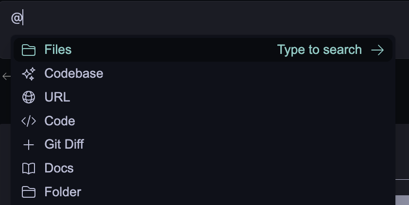
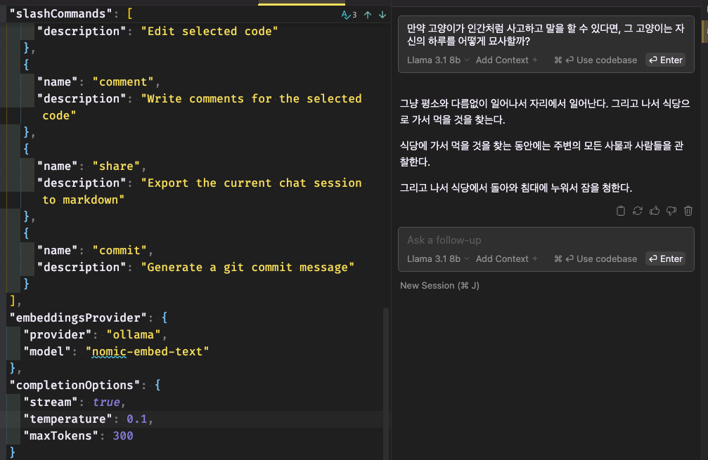
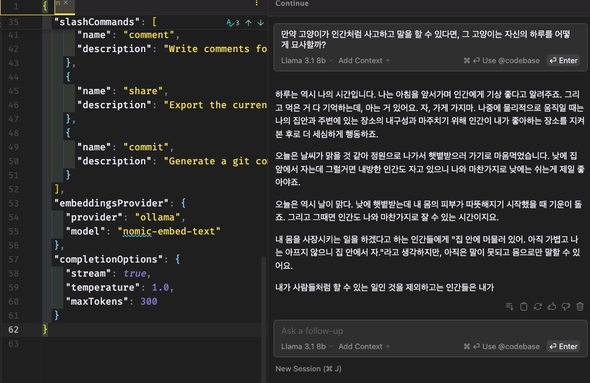

# LLM completion options & continue에서 설정하기, 챗 잘사용하기 - 효과적인 프롬프팅(system, user)

## 목차

- [LLM completion options \& continue에서 설정하기, 챗 잘사용하기 - 효과적인 프롬프팅(system, user)](#llm-completion-options--continue에서-설정하기-챗-잘사용하기---효과적인-프롬프팅system-user)
  - [목차](#목차)
  - [팀 소개](#팀-소개)
    - [🍫 두바이초콜릿(dubai-chocolate)](#-두바이초콜릿dubai-chocolate)
  - [LLM completion options 알아보기](#llm-completion-options-알아보기)
    - [LLM 이란?](#llm-이란)
    - [LLM Completion Options 란?](#llm-completion-options-란)
    - [Continue의 completionOptions 소개](#continue의-completionoptions-소개)
  - [원하는 구조로 출력 커스텀](#원하는-구조로-출력-커스텀)
    - [Context Provider 커스텀하기](#context-provider-커스텀하기)
      - [Context Provider 란?](#context-provider-란)
      - [기본 제공 Context Providers](#기본-제공-context-providers)
      - [커스텀 Context Provider 만들기](#커스텀-context-provider-만들기)
      - [실습 : Food-Review Context Provider](#실습--food-review-context-provider)
    - [prompt 커스텀하기](#prompt-커스텀하기)
      - [1. Continue에서 completionOption 설정하기](#1-continue에서-completionoption-설정하기)
      - [실습 : `temperature`로 창의적인 응답 만들기](#실습--temperature로-창의적인-응답-만들기)
      - [2. Custom slash commands](#2-custom-slash-commands)
  - [효과적인 프롬프트 엔지니어링](#효과적인-프롬프트-엔지니어링)
    - [LLM의 응답의 품질을 더욱 향상시키기](#llm의-응답의-품질을-더욱-향상시키기)
    - [Continue와 함께 개발에 활용하는 법](#continue와-함께-개발에-활용하는-법)
    - [참고자료](#참고자료)

## 팀 소개

### 🍫 두바이초콜릿(dubai-chocolate)

| 정승화                                                       | 김민성                                                        | 이영주                                                       | 송영욱                                                       | 왕지은                                                        | 최은정                                                       |
| ------------------------------------------------------------ | ------------------------------------------------------------- | ------------------------------------------------------------ | ------------------------------------------------------------ | ------------------------------------------------------------- | ------------------------------------------------------------ |
|  |  |  |  |  |  |
| [@JSH-data](https://github.com/JSH-data)                     | [@GreenIdealist](https://github.com/GreenIdealist)            | [@abyss-s](https://github.com/abyss-s)                       | [@R3gardless](https://github.com/R3gardless)                 | [@Jieunwang0](https://github.com/Jieunwang0)                  | [@rovin0805](https://github.com/rovin0805)                   |

## LLM completion options 알아보기

### LLM 이란?

"대규모 언어 모델"로, 굉장히 많은 데이터를 학습한 AI 모델입니다. 이를 통해 사람처럼 자연스럽게 대화하거나 다양한 글을 작성하는 능력을 가지고 있습니다. 대표적인 LLM
ChatGPT가 있습니다.

### LLM Completion Options 란?

**언어 모델이 텍스트를 생성하는 방식**을 조정하는 설정들로, 출력되는 텍스트의 **길이, 다양성, 일관성** 등에 영향을 미칩니다. 단, 각 모델들이 지원하는 Option들도 약간씩 상이하며 동일한 값을 주더라도 모델마다 응답 변화에 편차가 있을 수 있습니다.

### Continue의 completionOptions 소개

**Continue**에서 Completion Options를 수정하고 싶다면 `config.json`를 통해 수정해야 합니다.

**continue**의 [config](https://docs.continue.dev/customize/config)에서 수정할 수 있는 옵션은 아래와 같습니다.

```json
"completionOptions": {
  "stream": "boolean",
  "teperature": "number",
  "topP": "number",
  "topK": "integer",
  "presencePenalty": "number",
  "frequencePenalty": "number",
  "mirostat": "number",
  "stop": "string[]",
  "maxTokens": "number",
  "numThreads": "integer",
  "keepAlive": "integer",
}
```

- `stream` : LLM 응답을 [streaming](https://brunch.co.kr/@joypinkgom/51)으로 받을지 선택하는 옵션입니다. 스트리밍을 사용하면 응답을 한 번에 받지 않고, 점진적으로 받아볼 수 있습니다.
- [`temperature`](https://brunch.co.kr/@yeounyi/47) : 모델이 생성하는 **응답의 창의성이나 랜덤성을 조정**합니다. 값이 높을수록 창의적인 응답을, 낮을수록 일관성 있고 예측 가능한 응답을 생성합니다.
- `topP` : LLM에서 생성할 단어를 선택하는 과정에서 확률 분포 상위 P%의 단어들만 선택하여 응답을 생성하는 방식입니다. topP가 낮을수록 확률이 높은 단어들만 선택되며, 높을수록 더 다양한 단어가 선택됩니다.
- `topK` : LLM에서 **응답을 생성할 때 고려할 후보 단어들의 개수를 제한하는 옵션**입니다. topK가 낮으면 답변이 더 예측 가능하고 고정된 표현을 사용할 가능성이 크고, topK가 높으면 더 창의적이거나 다양하게 답변이 나올 가능성이 커집니다.
- `presencePenalty` : 모델이 이미 언급한 단어를 다시 사용하는 것을 얼마나 억제할지 조절합니다. 이 옵션을 통해 **같은 단어를 반복하는 것을 방지하거나 반복하도록 유도**할 수 있습니다.
- `frequencePenalty` : 모델이 특정 단어를 얼마나 자주 반복해서 사용할지 조절합니다. 이 옵션을 통해 **단어의 빈도를 억제하거나 허용**할 수 있으며, 모델이 같은 단어나 문구를 반복적으로 사용하지 않도록 제어할 수 있습니다.
- `mirostat` : **LLM에서 실시간으로 응답의 일관성과 품질을 지속적으로 조정하기 위한 동적 샘플링 알고리즘입니다.** 모델이 생성하는 텍스트의 정보량을 일정하게 유지하면서 질문이나 주제에 적합한 수준의 다양성과 결정성을 지속적으로 조절합니다.
- `stop` : LLM이 **응답을 중지해야 할 시점을 지정**하는 기능입니다. 즉, 모델이 텍스트를 생성하는 도중 **특정 토큰이나 문자열이 등장하면 응답 생성을 중단**하도록 설정할 수 있습니다.
- `maxTokens` : 모델이 생성할 수 있는 **최대 토큰 수**를 의미합니다. 이 옵션은 모델이 하나의 프롬프트에 대해 응답할 때 생성할 텍스트의 길이를 제한하는 역할을 합니다.
- `numThreads` : 생성 과정에서 **사용되는 스레드의 수를 조절**합니다.
- `keepAlive` : 요청이 없는 경우 모델을 메모리에서 언로드하기까지의 시간입니다. 기본 값은 `60 * 30 = 30분` 입니다.

## 원하는 구조로 출력 커스텀

### [Context Provider](https://docs.continue.dev/customize/context-providers) 커스텀하기

#### Context Provider 란?

LLM에 특정한 콘텐츠를 제공하는 기능으로, `@`를 입력하면 LLM 에 context로 제공할 수 있는 콘텐츠 드롭다운을 볼 수 있습니다.

_이때 여기서 말하는 콘텐츠란, LLM에게 제공되는 추가 정보(파일 내용, 프로젝트 코드, 깃 변경 사항, 깃 이슈, 터미널 출력, 웹 페이지 내용, 문서 등)를 의미합니다. 이 정보를 통해 모델이 주어진 입력에 대한 응답을 보다 정확하고 관련성 있게 생성할 수 있도록 돕습니다._



#### 기본 제공 [Context Providers](https://docs.continue.dev/customize/context-providers)

Continue는 기본적으로 아래와 같은 built-in context provider 를 제공합니다.

`~/.continue/config.json`의 `contextProviders` 에 추가하면 됩니다.

```json
  "contextProviders": [
    {
      "name": "code",
      "params": {}
    },
    {
      "name": "docs",
      "params": {}
    },
    {
      "name": "diff",
      "params": {}
    },
    { "name": "open", "params": { "onlyPinned": true } },
    {
      "name": "issue",
      "params": {
        "repos": [
          {
            "owner": "continuedev",
            "repo": "continue"
          }
        ],
        "githubToken": "ghp_xxx"
      }
    }
    ...
  ]
```

**Built-in Context Providers 예시:**

- `@file`: 현재 워크스페이스의 파일을 context로 제공.
- `@code`: 프로젝트 내 특정 함수나 클래스를 context로 제공.
- `@Git Diff`: 현재 브랜치의 변경 사항을 context로 제공.
- `@terminal`: IDE의 터미널 내용을 context로 제공.
- `@open`: 현재 열려 있는 파일의 내용들을 context로 제공.
- `@folder`: 현재 워크스페이스의 폴더를 context로 제공. `@codebase` 와 동일한 검색 메커니즘을 사용하지만 단일 폴더에서만 검색할 수 있음.
- `@codebase`: 워크스페이스 전체에서 가장 관련성 높은 콘텐츠를 자동으로 가져올 수 있도록 codebase 를 색인화
- `@url`: 특정 URL의 내용을 markdown 형식으로 context로 제공.
- `@issue`: GitHub issue의 대화를 context로 제공 (개인 접근 토큰 필요).
- `@docs`: Continue에서 문서와 상호작용할 수 있게 해줌. 정적 사이트나 GitHub 페이지를 색인화하여 쉽게 접근 가능.

⬇️ 기존 샘플을 참조하여 코드 생성</br>
</br>
</br>⬇️ 특정 폴더(`@Folder`)에 대한 질문을 하여 관련 결과가 나올 확률 상승</br>


#### [커스텀 Context Provider](https://docs.continue.dev/customize/tutorials/build-your-own-context-provider) 만들기

모든 context provider 는 플러그인으로, 기본으로 제공하는 플러그인 외에도 필요한 source 를 제공하지 않는 경우 새로운 context provider 를 **_요청 혹은 개발_** 할 수 있습니다.

REST API를 통해 외부 데이터베이스에서 정보를 검색하고 그 결과를 받아 자신만의 `CustomContextProvider` 를 구현할 수 있습니다.

`context provider` 에는 아래의 총 3가지 종류(`ContextProviderType`)가 존재합니다.

1. **normal**: 기본 설정. 별도의 선택(submenu) 및 입력(query) 없이 사용.
2. **query**: 유저가 텍스트 박스로 입력하여 context 항목 생성. `"type": "query"`로 설정.
3. **submenu**: 유저가 선택할 수 있는 항목을 제공. `"type": "submenu"`로 설정해야 하며, `loadSubmenuItems`와 `getContextItems` 모두 구현해야 함.

```typescript
// ~/.continue/config.ts
interface CustomContextProvider {
  title: string;
  displayTitle?: string;
  description?: string;
  renderInlineAs?: string;
  type?: ContextProviderType;
  getContextItems(
    query: string,
    extras: ContextProviderExtras
  ): Promise<ContextItem[]>;
  loadSubmenuItems?: (
    args: LoadSubmenuItemsArgs
  ) => Promise<ContextSubmenuItem[]>;
}

const RagContextProvider: CustomContextProvider = {
  title: "rag",
  displayTitle: "RAG",
  description:
    "Retrieve snippets from our vector database of internal documents",

  getContextItems: async (
    query: string,
    extras: ContextProviderExtras
  ): Promise<ContextItem[]> => {
    const response = await fetch("https://internal_rag_server.com/retrieve", {
      method: "POST",
      body: JSON.stringify({ query }),
    });

    const results = await response.json();

    return results.map((result) => ({
      name: result.title,
      description: result.title,
      content: result.contents,
    }));
  },
};

export function modifyConfig(config: Config): Config {
  if (!config.contextProviders) {
    config.contextProviders = [];
  }
  config.contextProviders.push(RagContextProvider);
  return config;
}
```

#### 실습 : Food-Review Context Provider

</br>

**1. Query Type**

<details>
<summary> <code>~/.continue/config.ts</code> </summary>

```Typescript
const FoodReviewContextProvider: CustomContextProvider = {
  title: "food-review",
  displayTitle: "food-review",
  description: "Food Review Context Providers",
  type: "query", // query 옵션 추가
  
  getContextItems: async (
      query: string,
      extras: ContextProviderExtras,
  ): Promise<ContextItem[]> => {
      const response = await fetch("http://localhost:8000/retrieve", {
          method: "POST",
          headers : {
              "Content-Type": "application/json",
          },
          body: JSON.stringify({ query })
      });
      
      const results = await response.json();

      return results.map((result) => ({
          name: result.name,
          description: result.description,
          content: result.content
      }))
  },

}
```

</details>

</br></br>
</br>

**2. Submenu Type**

<details>
<summary> <code>~/.continue/config.ts</code> </summary>

```Typescript
const FoodReviewContextProvider: CustomContextProvider = {
  title: "food-review",
  displayTitle: "food-review",
  description: "Food Review Context Providers",
  type: "submenu", // submenu 옵션 추가
  
  getContextItems: async (
      query: string,
      extras: ContextProviderExtras,
  ): Promise<ContextItem[]> => {
      const response = await fetch("http://localhost:8000/retrieve", {
          method: "POST",
          headers : {
              "Content-Type": "application/json",
          },
          body: JSON.stringify({ query })
      });
      
      const results = await response.json();

      return results.map((result) => ({
          name: result.name,
          description: result.description,
          content: result.content
      }))
  },

  loadSubmenuItems: async (
      args: LoadSubmenuItemsArgs,
  ): Promise<ContextSubmenuItem[]> => {
      const list = ["coffee", "steak", "burger"];
      const result = list.map((item) => {
          return {
              id: item,
              title: item,
              description: `description of ${item}`,
          };   
      });
      return result
  },
}

export function modifyConfig(config: Config): Config {
  if (!config.contextProviders) {
      config.contextProviders = [];
  }
  config.contextProviders.push(FoodReviewContextProvider);
  return config;
}
```

</details>

</br></br>
</br>

### prompt 커스텀하기

##### [1. Continue에서 completionOption 설정하기](https://docs.continue.dev/customize/config)

Continue에서 `completionOption` 설정하는 데에는 2가지 방법이 있습니다.

**1) `config.json` > `completionOption`**

전역적으로 설정하는 방법입니다. 여기서 설정한 `completionOption` 값들은 모델에 상관없이 Continue에서 모든 작업에 동일하게 적용됩니다.

```json
{
  "completionOptions": {
    "temperature": 0.7,
    "topP": 0.9,
    "maxTokens": 150
  }
}
```

**2) `config.json` > `models` > `completionOptions`**

모든 모델에 대한 기본값이 아니라 특정 모델에 대한 설정을 별도로 정의하고 싶을 때 사용합니다.

예를 들면 `Msty`와 `gpt-4o-mini`에 각각 다른 `completionOptions` 설정을 부여할 수도 있습니다.

```json
{
  "models": [
    {
      "title": "Msty",
      "provider": "msty",
      "model": "deepseek-coder:6.7b",
      "completionOptions": {
        "temperature": 0.9,
        "topP": 0.7,
        "maxTokens": 100
      }
    },
    {
      "title": "GPT-4o Mini",
      "provider": "openai",
      "model": "gpt-4o-mini",
      "completionOptions": {
        "temperature": 0.6,
        "topP": 0.8,
        "maxTokens": 200
      }
    }
  ]
}
```

#### 실습 : `temperature`로 창의적인 응답 만들기

앞에 설명했던 것처럼 `temperature` 옵션을 통해 LLM의 답변의 창의성을 끌어올릴 수 있습니다. `temperature`를 **0.1**과 **1.0**으로 각각 설정하여 동일한 질문에 대해서 얼마나 다르게 답변하는지 확인 해보겠습니다.

`temperature`가 `0.1`인 경우



`temperature`를 `1.0`인 경우



위 응답 결과를 통해 `temperature`가 높은 경우 더 많은 단어를 활용하여 응답을 주는 것을 확인할 수 있습니다.

#### 2. Custom slash commands

**1) [`.prompt` 파일 생성하기](https://docs.continue.dev/customize/deep-dives/prompt-files)**

- 워크스페이스 최상단에 `.prompts/` 폴더를 직접 생성하거나, chat box 밑의 Build a custom prompt를 누르면 워크스페이스 최상단에 `.prompts`라는 폴더가 생성됩니다.
- `.prompts` 폴더에서 생성한 .prompt 파일의 이름은 프롬프트를 생성하는 데 사용할 슬래시 명령어의 이름이 됩니다. ( e.g., `test.prompt` ⇒ `/test` )
- 파일에 프롬프트 내용을 작성하면 chat 화면에서 슬래시(/)+ 프롬프트파일명 + ENTER를 통해 프롬프트에서 지시한 내용을 따르게 됩니다.

```text
temperature: 0.5
maxTokens: 4096
---
<system>
You will be acting as a senior software engineer helping a colleague document their code.
</system>
You will follow the guidelines for writing great code comments:
{{{ url "https://stackoverflow.blog/2021/12/23/best-practices-for-writing-code-comments/" }}}
---
Using this information, write a comment for the following code:
{{{ input }}}
```

- **서문** : `---` 구분 기호 위에서 YAML 구문을 사용해서 모델 매개변수를 지정할 수 있게 합니다. 필요하지 않다면 `---` 구분 기호까지 생략합니다.
- **System 태그** : 시스템 메세지를 통해 시스템에게 역할을 부여해주고, 지시, 요구사항을 알려줍니다.
- **Context Provider**: `config.json`에 추가한 모든 컨텍스트 공급자는 컨텍스트 공급자의 이름을 사용하여 참조할 수 있습니다. 입력을 받는 컨텍스트 공급자도 지원됩니다.
- **내장 변수** : 현재 사용 가능한 기본 제공 변수는 다음과 같습니다. `{{{ input }}}`, `{{{ currentFile }}}`, `{{{ ./path/to/file.js }}}`

</br>

**2) 자연어 프롬프트 (`customCommands` 속성, `config.json`)**

`config.json` 파일에 `customCommands` 속성을 추가하는 것으로, 자연어로 작성된 명령어를 정의하는 custom slash commands를 만들 수 있습니다.

```json
customCommands=[{
  "name": "check",
  "description": "Check for mistakes in my code",
  "prompt": "{{{ input }}}\n\nPlease read the highlighted code and check for any mistakes. You should look for the following, and be extremely vigilant:\n- Syntax errors\n- Logic errors\n- Security vulnerabilities\n- Performance issues\n- Anything else that looks wrong\n\nOnce you find an error, please explain it as clearly as possible, but without using extra words. For example, instead of saying 'I think there is a syntax error on line 5', you should say 'Syntax error on line 5'. Give your answer as one bullet point per mistake found."
}]
```

- `name` : 슬래시 명령을 호출하는 데 입력할 이름
- `description` : 드롭다운 메뉴에 표시되는 설명
- `prompt` : Handlebars 구문을 사용한 템플릿 작성을 지원
- `input` : 슬래시 명령으로 입력한 추가 입력. 예를 들어, 를 입력하면 /test only write one test. input여기 only write one test에는 강조 표시된 코드 블록도 포함됩니다.
- `file name`: 절대 경로나 현재 작업 디렉토리를 기준으로 한 상대 경로를 제공하여 모든 파일을 참조할 수 있습니다.

</br>

**3) 함수를 작성하는 프롬프트 (`slashCommands` 속성, `config.ts`)**

`customCommands`로 사용자 지정 명령을 작성하는 것보다 한 단계 더 나아가려면 응답을 반환하는 사용자 지정 함수를 작성할 수 있습니다.

이를 위해서는 `config.json` 대신 `config.ts`를 사용해야 하는데, 이곳에서 `slashCommands` 배열에 새로운 `slashCommand` 객체를 추가합니다.

```typescript
export function modifyConfig(config: Config): Config {
  config.slashCommands?.push({
    name: "commit",
    description: "Write a commit message",
    run: async function* (sdk) {
      const diff = await sdk.ide.getDiff();
      for await (const message of sdk.llm.streamComplete(
        `${diff}\n\nWrite a commit message for the above changes. Use no more than 20 tokens to give a brief description in the imperative mood (e.g. 'Add feature' not 'Added feature'):`,
        {
          maxTokens: 20,
        }
      )) {
        yield message;
      }
    },
  });
  return config;
}
```

## 효과적인 프롬프트 엔지니어링

### LLM의 응답의 품질을 더욱 향상시키기

사용자는 `프롬프트 디자인의 다양한 전략과 기법`을 통해 효과적으로 질문함으로써, LLM의 성능을 최적화하여 더 나은 응답 결과를 도출할 수 있습니다.

다음은 사용자가 시도해볼 수 있는 `프롬프트 디자인의 다양한 전략과 기법`입니다.

- **질문하기 전 생각 구조화하기**
  - 질문을 하기 전에 생각의 연결고리(Chain-of-Thought, CoT)를 통해 대답을 유도합니다.
    - `"차근차근 단계적으로 생각해 줘"`
- **프롬프트에게 페르소나 부여하기**
  - 프롬프트에게 역할, 맥락과 배경을 부여합니다.
    - `"너는 ~ 역할이고, 나는 이러한 답변이 필요한 ~ 사람이야."`
  - 답변 난이도를 결정하는 문체를 지정하면 더욱 좋습니다.
    - `"졸업 논문에 작성할 수 있을 정도로 전문적으로 알려줘" 또는 "초등학생도 쉽게 이해할 수 있을 정도로 설명해줘"`
- **명확하고 구체적으로 지시하기**
  - 범위를 좁혀서 질문합니다.
  - 어떤 포맷으로 출력할지 명시합니다.
  - 어떤 방법으로 추출할지 명확히 합니다.
    - `"300자 이내의 서론, 본론, 결론으로 알려줘", "표로 알려줘", "~ 관련해서 10가지를 알려줘"`
- **영어로 번역해서 질문하기**
  - 대부분의 AI가 영어를 기반으로 작성되었기 때문에 영어로 질문할 때 답변의 퀄리티가 더 좋을 때가 많습니다.
  - 특히 전문 분야의 경우, 한국어 질문에 대한 답변이 아쉬울 때는 영어로 질문하고, 생성된 영어 답변을 다시 한글로 번역해봅시다.
- **보상 제시하기**
  - 질문에 응답할 때 동기를 부여하기 위해 보상을 제안합니다.
    - `"이 문제를 해결하면 다음 단계로 넘어갈 수 있어."`
- **처벌 언급하기**
  - 응답이 없거나 부정확할 경우의 결과를 언급하여 정확한 응답을 유도합니다.
    - `"답변이 틀리면 시간이 낭비될 거야."`
- **자연스러운 대화 유도하기**
  - 인간적인 대화 스타일을 유도하여 보다 자연스러운 답변을 요청합니다.
    - `"친근하게 이야기하듯 설명해 줘."`
- **정보 충분히 요구하기**
  - 질문이 불완전할 경우 더 많은 정보를 요청하여 정확한 답변을 얻습니다.
    - `"더 많은 세부사항을 제공해 줄 수 있어?"`
- **테스트 포함 요청하기**
  - 생성된 답변을 테스트할 수 있는 형식으로 제공받습니다.
    - `"이 코드를 실행 가능한 상태로 제공해 줘."`
- **구분 기호 사용하기**
  - 특정 단어를 강조하거나 구조화된 답변을 요청할 때 구분 기호를 사용합니다.
    - `"각 항목을 '•' 기호로 구분해서 나열해 줘."`
- **단어 반복 사용하기**
  - 특정 단어를 강조하거나 주요 개념을 반복하여 설명하도록 요청합니다.
    - `"이 개념을 여러 번 반복해서 강조해 줘."`
- **출력문 포함하기**
  - 답변이 특정 형식으로 출력되도록 지시합니다.
    - `"이 코드를 출력 형식으로 작성해 줘."`
- **자세한 내용 요청하기**
  - 더 구체적인 정보를 포함하여 글을 작성하도록 요청합니다.
    - `"좀 더 자세하게 설명해 줘."`
- **수정 요청하기**
  - 이미 생성된 내용을 수정하여 더 나은 결과를 요구합니다.
    - `"이 내용을 더 간결하게 다듬어 줘."`
- **코드 생성 요청하기**
  - 여러 파일에 걸친 코드를 작성하거나 특정 구조로 제공받습니다.
    - `"이 코드의 각 함수는 별도의 파일로 분리해 줘."`
- **특정 텍스트로 시작하기**
  - 주어진 텍스트나 문구를 바탕으로 답변을 요청합니다.
    - `"이 문장을 바탕으로 추가 설명을 작성해 줘."`
- **요구 사항 명시하기**
  - 텍스트나 코드 생성에 필요한 특정 요구 사항을 명확히 합니다.
    - `"이 요구 사항에 맞춰 텍스트를 작성해 줘."`
- **제공된 예시 기반 텍스트 생성**
  - 제공된 예시와 유사한 스타일이나 형식으로 텍스트를 생성하도록 요청합니다.
    - `"이 예시와 같은 형식으로 텍스트를 작성해 줘."`

### Continue와 함께 개발에 활용하는 법

- **@Codebases, @Files**
  - 특정 함수 내용 등 코드 분석
  - 버그나 에러 찾기
- **Comment**
  - 주석 작성
- **@Docs**
  - 공식 문서 예제를 바로 참고하여 작성
- **/Build a custom propmpt or command**
  - 테스트 케이스 작성 및 검사
  - 반복해야 하는 작업을 자동화
- **/Chat, /Autocomplete**
  - 개발 문서나 양식 초안 작성

> 생성형 AI를 사용하면서 느낀 점은 대체로 여러 번 질답을 거듭할수록 답변의 질이 떨어진다는 것이었습니다. 따라서 초기 질문 지시사항을 어떻게 주느냐에 따라 시간과 비용이 크게 차이납니다. 내가 모르는 것이 무엇이고, 어떻게 잘 도움을 받을 수 있을지에 대한 '메타인지'를 기릅시다😊

### 참고자료

- [ChatGPT에게서 좋은 대답을 이끌어 내는 방법 7가지](https://tech.kakaobank.com/posts/2312-drawing-out-good-responses-from-ai/)
- [좋은 질문을 하는 방법, 구조화 방법](https://www.gotai.co.kr/%EC%B1%97%EC%A7%80%ED%94%BC%ED%8B%B0-2/)
- [Principled Instructions Are All You Need for Questioning](https://arxiv.org/abs/2312.16171)
- [ATLAS: An LLM Inquiry Principle Benchmark](https://github.com/VILA-Lab/ATLAS)
