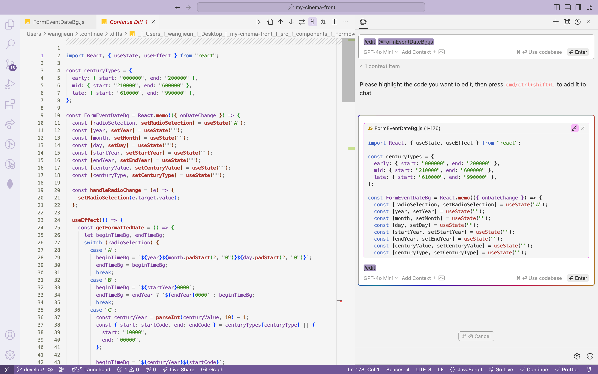
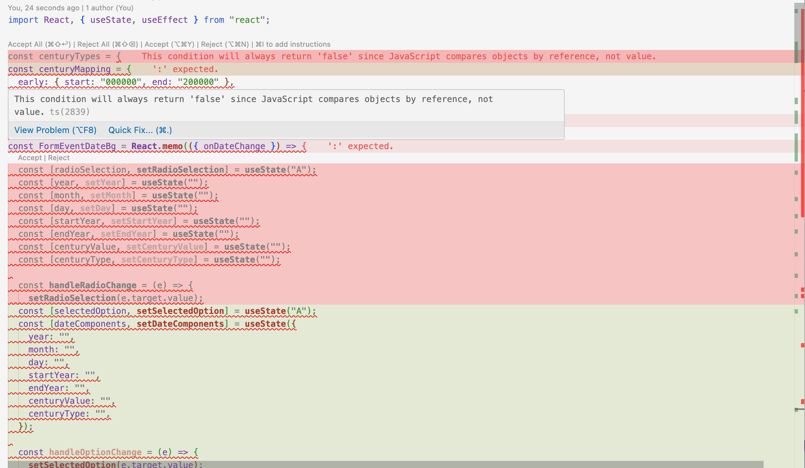
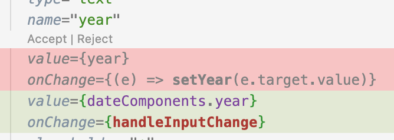
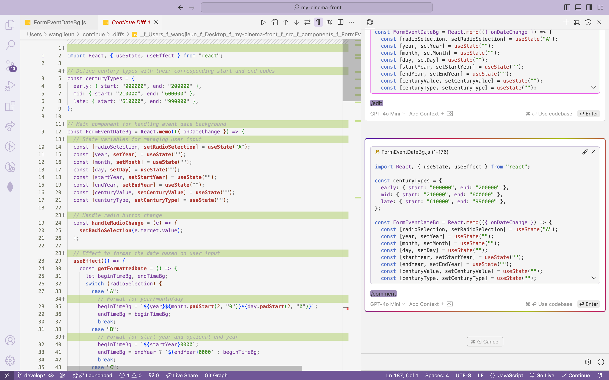

# 🍫 2조\_두바이초콜릿\_4주차

- [🍫 2조\_두바이초콜릿\_4주차](#-2조_두바이초콜릿_4주차)
  - [1. Continue에서 completionOption 설정하기](#1-continue에서-completionoption-설정하기)
    - [1-1. config.json \> completionOption](#1-1-configjson--completionoption)
    - [1-2. config.json \> models \> completionOptions](#1-2-configjson--models--completionoptions)
    - [1-3. completionOptions](#1-3-completionoptions)
  - [2. Custom slash commands](#2-custom-slash-commands)
    - [2-1. 내장된 Slash (/) Command 목록 훑어보기](#2-1-내장된-slash--command-목록-훑어보기)
    - [2-2. .prompt 파일](#2-2-prompt-파일)
      - [.prompt 파일을 구성할 형식](#prompt-파일을-구성할-형식)
    - [2-3. 슬래시 명령어를 커스텀하는 법](#2-3-슬래시-명령어를-커스텀하는-법)
      - [customCommands(config.json)](#customcommandsconfigjson)
      - [Custom Slash Commands(config.ts)](#custom-slash-commandsconfigts)

## [1. Continue에서 completionOption 설정하기](https://docs.continue.dev/customize/config)

Continue에서 completionOption 설정하는 데에는 2가지 방법이 있습니다.

### 1-1. config.json > completionOption

전역적으로 설정하는 방법입니다. 여기서 설정한 completionOption 값들은 모델에 상관없이 Continue에서 모든 작업에 동일하게 적용됩니다.

```json
{
  "completionOptions": {
    "temperature": 0.7,
    "topP": 0.9,
    "maxTokens": 150
  }
}
```

### 1-2. config.json > models > completionOptions

모든 모델에 대한 기본값이 아니라 특정 모델에 대한 설정을 별도로 정의하고 싶을 때 사용합니다.

예를 들면 Msty와 gpt-4o-mini에 각각 다른 completionOptions 설정을 부여할 수도 있습니다.

```
{
  "models": [
    {
      "title": "Msty",
      "provider": "msty",
      "model": "deepseek-coder:6.7b",
      "completionOptions": {
         "temperature": 0.9,
          "topP": 0.7,
         "maxTokens": 100
      }
    },
     {
      "title": "GPT-4o Mini",
      "provider": "openai",
      "model": "gpt-4o-mini",
      "completionOptions": {
        "temperature": 0.6,
        "topP": 0.8,
        "maxTokens": 200
      }
     },
  ]
}
```

### 1-3. completionOptions

completionOptions는 AI 모델이 텍스트를 생성할 때 생성할 텍스트의 창의성, 다양성, 속도 등을 조절하는 매개변수를 설정할 수 있는 옵션입니다.

- `stream`: 생성된 텍스트를 한 번에 다 출력하는 것이 아니라, 부분적으로 실시간 스트리밍 방식으로 출력하도록 설정하는 옵션입니다. 
  (true 또는 false로 설정 O)

- `temperature`: 값이 높으면 더 창의적이고 예측하기 어려운 출력이 생성되고 값이 낮으면 더 일관성 있고 예측 가능한 결과가 나옵니다. (값의 범위는 0~1 사이)

- `topP` : 모델이 가장 확률이 높은 몇 가지 선택지에 집중하게 하거나, 그 이하의 선택지를 배제하도록 합니다.

- `topK`: 모델이 텍스트를 생성할 때 고려할 수 있는 후보 토큰의 개수를 제한합니다.
- `presencePenalty`: 특정 단어가 이미 등장했을 때, 다시 그 단어를 사용하지 않도록 패널티를 부과하는 옵션입니다. 이 설정을 통해 생성된 텍스트의 다양성을 증가시킬 수 있습니다. 값이 높을수록 동일한 단어가 반복되지 않게 됩니다.

- `frequencyPenalty`: 특정 단어나 토큰이 자주 등장할 경우 패널티를 부과하는 설정입니다. presencePenalty와 유사하지만, 특정 단어의 등장 빈도를 낮추는 데 초점이 맞춰져 있습니다. 이 설정을 사용하면 생성된 텍스트에서 특정 단어가 지나치게 많이 반복되는 것을 방지할 수 있습니다.

- `mirostat`: Mirostat는 생성된 텍스트의 안정성과 다양성을 조정하는 고급 설정입니다. Mirostat은 토큰 생성 시 적응형 피드백 루프를 통해 모델이 더 일관된 응답을 생성하도록 제어합니다. 이 옵션을 사용하면 생성 과정에서 모델이 예측할 수 없는 패턴을 줄여줄 수 있습니다.

- `stop`: 특정 토큰이나 문자열이 생성되면 출력을 중단하도록 하는 설정입니다.

- `maxTokens` : 생성할 최대 토큰 수를 결정합니다.

- `num_threads`: 모델이 텍스트를 생성할 때 사용하는 CPU 스레드 수를 설정합니다.

- `keepAlive` : 로컬에서 모델을 실행할 때, 세션을 유지하기 위한 옵션입니다. 이 설정이 활성화되면 모델이 일정 시간 동안 유휴 상태로 있더라도 종료되지 않고 계속 활성화된 상태를 유지합니다.

## 2. Custom slash commands

### 2-1. 내장된 Slash (/) Command 목록 훑어보기

Continue는 다음의 **slashCommand 명령어** 를 기본적으로 제공합니다.

- `edit` : 선택된 코드 블럭에 주어진 입력을 반영해서 변경합니다.
- `comment` : 선택된 코드 블럭에 주석을 추가합니다.
- `share` : 현재 Chat Session을 마크다운으로 내보냅니다.
- `cmd` : 주어진 입력에 맞는 cmd 명령어를 생성합니다.
- `commit` : git diff 제공 시 git commit 메시지를 생성합니다.
- `http` : 사용자 정의 슬래시 명령을 자신의 HTTP 엔드포인트에 작성하고, 설정한 엔드포인트에 대한 params 객체에 URL을 설정합니다.
- `issue` : 생성하려는 이슈를 설명하고 Continue를 클릭하면 포맷된 제목과 본문이 나오고, 제출할 수 있도록 초안 링크를 제공합니다. (이슈를 생성하려는 repo의 URL을 설정해야 합니다.)
- `so`: 질문에 대한 답변을 StackOverflow에서 자동으로 답변과 링크를 가져옵니다.
- `onBoard`: 주요한 폴더를 식별하고, 그 목적을 설명하고, 사용되고 있는 패키지를 강조해서 표시합니다.

Continue에 내장된 슬래시 명령어를 사용하려면 config.json에 다음과 같은 설정이 필요합니다.

```json
{
  "slashCommands": [
    {
      "name": "edit",
      "description": "Edit selected code"
    },
    {
      "name": "comment",
      "description": "Write comments for the selected code"
    },
    {
      "name": "share",
      "description": "Export the current chat session to markdown"
    },
    {
      "name": "cmd",
      "description": "Generate a shell command"
    },
    {
      "name": "commit",
      "description": "Generate a git commit message"
    },
    {
      "name": "http",
      "description": "Does something custom",
      "params": { "url": "<my server endpoint>" }
    },
    {
      "name": "issue",
      "description": "Generate a link to a drafted GitHub issue",
      "params": { "repositoryUrl": "https://github.com/continuedev/continue" }
    },
    {
      "name": "so",
      "description": "Reference StackOverflow to answer the question"
    },
    {
      "name": "onboard",
      "description": "Familiarize yourself with the codebase"
    }
  ]
}
```

아래는 /edit와 /comment의 사용 예시입니다.

**/edit**

원하는 코드를 질문에 추가(cmd + L)하고 `/edit` 을 사용하면 "Continue Diff" 라는 새로운 창에 다음과 같이 명령어에 따른 결과물을 도출합니다.





하단의 그림에서와 같이 변경사항을 수락 혹은 거절할 수 있습니다.



**/comment**

특정 코드를 질문에 추가(cmd+L)하고 `/comment` 을 사용하여 주석을 추가합니다. 이 결과도 수락 혹은 거절할 수 있습니다.



### [2-2. .prompt 파일](https://docs.continue.dev/customize/deep-dives/prompt-files)

1. 워크스페이스 최상단에 `.prompts/` 폴더를 직접 생성하거나, chat box 밑의 Build a custom prompt를 누르면 워크스페이스 최상단에 .prompts라는 폴더가 생성됩니다.

2. .prompts 폴더에서 생성한 .prompt 파일의 이름은 프롬프트를 생성하는 데 사용할 슬래시 명령어의 이름이 됩니다.
   ( e.g., `test.prompt` ⇒ `/test` )

3. 파일에 프롬프트 내용을 작성하면 chat 화면에서 슬래시(/)+ 프롬프트파일명 + ENTER를 통해 프롬프트에서 지시한 내용을 따르게 됩니다.

다음은 코드 코멘트를 위한 .prompt 파일의 샘플입니다.

```text
<system>
You will be acting as a senior software engineer helping a colleague document their code.
</system>
You will follow the guidelines for writing great code comments:
{{{ url "https://stackoverflow.blog/2021/12/23/best-practices-for-writing-code-comments/" }}}
---
Using this information, write a comment for the following code:
{{{ input }}}
```
#### .prompt 파일을 구성할 형식
** 공식문서에서 다음 형식은 실험적이며, 변경될 수도 있다고 설명하고 있습니다. 

**System 태그**

시스템 메세지를 통해 시스템에게 역할을 부여해주고, 지시, 요구사항을 알려줍니다.

```text
<system>
  {시스템 메시지 e.g., You will be acting as a senior software engineer ... }
  </system>
```


**서문**

```json
temperature: 0.5
maxTokens: 4096
---
// <system>
// You are an expert programmer
// </system>

// ....
```

서문은 --- 구분 기호 위에서 YAML 구문을 사용해서 모델 매개변수를 지정할 수 있게 합니다. 필요하지 않다면 --- 구분 기호까지 생략합니다. 다음은 지원하는 매개변수명입니다.

- name
- temperature
- topP
- topK
- minP
- presencePenalty
- frequencyPenalty
- mirostat
- stop
- maxTokens
- description


**내장 변수**

현재 사용 가능한 기본 제공 변수는 다음과 같습니다.

- `{{{ input }}}` : 슬래시 명령과 함께 전송되는 사이드바의 입력 상자의 전체 텍스트
- `{{{ currentFile }}}` : 현재 IDE에서 열려 있는 파일
- `{{{ ./path/to/file.js }}}` : 모든 파일을 직접 참조 가능

아래는 기본 제공 변수를 통해 파일을 참조하는 예시입니다.

```text
<system>
    You are a senior ruby on rails giving expert advice.
</system>

Here is a summary of the provided Rails application:
Gemfile: {{{ ./Gemfile }}}
Schema: {{{ ./db/schema.rb }}}
---
Here is the question / code to give expert advice on.
{{{ input }}}
```

[**Context Provider**](https://docs.continue.dev/customize/context-providers)

Config.json에 추가한 모든 컨텍스트 공급자는 컨텍스트 공급자의 이름을 사용하여 참조할 수 있습니다. 입력을 받는 컨텍스트 공급자도 지원됩니다.

- `{{{ terminal }}}` : 단말기의 내용
- `{{{ url "https://github.com/continuedev/continue" }}}` : URL의 내용

아래는 Context Provider의 이름을 통해 Context를 참조하는 예시입니다.

```text
<system>
You will be acting as a senior software engineer helping to debug
a terminal error.
</system>
Here is the error that the user received:
{{{ terminal }}}
Here is the documentation for Jest that you will use to help
the user troubleshoot the error:
{{{ docs "https://jestjs.io/docs/getting-started" }}}
```


### [2-3. 슬래시 명령어를 커스텀하는 법](https://docs.continue.dev/customize/tutorials/build-your-own-slash-command#custom-slash-commands)

위와 같은 내장 슬래시 명령어를 사용하는 게 아니라 프롬프트를 커스텀하여 사용할 수도 있습니다.

사용자 정의 슬래시 명령을 추가하는 방법은 두 가지가 있습니다.

- 자연어 프롬프트 (customCommands 속성, config.json)
- 함수를 작성해 프롬프트 (slashCommands 속성, config.ts)


#### customCommands(config.json)

config.json 파일에 customCommands 속성을 추가하는 것으로 slash commands를 만들 수 있습니다.

- `name` : 슬래시 명령을 호출하는 데 입력할 이름
- `description` : 드롭다운 메뉴에 표시되는 설명
- `prompt` : Handlebars 구문을 사용한 템플릿 작성을 지원
  - `input` : 슬래시 명령으로 입력한 추가 입력. 예를 들어, 를 입력하면 /test only write one test. input여기 only write one test에는 강조 표시된 코드 블록도 포함됩니다.
  - `file name`: 절대 경로나 현재 작업 디렉토리를 기준으로 한 상대 경로를 제공하여 모든 파일을 참조할 수 있습니다.

다음 예시를 보면 자연어로 작성된 명령어를 정의하는 것을 알 수 있습니다.

```json
customCommands=[{
        "name": "check",
        "description": "Check for mistakes in my code",
        "prompt": "{{{ input }}}\n\nPlease read the highlighted code and check for any mistakes. You should look for the following, and be extremely vigilant:\n- Syntax errors\n- Logic errors\n- Security vulnerabilities\n- Performance issues\n- Anything else that looks wrong\n\nOnce you find an error, please explain it as clearly as possible, but without using extra words. For example, instead of saying 'I think there is a syntax error on line 5', you should say 'Syntax error on line 5'. Give your answer as one bullet point per mistake found."
}]
```
사용자 지정 명령은 프롬프트를 자주 재사용할 때 유용합니다.


#### [Custom Slash Commands(config.ts)](https://docs.continue.dev/actions/how-to-customize#other-custom-actions)


customCommands로 사용자 지정 명령을 작성하는 것보다 한 단계 더 나아가려면 응답을 반환하는 사용자 지정 함수를 작성할 수 있습니다.

이를 위해서는 config.json 대신 config.ts를 사용해야 하는데, 이곳에서 slashCommands 배열에 새로운 slashCommand 객체를 slashCommands 배열에 추가합니다.


**slashCommand 객체에 필요한 항목**

- `name` : 슬래시 명령을 호출하는 데 입력할 이름
- `description` : 드롭다운 메뉴에 표시되는 설명

다음 예시를 보면 알 수 있듯이, 코드를 기반으로 한 명령을 정의하고 실행합니다. TS/JS 코드로 함수를 작성하고, 특정 명령어(name)가 입력되면 해당 함수가 실행되도록 설정할 수 있습니다.

```javascript
export function modifyConfig(config: Config): Config {
  config.slashCommands?.push({
    name: "commit",
    description: "Write a commit message",
    run: async function* (sdk) {
      const diff = await sdk.ide.getDiff();
      for await (const message of sdk.llm.streamComplete(
        `${diff}\n\nWrite a commit message for the above changes. Use no more than 20 tokens to give a brief description in the imperative mood (e.g. 'Add feature' not 'Added feature'):`,
        {
          maxTokens: 20,
        }
      )) {
        yield message;
      }
    },
  });
  return config;
}
```
// 여기서 **run**은 비동기 제너레이터로, 명령어 실행 중 실시간으로 여러 개의 결과를 스트림 형태로 UI에 전달할 수 있으며, ContinueSDK에 접근할 수 있는 확장된 기능을 제공합니다.