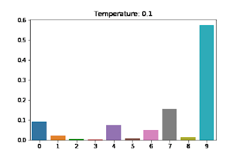

- [LLM의 Completion Options](#LLM의 Completion Option)
- [continue의 completionOptions](#continue의 completionOptions)
    - [stream](#stream)
    - [temperature](#temperature)
    - [topP](#topp)
    - [topK](#topk)
    - [presencePenalty](#presencepenalty)
    - [frequencePenalty](#frequencePenalty)
    - [mirostat](#mirostat)
    - [stop](#stop)
    - [maxTokens](#maxtokens)
    - [numThreads](#numThreads)
    - [keepAlive](#keepAlive)
- [Completion Options를 통해 응답 제어하기](#Completion-Options를-통해-응답-제어하기)
  - [temperature로 창의적인 응답 만들기](#temperature로-창의적인-응답-만들기)
- [References](#References)

### LLM의 Completion Option
LLM의 Completion Option은 **언어 모델이 텍스트를 생성하는 방식**을 조정하는 설정들로, 출력되는 텍스트의 **길이, 다양성, 일관성** 등에 영향을 미칩니다.
각 모델들이 지원하는 Option들도 약간씩 상이하며 동일한 값을 주더라도 모델마다 응답 변화에 편차가 있을 수 있습니다. 

**continue**에서 Completion Options를 수정하고 싶다면 config.json를 통해 수정해야합니다.

### continue의 completionOptions
**continue**의 [config](https://docs.continue.dev/customize/config)에서 수정할 수 있는 옵션은 아래와 같습니다. 

```json
"completionOptions": {
  "stream": "boolean",
  "teperature": "number",
  "topP": "number",
  "topK": "integer",
  "presencePenalty": "number",
  "frequencePenalty": "number",
  "mirostat": "number",
  "stop": "string[]",
  "maxTokens": "number",
  "numThreads": "integer",
  "keepAlive": "integer",
}
```

#### stream
LLM 응답을 [streaming](https://brunch.co.kr/@joypinkgom/51)으로 받을지 선택하는 옵션입니다. `anthroic`에서만 제공됩니다.

#### temperature
[`temperature`](https://brunch.co.kr/@yeounyi/47) 옵션은 모델이 생성하는 **응답의 창의성이나 랜덤성을 조정**합니다. 숫자로 표현되며 0부터 무한대의 값을 가질 수 있습니다.

아래의 그림처럼 `temperature`가 상승할 수록 더 많은 단어를 선택할 확률이 올라기 때문에 더욱 창의적인 응답을 기대할 수 있게 됩니다. 



##### Example
- **`temperature = 0`** 응답을 일관성이 있게 만듭니다. 모델이 생성하는 문장들이 반복되거나 지루해질 수 있습니다. 
- **`temperature = 1`** 응답에 창의성을 강하게 부여합니다. 모델이 생성하는 문장의 일관성이 없거나 의미가 모호해질 수 있습니다.

#### topP
`topP` 옵션은 LLM에서 생성할 단어를 선택하는 과정에서 확률 분포의 일부를 자르는 방식을 의미합니다.

`topP`는 일반적으로 "누적 확률 기반 샘플링 (nucleus sampling)"이라고 불리며, 확률 분포에서 상위 P%에 해당하는 후보들만 고려한 후 그 안에서 랜덤하게 단어를 선택합니다. 확률이 높은 일부 단어들만 대상으로 하므로, 모델의 출력을 더 제어할 수 있습니다.

##### Example
- **`topP = 1`** 완전 무작위 샘플링을 통해 단어를 생성합니다. 가장 창의적인 응답을 얻을 수 있게 됩니다.
- **`topP = 0.5`** 확률 분포에서 상위 50%에 해당하는 단어들만 선택 대상으로 하고, 그 이하의 확률을 가진 단어들은 무시합니다.

#### topK
`topK` 옵션은 LLM에서 **응답을 생성할 때 고려할 후보 단어들의 개수를 제한하는 옵션**입니다.

##### Example
- **`topK = 1`** 가장 확률이 높은 단어 하나만 선택됩니다. 즉, 모델은 항상 **가장 결정적인** 응답을 생성합니다.
- **`topK = 5`** 확률이 높은 상위 5개의 단어들만 선택 후보에 들어가며, 그 안에서 무작위로 단어를 고릅니다.
- **`topK = 0`** 모든 단어가 선택될 수 있는 완전 무작위 샘플링을 통해 단어를 생성합니다. 이 경우 창의적인 응답을 얻을 수 있지만, 응답이 비논리적이거나 예측 불가능할 수 있습니다.

#### presencePenalty
`presencePenalty` 옵션은 모델이 이미 언급한 단어를 다시 사용하는 것을 얼마나 억제할지 조절합니다. 이 옵션을 통해 **같은 단어를 반복하는 것을 방지하거나 반복하도록 유도**할 수 있습니다.

#### frequencePenalty
`frequencyPenalty` 옵션은 모델이 특정 단어를 얼마나 자주 반복해서 사용할지 조절합니다. 이 옵션을 통해 **단어의 빈도를 억제하거나 허용**할 수 있으며, 모델이 같은 단어나 문구를 반복적으로 사용하지 않도록 제어할 수 있습니다.

#### mirostat
`microstat` 옵션은 **LLM에서 응답의 일관성과 품질을 지속적으로 조정하기 위한 동적 샘플링 알고리즘입니다.** 모델이 생성하는 텍스트의 정보량을 일정하게 유지하면서 질문이나 주제에 적합한 수준의 다양성과 결정성을 지속적으로 조절합니다.

`microstat`은 다른 옵션들(`teperature`, `topK`)과는 다르게 **응답 생성 과정에서 모델의 출력을 실시간으로 모니터링하고 수정합니다.** 이를 통해 대화의 흐름이나 맥락에 맞춰 **적절한 창의성**을 유지하면서도 **논리적인 응답**을 생성하는 데 도움이 됩니다.

현재 `Ollama`,  `LM Studio`, `llama.cpp`에서만 활용이 가능합니다.

#### stop
`stop` 옵션은 LLM이 **응답을 중지해야 할 시점을 지정**하는 기능입니다. 즉, 모델이 텍스트를 생성하는 도중 **특정 토큰이나 문자열이 등장하면 응답 생성을 중단**하도록 설정할 수 있습니다.

#### maxTokens
`maxTokens` 옵션은 모델이 생성할 수 있는 **최대 토큰 수**를 의미합니다. 이 옵션은 모델이 하나의 프롬프트에 대해 응답할 때 생성할 텍스트의 길이를 제한하는 역할을 합니다.

#### numThreads
`numThreads` 옵션은 생성 과정에서 **사용되는 스레드의 수를 조절**합니다. `Ollama`에서만 활용이 가능합니다. 

#### keepAlive
`keepAlive` 옵션은 요청이 없는 경우 모델을 메모리에서 언로드하기까지의 시간입니다. 기본 값은 `60 * 30 = 30분` 입니다.


### Completion Options를 통해 응답 제어하기

#### temperature로 창의적인 응답 만들기
앞에 설명했던 것처럼 `temperature` 옵션을 통해 LLM의 답변의 창의성을 끌어올릴 수 있습니다. `temperature`를 **0.1**과 **1.0**으로 각각 설정하여 동일한 질문에 대해서 얼마나 다르게 답변하는지 확인 해보겠습니다.  
 
`temperature`가 `0.1`인 경우


`temperature`를 `1.0`인 경우


위 응답 결과를 통해 `temperature`가 높은 경우 더 많은 단어를 활용하여 응답을 주는 것을 확인할 수 있습니다.

#### References
- [왜 ChatGPT는 따뜻할수록 더 창의적일까?](https://brunch.co.kr/@yeounyi/47)
- [클로드(Claude) API 사용법: 시작부터 실전까지](https://www.developerfastlane.com/blog/how-to-use-claude-api)
- [Ollama Model File](https://github.com/ollama/ollama/blob/main/docs/modelfile.md)
