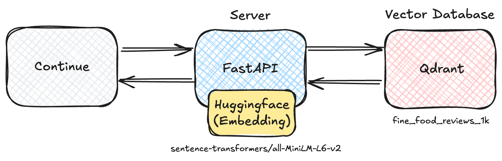
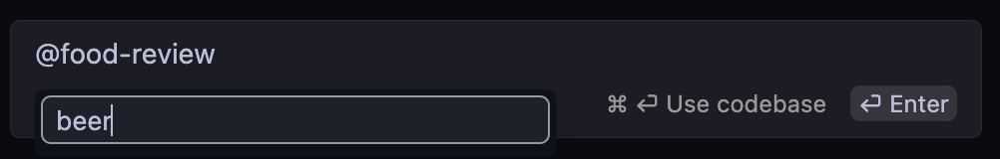
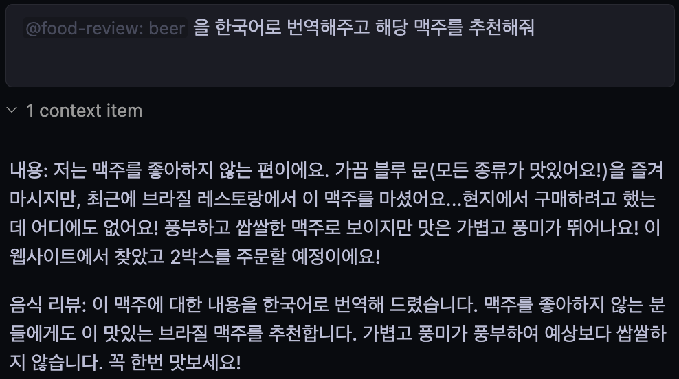
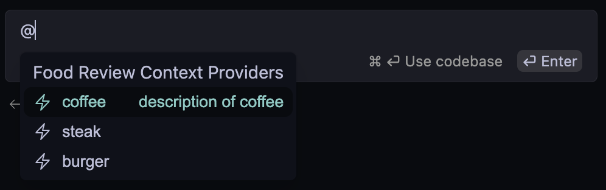
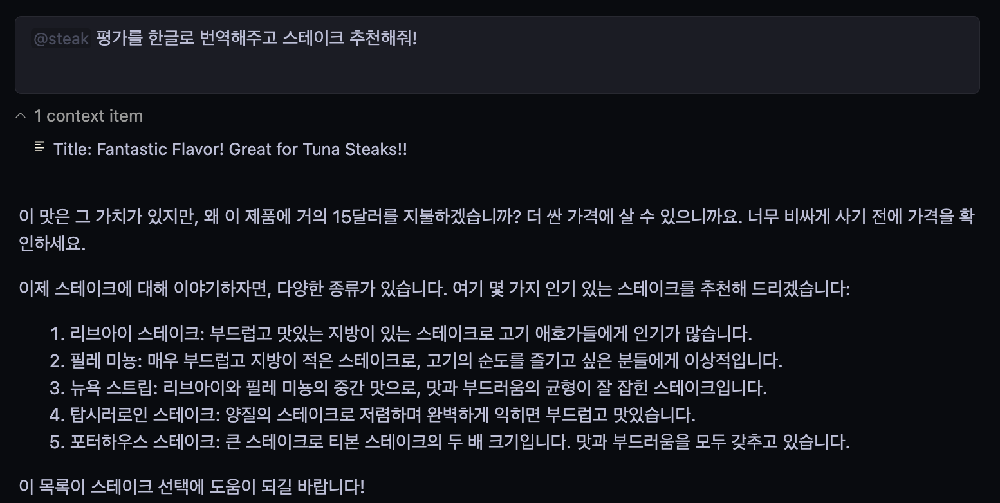

# Build your own context provider

이 문서는 자신만의 `Context Provider` 를 구현하기 위한 방법에 대해 다룹니다.

> [!NOTE]
> 이 문서는 [Build your own context provider](https://docs.continue.dev/customize/tutorials/build-your-own-context-provider) 공식 문서를 참고하여 작성되었습니다.

## `CustomContextProvider`

```typescript
interface CustomContextProvider {
  title: string;
  displayTitle?: string;
  description?: string;
  renderInlineAs?: string;
  type?: ContextProviderType;
  getContextItems(
    query: string,
    extras: ContextProviderExtras,
  ): Promise<ContextItem[]>;
  loadSubmenuItems?: (
    args: LoadSubmenuItemsArgs,
  ) => Promise<ContextSubmenuItem[]>;
}
```

색인화된 문서를 저장해 둔 vector database 가 있을 때 REST API 로 
`context provider` 는 쿼리를 서버로 보내 결과를 vector database 로부터 받습니다.

> [!WARNING]
> `getContextItems` 의 반환 타입은 `array of objects` 이어야 하고, 아래의 property 를 가지고 있어야 합니다.
>
> - `name` : 제목으로 표시될 context 항목 이름
> - `description` : context 항목의 설명
> - `content` : LLM 에 context 로 제공될 실제 내용

```typescript
// ~/.continue/config.ts
const RagContextProvider: CustomContextProvider = {
  title: "rag",
  displayTitle: "RAG",
  description:
    "Retrieve snippets from our vector database of internal documents",

  getContextItems: async (
    query: string,
    extras: ContextProviderExtras,
  ): Promise<ContextItem[]> => {
    const response = await fetch("https://internal_rag_server.com/retrieve", {
      method: "POST",
      body: JSON.stringify({ query }),
    });

    const results = await response.json();

    return results.map((result) => ({
      name: result.title,
      description: result.title,
      content: result.contents,
    }));
  },
};
```

위와 같이 구현하고 `contextProvider` 를 `config.ts` 에 추가하면 됩니다.

```typescript
export function modifyConfig(config: Config): Config {
  if (!config.contextProviders) {
    config.contextProviders = [];
  }
  config.contextProviders.push(RagContextProvider);
  return config;
}
```

> [!TIP]
> 별도의 `config.json` 변경은 필요 없습니다.

## Custom Context Providers with Submenu or Query

`context provider` 에는 아래의 총 3가지 종류가 존재합니다.

- normal : default 로 설정된 값으로 별도의 선택(submenu) 및 입력(query) 없이 사용합니다.
- query
    - 유저에게 text box 로 입력을 받아 context 항목을 생성합니다. (ex. `@search`, `@google`) 해당 입력은 `getContextItems` 에서 `query` 인자로 넘겨집니다.
    - custom context provider 에서 `"type": "query"` 로 지정할 수 있습니다.
- submenu
    - 유저에게 선택할 수 있는 항목을 제공합니다. (ex. `@issue`, `@folder`) 해당 선택은 `loadSubmenuItems` 에서 `args.submenuItemId` 인자로 넘겨집니다.
    - `loadSubmenuItems` 와 `getContextItems` 모두 구현해야 합니다.
    - custom context provider 에서 `"type": "submenu"` 로 지정할 수 있습니다.
        ```typescript
        const ReadMeContextProvider: CustomContextProvider = {
            title: "readme",
            displayTitle: "README",
            description: "Reference README.md files in your workspace",
            type: "submenu",

            getContextItems: async (
                query: string,
                extras: ContextProviderExtras,
            ): Promise<ContextItem[]> => {
                // 'query' is the filepath of the README selected from the dropdown
                const content = await extras.ide.readFile(query);
                return [
                {
                    name: getFolder(query),
                    description: getFolderAndBasename(query),
                    content,
                },
                ];
            },

            loadSubmenuItems: async (
                args: LoadSubmenuItemsArgs,
            ): Promise<ContextSubmenuItem[]> => {
                // Filter all workspace files for READMEs
                const allFiles = await args.ide.listWorkspaceContents();
                const readmes = allFiles.filter((filepath) =>
                filepath.endsWith("README.md"),
                );

                // Return the items that will be shown in the dropdown
                return readmes.map((filepath) => {
                return {
                    id: filepath,
                    title: getFolder(filepath),
                    description: getFolderAndBasename(filepath),
                };
                });
            },
            };

            export function modifyConfig(config: Config): Config {
            if (!config.contextProviders) {
                config.contextProviders = [];
            }
            config.contextProviders.push(ReadMeContextProvider);
            return config;
            }

            function getFolder(path: string): string {
            return path.split(/[\/\\]/g).slice(-2)[0];
            }

            function getFolderAndBasename(path: string): string {
            return path
                .split(/[\/\\]/g)
                .slice(-2)
                .join("/");
        }
        ```
        1. `@readme` 선택 시 드롭다운 메뉴로 선택할 수 있는 항목(`loadSubmenuItems`)을 제공해줍니다.
        2. 드롭다운 메뉴에서 하나의 README 를 선택하고 입력을 작성합니다.
        3. 선택된 `ContextSubmenuItem` 의 `id` 가 `getContextItems` 의 `query` 인자로 넘겨집니다.
        4. `getContextItems` 에서 해당 `query` 를 이용해 파일을 읽고 프롬프트에 포함될 context 항목의 내용 형식을 지정합니다.

## Importing outside modules

`~/.continue` 디렉토리에서 `npm install <module_name>` 을 하면 `config.ts` 로 가져올 수 있습니다.

## `CustomContextProvider` Reference

- `title`: 컨텍스트 제공자를 식별하는 제목
- `displayTitle` (optional): 드롭다운에 표시되는 제목
- `description` (optional): 마우스를 올렸을 때 드롭다운에 표시되는 설명
- `type` (optional): `context provider` 의 유형. 옵션은 "normal", "query", "submenu"입니다. 기본값은 "normal"입니다.
- `renderInlineAs` (optional): 프롬프트 상단에 인라인으로 렌더링할 문자열입니다. 값이 제공되지 않으면 displayTitle가 사용됩니다. 기본 displayTitle를 렌더링하지 않으려면 빈 문자열을 제공할 수 있습니다.
- `getContextItems`: 프롬프트에 포함할 문서를 반환하는 함수입니다. 다음 인수에 대한 액세스 권한이 부여됩니다:
    - `extras.fullInput`: 텍스트 상자에 대한 사용자의 전체 입력을 나타내는 문자열입니다. 예를 들어, 임베딩 세트와 비교할 수 있도록 텍스트(예: fullInput)를 임베딩으로 변환하여 임베딩을 생성하는 데 사용할 수 있습니다.
    - `extras.embeddingsProvider`: 임베딩 제공자는 텍스트(예: fullInput)를 임베딩으로 변환하는 `embed` 라는 함수가 있습니다.
    - `extras.llm`: 현재 기본 LLM입니다. 이 함수를 사용하여 완료 요청을 할 수 있습니다.
    - `extras.ide`: IDE 클래스의 인스턴스로, 터미널의 내용, 열린 파일 목록 또는 현재 열린 파일의 경고 등 IDE에서 다양한 정보를 수집할 수 있습니다.
- `loadSubmenuItems` (optional): submenu 에 표시할 `ContextSubmenuItems` 목록을 반환하는 함수입니다. `getContextItems` 에 전달되는 `IDE` 와 동일한 `IDE` 에 액세스할 수 있습니다.

## Practice (Food-Review Context Provider!)

아래 아키텍쳐를 구성하여 실습을 진행하였습니다.

데이터 : [fine_food_reviews_1k](https://github.com/openai/openai-cookbook/blob/main/examples/data/fine_food_reviews_1k.csv)




### Query Type

```typescript
// ~/.continue/config.ts
const FoodReviewContextProvider: CustomContextProvider = {
  title: "food-review",
  displayTitle: "food-review",
  description: "Food Review Context Providers",
  type: "query", // query 옵션 추가
  
  getContextItems: async (
      query: string,
      extras: ContextProviderExtras,
  ): Promise<ContextItem[]> => {
      const response = await fetch("http://localhost:8000/retrieve", {
          method: "POST",
          headers : {
              "Content-Type": "application/json",
          },
          body: JSON.stringify({ query })
      });
      
      const results = await response.json();

      return results.map((result) => ({
          name: result.name,
          description: result.description,
          content: result.content
      }))
  },

}


export function modifyConfig(config: Config): Config {
  if (!config.contextProviders) {
      config.contextProviders = [];
  }
  config.contextProviders.push(FoodReviewContextProvider);
  return config;
}
```

#### 결과






### Submenu Type

```typescript
const FoodReviewContextProvider: CustomContextProvider = {
  title: "food-review",
  displayTitle: "food-review",
  description: "Food Review Context Providers",
  type: "submenu", // submenu 옵션 추가
  
  getContextItems: async (
      query: string,
      extras: ContextProviderExtras,
  ): Promise<ContextItem[]> => {
      const response = await fetch("http://localhost:8000/retrieve", {
          method: "POST",
          headers : {
              "Content-Type": "application/json",
          },
          body: JSON.stringify({ query })
      });
      
      const results = await response.json();

      return results.map((result) => ({
          name: result.name,
          description: result.description,
          content: result.content
      }))
  },

  loadSubmenuItems: async (
      args: LoadSubmenuItemsArgs,
  ): Promise<ContextSubmenuItem[]> => {
      const list = ["coffee", "steak", "burger"];
      const result = list.map((item) => {
          return {
              id: item,
              title: item,
              description: `description of ${item}`,
          };   
      });
      console.log(result);
      return result
  },
}

export function modifyConfig(config: Config): Config {
  if (!config.contextProviders) {
      config.contextProviders = [];
  }
  config.contextProviders.push(FoodReviewContextProvider);
  return config;
}
```

#### 결과




