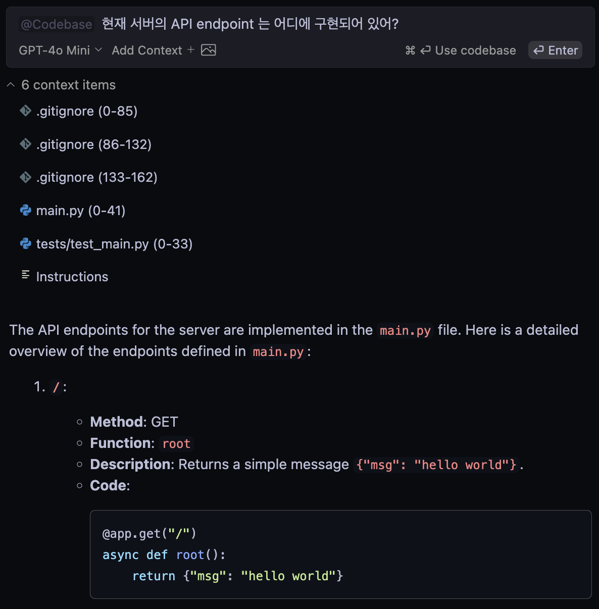

# Continue Context Providers Deep Dives

이 문서는 Continue 의 Context Providers 중 `@Codebase` 와 `@Docs` 을 중점으로 다룹니다.

> [!NOTE]
> 이 문서는 [Continue Context Providers Codebase](https://docs.continue.dev/customize/deep-dives/codebase) 와 [Continue Context Providers Docs](https://docs.continue.dev/customize/deep-dives/docs) 공식 문서를 참고하여 작성되었습니다.

> [!NOTE]
> 이 문서는 VS Code 기준으로 작성되었습니다.

## @Codebase

Continue 는 워크스페이스 전체에서 가장 관련성 높은 콘텐츠를 자동으로 가져올 수 있도록 codebase 를 색인화합니다.

이는 embedding 기반 검색과 keyword 검색을 조합하여 수행합니다.

기본적으로 모든 임베딩은 `all-MiniLM-L6-v2`를 사용하여 로컬에서 계산되며, `~/.continue/index`에 로컬로 저장됩니다.


>[!NOTE]
> 현재 codebase 검색 기능은 `@Codebase` 와 `@Folder` 과 질문으로 가능합니다.
>
> 입력을 나머지 codebase 또는 folder 의 임베딩과 비교하여 관련 파일을 결정합니다.

### 일반적인 사용 사례

다음은 `@Codebase` 혹은 `@Folder` 를 사용한 좋은 사례 입니다.

- codebase 에 대한 질문
    - 

- 기존 샘플을 참조하여 코드 생성
    - 

- 특정 폴더(`@Folder`)에 대한 질문을 하여 관련 결과가 나올 확률 상승
    - 


### Configuration

`config.json` 에서 `@Codebase` 와 `@Folder` 옵션을 설정할 수 있습니다.

```json
{
  "contextProviders": [
    {
      "name": "codebase",
      "params": {
        "nRetrieve": 25,
        "nFinal": 5,
        "useReranking": true
      }
    }
  ]
}
```

- `nRetrieve`: 초기 벡터 데이터베이스에서 검색할 결과 수 (default: 25)
- `nFinal`: 재랭킹 후 사용할 최종 결과 수 (default: 5)
- `useReranking`: 재랭킹 사용 여부 (default: true)
    - 이 옵션을 사용하면 초기 `nRetrieve` 결과를 선택한 후, LLM을 사용하여 상위 `nFinal` 결과를 선택 

### Ignore files during indexing

Continue 는 `.gitignore` 파일을 기반으로 색인화하지 않을 파일을 결정합니다.
추가로 색인화하지 않아야 하는 파일은 `.continueignore` 파일에 추가할 수 있습니다.

>[!NOTE]
> 색인화된 파일은 `~/.continue/index/index.sqlite` 에 저장됩니다.

## @Docs

`@Docs` 는 Continue 에서 직접 문서를 상호작용할 수 있게 해줍니다.

이 기능은 정적 사이트나 Github 페이지를 색인화하여, 코딩 시 문서에 쉽게 접근하고 활용할 수 있도록 만듭니다.

### How It Works

`@Docs` 는 지정된 문서 사이트를 크롤링하여 임베딩을 생성하고 이를 로컬에 저장하여 빠르고 효율적으로 문서 콘텐츠에 액세스할 수 있도록 합니다.

  1. 지정된 문서 사이트 크롤링
  2. 콘텐츠 임베딩 생성
  3. 임베딩을 로컬에 저장
  4. `@Docs` 를 통해 색인화된 콘텐츠에 액세스 제공

> [!TIP]
> 인기 있는 프레임워크와 라이브러리에 대해서는 사전 색인화된 (문서 사이트 목록)[https://github.com/continuedev/continue/blob/main/core/indexing/docs/preIndexedDocs.ts]을 제공합니다.

### Indexing Your Own Documentation

- `@Docs` 를 사용

  단일 문서 사이트를 추가하려면,`@Docs` 를 사용하는 것을 추천합니다.

  1. `@Docs` 를 입력하고 엔터를 누릅니다.
  2. 리스트에서 `+ Add Docs` 를 선택합니다.
  3. 대화상자에 필요한 정보를 입력합니다.  
    

- `config.json` 사용

  `config.json` 에 직접 문서 사이트를 추가할 수 있습니다.

  ```json
    "docs": [
      {
        "title": "FastAPI",
        "startUrl": "https://fastapi.tiangolo.com/ko/",
        "rootUrl": "https://fastapi.tiangolo.com/ko/",
        "faviconUrl": ""
      }
    ]
  ```
  - `title`: 문서 사이트의 이름으로, UI에서 식별용으로 사용
  - `startUrl`: 색인화 과정이 시작되는 URL
  - `rootUrl`: 문서 사이트의 기본 URL로, 색인화할 페이지를 결정하는 데 사용
  - `faviconUrl`: 사이트의 favicon URL로, UI에서 시각적으로 식별하는 데 사용

> [!WARNING]
> 현재 자동으로 재색인화(re-index) 하지 않아 수동으로 재색인화(re-index) 해야 `@Docs` 목록이 최신화됩니다.
>
> 재색인화를 진행하려면, `Continue: Docs Force Re-Index` 를 실행합니다.


### Crawling dynamically generated sites with `useChromiumForDocsCrawling`

Javascript 로 동적으로 생성되는 사이트를 크롤링하기 위해 가벼운 도구를 사용합니다.

동적으로 생성된 사이트를 크롤링하거나 사이트 크롤링 시 오류가 발생하는 경우, `config.json` 에서 `useChromiumForDocsCrawling` 옵션을 활성화하여 사용할 수 있습니다.

이는 `~/.continue/utils` 에 Chromium 를 다운로드하고 설치합니다.
```json
"experimental": {
    "useChromiumForDocsCrawling": true
}
```