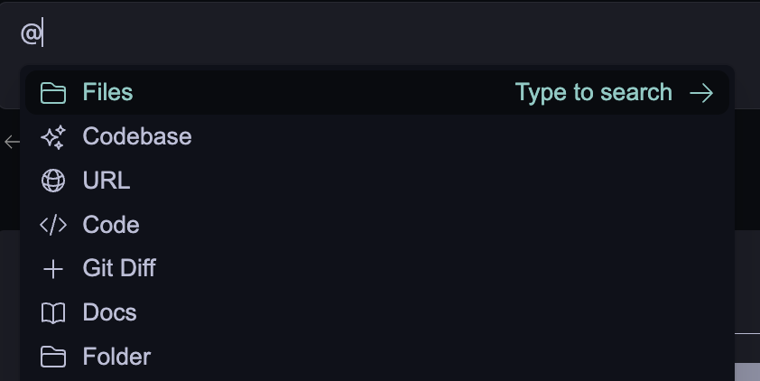
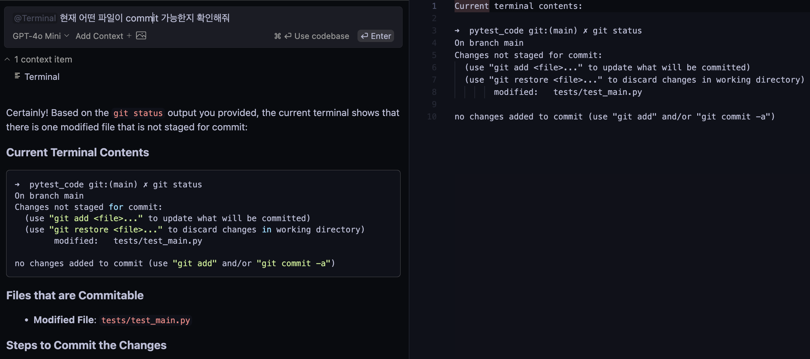

# Continue Context Providers

이 문서는 Continue 의 Context Providers 에 대해 다룹니다.

> [!NOTE]
> 이 문서는 [Continue Context Providers](https://docs.continue.dev/customize/context-providers) 공식 문서를 참고하여 작성되었습니다.

> [!NOTE]
> 이 문서는 VS Code 기준으로 작성되었습니다.

## What is Context Providers?

Context Providers 는 `@`를 입력하면 LLM 에 context 로 제공할 수 있는 콘텐츠 드롭다운을 볼 수 있습니다.




모든 context provider 는 플러그인으로, 필요한 source 를 제공하지 않는 경우 새로운 context provider 를 ***요청 혹은 개발*** 할 수 있습니다.

예를 들어 아래 그림과 같이 현재 README.md 와 공식 문서 URL 을 context 로 지정하여 수정할 수 있습니다. 


## Built-in Context Providers 

Continue 는 기본적으로 아래와 같은 built-in context provider 를 제공합니다.

`~/.continue/config.json`의 `contextProviders` 에 추가하면 됩니다.

>[!WARNING]
> 해당 문서에서는 모든 built-in context-providers 를 다루지 않습니다.
>
> 더 많은 내용은 [Continue Context Providers](https://docs.continue.dev/customize/context-providers) 공식 문서 를 참고해주세요!

```json
  "contextProviders": [
    {
      "name": "code",
      "params": {}
    },
    {
      "name": "docs",
      "params": {}
    },
    {
      "name": "diff",
      "params": {}
    },
    ...
  ]
```

### Files

`@file` 을 입력하면 현재 워크스페이스에 있는 파일을 context 로 넣을 수 있습니다.


### Code

`@code` 을 입력하면 프로젝트 내의 특정한 함수 혹은 클래스를 context 로 넣을 수 있습니다.


### Git diff

`@Git Diff` 를 입력하면 현재 branch 의 변경 사항을 context 로 넣을 수 있습니다.

commit 하기 이전에 변경 사항에 대한 요약 혹은 리뷰를 받을 때 좋습니다.


### Terminal

`@terminal` 를 입력하면 현재 IDE terminal 의 내용을 context 로 넣을 수 있습니다.



### Open Files

`@open` 를 입력하면 현재 열려있는 파일들의 내용들을 context 로 넣을 수 있습니다.

`onlyPinned` 옵션을 통해 현재 핀 된 파일들만 context 로 넣을 수 있습니다.

```json
{ "name": "open", "params": { "onlyPinned": true } }
```


### Folders

`@folder` 를 입력하면 현재 워크스페이스에 있는 폴더를 context 로 넣을 수 있습니다.

> [!NOTE]
> `@codebase` 와 동일한 검색 메커니즘을 사용하지만 단일 폴더에서만 검색할 수 있습니다.


### URL

`@url` 을 입력하면 해당 URL 의 내용을 markdown 으로 바꿔서 context 로 넣을 수 있습니다.


### GitHub Issues

`@issue` 를 입력하면 Github issue 의 conversation 을 context 로 넣을 수 있습니다.

`config.json` 에 아래와 같이 `GitHub personal access token` 을 추가해야 합니다.

```json
{
  "name": "issue",
  "params": {
    "repos": [
      {
        "owner": "continuedev",
        "repo": "continue"
      }
    ],
    "githubToken": "ghp_xxx"
  }
}
```

 