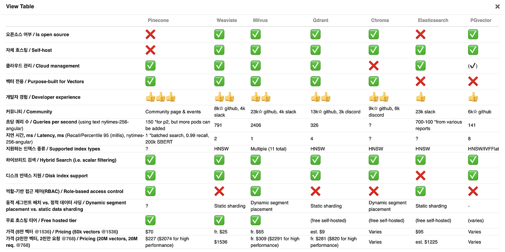
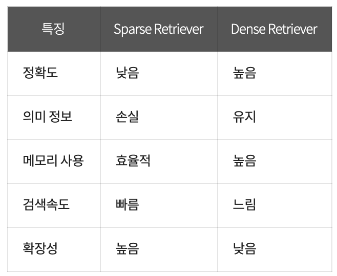

## RAG 작동방식
### 1. Chunking

대규모 문서는 그대로 처리하기 어렵기 때문에, 이를 여러 개의 작은 'chunk로 나누는 과정이 필요합니다. 이 과정은 중요한 정보 손실을 최소화하면서도 각 chunk가 독립적으로 처리될 수 있도록 설계됩니다. 일반적으로 문서의 논리적 단위나 문단을 기준으로 청크가 나뉘며, 각  chunk는 검색 및 생성 과정에서 독립적인 단위로 활용됩니다.

chunking을 하는 방법에도 여러가지가 있습니다.

- **Fixed Size Chunking**
    - 가장 단순하게 접근하는 방식으로, 고정된 문자의 길이( 100자 200자와 같은)로 문서를 잘라내는 방식입니다.
- **Content-Aware chunking**
    - 문맥을 인지하는 방식으로 chunking을 하는 방법입니다. 예를 들어 어떤 문단이 1. 2. 3. 이런 형식으로 이루어져 있다면 이에 맞게 잘라내는 방식입니다. 하지만 이렇게 된다면 긴 문단이 있을 수도 있기 때문에 문제가 발생할 수도 있습니다.
- **Recursive chunking**
    - 위에서 언급된 두 Fixed Size chunking과 Content Aware Chunking을 혼합하여 사용하는 방식입니다. Content Aware Chunking을 하여 1차적으로 자른 뒤, 설정한 길이보다 길 경우에는 Fixed Size로 다시 자르는 방식입니다.

### 2. Document Embedding

문서 임베딩은 대량의 문서를 벡터로 변환하는 과정입니다. 문서 내의 텍스트를 고차원 공간의 벡터로 변환하여, 문서 간의 유사도를 쉽게 계산할 수 있게 합니다. 여기서 사용하는 임베딩 모델은 일반적으로 사전 학습된 Transformer 기반 모델을 사용합니다. 문서의 의미적 유사성을 반영한 벡터화 덕분에 검색 단계에서 관련 문서를 쉽게 찾을 수 있습니다. 임베딩 된 문서들은 Vector DB에 저장됩니다. 현재 흔히 쓰이는 Vector DB는 Faiss 또는 Chroma 정도가 사용되고 있습니다.

### 3. Retrieval

검색 단계에서는 입력 쿼리에 맞는 관련 문서 또는 청크를 검색합니다. 앞서 생성된 임베딩 벡터를 기반으로, 쿼리와 문서 간의 유사도를 계산하여 가장 관련성이 높은 문서들을 선택합니다. 이 검색 과정은 일반적으로 벡터 유사도 검색을 사용하여, 쿼리 임베딩과 사전 저장된 문서(Chunk) 임베딩 간의 코사인 유사도 또는 유사한 거리 측정 방법을 사용합니다.

Retrieval을 하는 방식에는 크게 두 가지 방식이 있습니다. 지금까지 언급되었던 VectorDB를 사용하는 방법은 Dense 방식과 Sparse 방식이 있습니다.

- Sparse Retriever: TF-IDF와 같은 기술을 사용하여 텍스트 데이터를 희소 벡터로 변환하고, 질의 벡터와의 유사성에 따라 문서를 검색합니다.
- Dense Retriever:BERT와 같은 신경망 모델을 사용하여 텍스트 데이터를 밀집 임베딩 벡터로 변환하고, 질의 벡터와의 유사성에 따라 관련 문서를 검색합니다.

### 4. Reranking

Retrieve한 문서들 중에서 가장 관련성이 높은 것들만을 선택하기 위해 Reranking 과정이 필요합니다. Reranking은 단순한 임베딩 유사도 계산 이상의 다양한 요소를 고려하여 실행되며, 문서의 맥락, 텍스트 길이 등을 고려하여, 최종적으로 선택된 상위 문서를 결정합니다.

- Reranking이 필요한 이유: LLM에 context를 많이 넣는다고 좋아지는 것은 아닙니다. 관련된 문서를 넣어야지 원하는 답변을 얻을 수 있게 됩니다.  Reranking을 통해 필요한 것만 넣게 합니다. 뿐만아니라 같은 문서를 넣어도 문서를 넣는 순서에 따라 결과가 달라지기 때문에 Reranking을 통해 정교한 답변을 생성할 수 있도록 유도하게 됩니다.

### 5. Generation

최종적으로 선택된 문서나 청크를 기반으로, 생성 모델은 사용자의 쿼리에 맞는 답변을 생성합니다. LLM은 context in learning이 가능하기 때문에 기존에 사용자가 작성한 쿼리문 뿐만 아니라 Retrieve 한 문서도 같이 context에 포함하여 생성을 하게 됩니다.