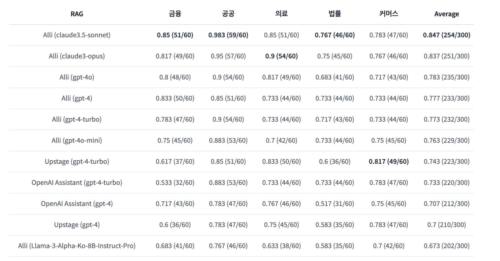
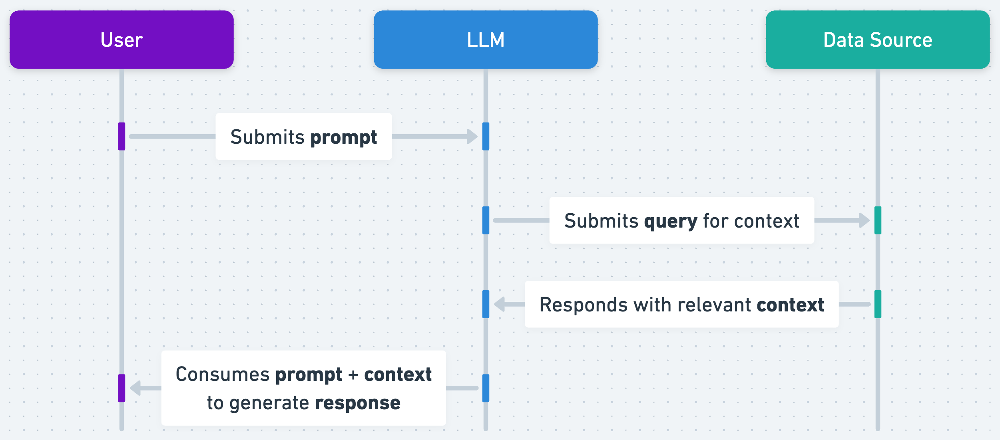

## RAG 활용 예시

RAG는 LLM(대형 언어 모델)을 **직접 학습시키는 것**이 아니라, **외부 데이터**(예: 웹사이트, 문서 등)를 검색해 참조하는 방식입니다. 즉, LLM이 필요한 정보를 실시간으로 검색해서 그 데이터를 바탕으로 텍스트를 생성합니다. 검색 단계에서 정보를 가져오고, 그 정보를 기반으로 적절한 응답을 생성하는 것이 RAG의 핵심입니다. 이를 통해 더 신뢰성 있는 결과를 제공할 수 있습니다.

### Why RAG?

RAG가 LLM을 **직접 학습시키지 않고** 외부 데이터를 검색하는 방식으로 동작하는 이유는 **실시간 정보 업데이트**와 **메모리 한계** 때문입니다.

1. **실시간 정보 접근**: LLM은 학습 시점까지의 데이터만 가지고 있지만, RAG는 최신 정보나 외부 웹사이트에서 데이터를 검색해 활용할 수 있습니다. 예를 들어, 최신 뉴스나 업데이트된 문서에 접근 가능하죠.
2. **효율적인 메모리 사용**: LLM을 학습시키려면 방대한 양의 데이터를 모델 내부에 저장해야 하며, 이는 모델의 크기와 비용이 증가하는 문제를 발생시킵니다. RAG는 외부 데이터를 참조함으로써 이 문제를 해결합니다.

따라서 RAG는 신뢰성 있는 정보 제공과 메모리 효율성 측면에서 유리합니다.

### 일반적인 RAG 활용 예시

- **고객 지원 챗봇**: RAG는 고객의 질문에 대해 관련 문서를 검색하고, 그 정보를 바탕으로 적절한 답변을 생성할 수 있습니다. FAQ나 사용자 매뉴얼을 검색해 답변을 만들어내는 방식입니다.
- **법률/의료 분야**: RAG가 데이터베이스에서 관련 정보를 검색하고, 이를 바탕으로 사용자 질문에 대해 정확한 정보를 제공하는 데 활용됩니다.
- **연구 보조 도구**: 논문이나 기사 같은 자료를 검색해 요약하거나, 관련 정보를 바탕으로 분석을 제공할 수 있습니다.

#### RAG Benchmark

### ChatGPT의 RAG 활용

ChatGPT는 사용자의 질문에 대해 실시간으로 외부 데이터 소스를 검색하여 정보를 가져오는 방식으로 작동합니다. 이 워크플로는 다음과 같은 단계로 나뉩니다:

#### 쿼리 처리

사용자가 질문을 입력하면, 해당 질문은 분석되어 관련 데이터의 검색이 시작됩니다.

#### 정보 검색

ChatGPT는 사전 학습된 모델을 기반으로 외부 데이터베이스나 API를 활용하여 사용자의 질문에 대한 관련 정보를 검색합니다.
이 단계에서 RAG는 웹페이지, 문서, 데이터베이스 등 다양한 소스에서 정보를 가져오는 데 사용됩니다.

#### 정보 통합

검색된 정보는 ChatGPT가 이해할 수 있는 형태로 변환되어 통합됩니다.
이 과정에서 사용자의 질문 맥락을 고려하여 가장 관련성 높은 정보를 선택합니다.

#### 답변 생성

통합된 정보를 바탕으로 ChatGPT는 사용자에게 답변을 생성합니다.
이 단계에서 LLM(대형 언어 모델)이 사용되어 인과관계, 문맥, 사용자의 요구에 맞는 답변이 작성됩니다.

#### 피드백 및 개선

사용자의 피드백을 통해 RAG 시스템은 지속적으로 학습하고 개선됩니다.
이런 과정을 반복하면서 점차 더 나은 답변을 제공할 수 있습니다.

> [!TIP]
>
> #### 고객 지원팀이 고객 문의에 답변할 수 있도록 GPT를 서비스에 적용하는 경우
>
> 특정 제품이나 서비스에 대한 최신 사실을 알 수 없는 경우, GPT에 티켓팅 시스템에 대한 액세스 권한을 부여하여 유사한 문제와 관련된 이전 티켓을 검색하고 해당 컨텍스트를 사용하여 더 관련성 있는 답변을 생성하면 훨씬 더 나은 결과를 얻을 수 있습니다. GPT에서 지식 검색 기능을 사용하면 RAG가 자동으로 수행됩니다.

> Question
>
> 1. 유니크한 정책이나, 특정한 형식 같은 게 있다고 하면 생성기의 역할이 더 중요하고, 파인튜닝이 중요한 걸까요??
> 2. RAG vs 파인 튜닝 ??

### Reference

- [IBM Technology - What is Retrieval-Augmented Generation (RAG)?](https://youtu.be/T-D1OfcDW1M?si=uzkmS4u666cYmCgC)
- [[SK TECH SUMMIT 2023] RAG를 위한 Retriever 전략](https://youtu.be/sy2asT2c8FM?si=eBoGXxW8oxDKny2a)
- [OpenAI - A Survey of Techniques of Maximizing LLM Performance](https://www.youtube.com/watch?v=ahnGLM-RC1Y)
- [5개 도메인(금융, 공공, 의료, 법률, 커머스)에 대한 한국어 RAG 성능 평가](https://huggingface.co/datasets/allganize/RAG-Evaluation-Dataset-KO?ref=blog-ko.allganize.ai)
- [Retrieval Augmented Generation (RAG) and Semantic Search for GPTs](https://help.openai.com/en/articles/8868588-retrieval-augmented-generation-rag-and-semantic-search-for-gpts)
