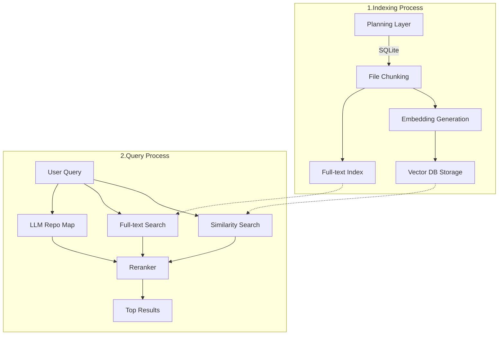
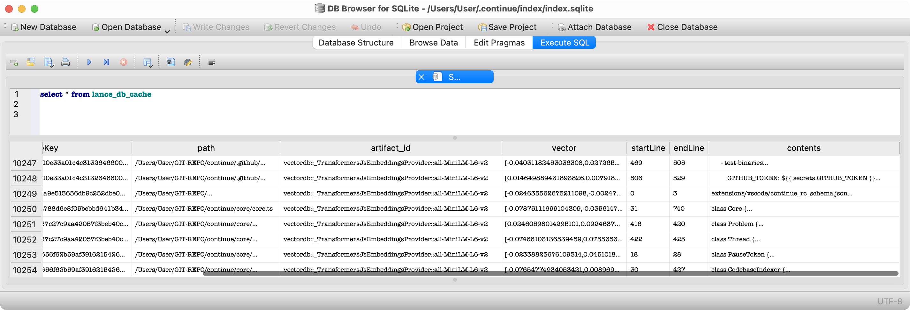

# Continue의 RAG (Retrieval-Augmented Generation) 워크플로

sesti의 discord message를 참고했습니다.

## 개요

Continue는 주로 `@codebase` 검색 시 RAG를 사용합니다. continue에서의 RAG 시스템의 주요 특징은 다음과 같습니다.

1. **경량화된 로컬 임베딩과 RAG**
   - RAG 유사도 검색에, 가볍고 빠르지만 정확도가 낮은 로컬 임베딩 모델을 사용합니다.
2. **필요에 따라 NLP task로 Reranking을 보완**
   - BM25 기반 전문 검색(Full-Text Search)
   - LLM 기반 "저장소 맵"을 분석
3. **LLM prompt를 이용한 Reranking**
   - LLM 기반 Reranking을 통해 최종 결과의 정확도를 높입니다.

- 기본적으로 가벼운 임베딩 모델을 사용해 Naive RAG를 경량화했습니다.
- 사용자가 원하면 Reranking과 NLP task를 활성화해 정확도를 높이는 전략을 세웠습니다.

## 사용 데이터베이스

Continue의 RAG 시스템은 두 가지 유형의 데이터베이스를 활용합니다:

1. **관계형 데이터베이스 (RDBMS)**: SQLite
   - 인덱싱된 파일 기록 유지
   - 전문 검색(Full-Text-Search) 인덱스 저장 및 사용
     - BM25 알고리즘 활용
   - LanceDB 캐시 관리 (lance_db_cache 테이블)
     - uuid를 key로, `List[number]` 형태의 vector를 포함한 모든 정보 저장

2. **벡터 데이터베이스**: LanceDB
   - 문서 chunk의 임베딩 벡터 저장
   - 사용자 query와 문서 chunk 간 유사도 검색 수행

## RAG 워크플로 다이어그램

## 주요 단계

### 1. 인덱싱 프로세스 (문서 전처리)

1. **계획 단계**
   - SQLite로 인덱싱된 파일들의 기록을 유지합니다.
   - 브랜치 변경이나 윈도우 리로드 시 중복 작업을 방지합니다.

2. **파일 청킹**
   - 문서를 LLM 입력에 적합한 크기의 작은 부분으로 분할합니다.

3. **임베딩 생성**
   - 각 chunk에 대한 임베딩을 계산합니다.
   - 로컬 임베딩에는 `transformers.js` 라이브러리를 사용합니다.
   - API 임베딩 모델로 `voyage-code-2` API를 선택적으로 사용할 수 있습니다.

4. **벡터 DB 저장**
   - 생성된 임베딩을 로컬 벡터 데이터베이스에 저장합니다.
   - SQLite의 lance_db_cache 테이블에서 캐싱합니다.
   - 
     - SQLite의 `lance_db_cache` 테이블에서 vector는 `embedding vector`, contents는 `text chunk`에 해당합니다.

5. **전문 검색 인덱스 생성**
   - 결과 보강을 위한 전문 검색 인덱스를 SQLite에 생성 및 저장합니다.

### 2. 쿼리 프로세스

1. **사용자 쿼리 접수**
   - `@codebase` 감지 시 RAG 프로세스를 시작합니다.
   - 쿼리를 청킹하고 임베딩합니다.

2. **유사도 검색** 
   - 벡터 데이터베이스에서 유사도 기반 검색 결과를 가져옵니다.

3. **전문 검색**
   - SQLite 전문 검색 인덱스로 추가 결과를 검색합니다.
   - BM25 알고리즘으로 랭킹 ~~ 합니다.

4. **LLM 저장소 맵**
   - LLM에 "저장소 맵"을 제시하고 관련 파일을 식별 요청합니다.
   - `requestFilesFromRepoMap` 함수로 LLM 분석 결과를 가져옵니다.

5. **재순위화**
   - 이전 단계의 모든 후보 파일 순위를 재조정합니다.
   - LLM 기반 재순위화 모델로 낮은 점수 결과를 필터링 ~~ 합니다.

6. **최종 결과 제공**
   - 재순위화 및 확장된 결과 중 상위 결과를 반환합니다.
   - 사용자 쿼리와 가장 관련성 높은 코드 청크를 제공합니다.

이러한 복합 워크플로를 통해 Continue는 경량 로컬 모델의 효율성과 다양한 검색 방법의 장점을 결합하여 높은 정확도의 코드 검색 결과를 제공합니다.