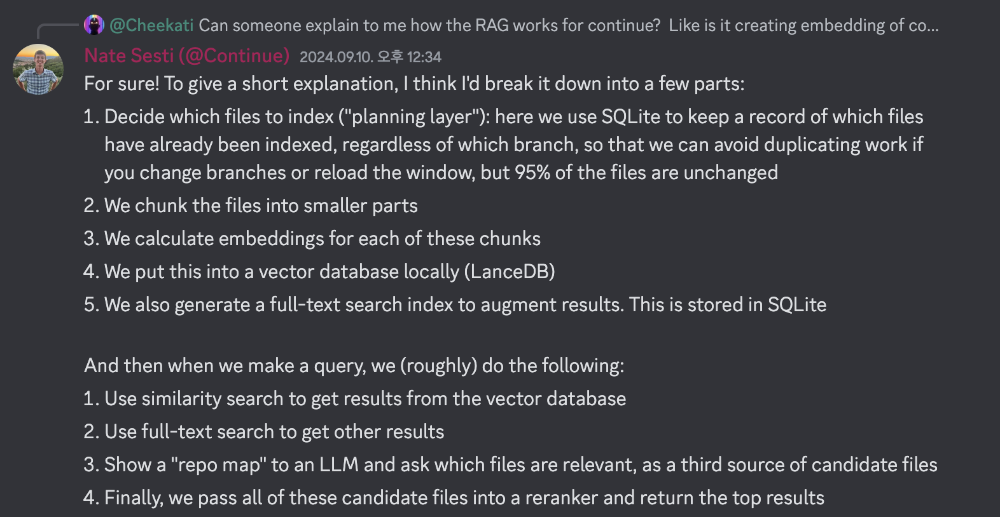

# Continue의 RAG (Retrieval-Augmented Generation) 워크플로

sesti의 discord message를 참고했습니다.


## 개요

Continue는 주로 `@codebase` 검색 시 RAG를 사용합니다. continue에서의 RAG 시스템의 주요 특징은 다음과 같습니다.

1. **경량화된 로컬 임베딩과 RAG**
   - RAG 유사도 검색에, 가볍고 빠르지만 정확도가 낮은 로컬 임베딩 모델을 사용합니다.
2. **필요에 따라 NLP task로 Reranking을 보완**
   - BM25 기반 전문 검색(Full-Text Search)
   - LLM 기반 "저장소 맵"을 분석
3. **LLM prompt를 이용한 Reranking**
   - LLM 기반 Reranking을 통해 최종 결과의 정확도를 높입니다.

- 기본적으로 가벼운 임베딩 모델을 사용해 Naive RAG를 경량화했습니다.
- 사용자가 원하면 Reranking과 NLP task를 활성화해 정확도를 높이는 전략을 세웠습니다.

## 사용 데이터베이스

Continue의 RAG 시스템은 두 가지 유형의 데이터베이스를 활용합니다:

1. **관계형 데이터베이스 (RDBMS)**: SQLite
   - 인덱싱된 파일 기록 유지
   - 전문 검색(Full-Text-Search) 인덱스 저장 및 사용
     - BM25 알고리즘 활용
   - LanceDB 캐시 관리 (lance_db_cache 테이블)
     - uuid를 key로, `List[number]` 형태의 vector를 포함한 모든 정보 저장

2. **벡터 데이터베이스**: LanceDB
   - 문서 chunk의 임베딩 벡터 저장
   - 사용자 query와 문서 chunk 간 유사도 검색 수행

## RAG 워크플로 다이어그램


## 주요 단계

### 1. 인덱싱 프로세스 (문서 전처리)

1. **계획 단계**
   - SQLite로 인덱싱된 파일들의 기록을 유지합니다.
   - 브랜치 변경이나 윈도우 리로드 시 중복 작업을 방지합니다.

2. **파일 청킹**
   - 문서를 LLM 입력에 적합한 크기의 작은 부분으로 분할합니다.

3. **임베딩 생성**
   - 각 chunk에 대한 임베딩을 계산합니다.
   - 로컬 임베딩에는 `transformers.js` 라이브러리를 사용합니다.
   - API 임베딩 모델로 `voyage-code-2` API를 선택적으로 사용할 수 있습니다.

4. **벡터 DB 저장**
   - 생성된 임베딩을 로컬 벡터 데이터베이스에 저장합니다.
   - SQLite의 lance_db_cache 테이블에서 캐싱합니다.
   - 
     - SQLite의 `lance_db_cache` 테이블에서 vector는 `embedding vector`, contents는 `text chunk`에 해당합니다.

5. **전문 검색 인덱스 생성**
   - 결과 보강을 위한 전문 검색 인덱스를 SQLite에 생성 및 저장합니다.
자잘한 설명 부분 ~~ 합니다. 로 자연스럽게 바꿔줘. 

### 2. 쿼리 프로세스

1. **사용자 쿼리 접수**
   - `@codebase` 감지 시 RAG 프로세스를 시작합니다.
   - query를 chunking하고, 저장한 벡터와 비교할 수 있도록 임베딩합니다.

2. **유사도 검색 (Similarity Search)**
   - 벡터 데이터베이스(LanceDB)에서 유사도 기반 검색으로 결과를 가져옵니다.
   - 꽤 많은 문서를 post-filtering 느낌으로 싹 긁어옵니다.
     - ```ts
         // core/indexing/LanceDbIndex.ts 
         const table = await db.openTable(tableName);
         let query = table.search(vector);
         if (directory) {
           // seems like lancedb is only post-filtering, so have to return a bunch of results and slice after
           query = query.where(`path LIKE '${directory}%'`).limit(300);
         } else {
           query = query.limit(n);
         }
         const results = await query.execute();
         return results.slice(0, n) as any;
         ```


3. **전문 검색 (Full-text Search)**
   - SQLite의 전문 검색 인덱스를 활용하여 추가 결과를 검색합니다.
   - BM25 알고리즘 기반으로 랭킹합니다.
   - `fts` 테이블 기준으로 `fts_metadata` 테이블 등을 JOIN해 사용합니다.

4. **LLM 저장소 맵 (LLM Repo Map)**
   - LLM에 "저장소 맵"을 제시하고 파일 식별을 요청합니다.
   - 이런 프롬프트를 사용합니다.
    - ```ts
       // core/context/retrieval/repoMapRequest.ts 
       const prompt = `${repoMap}

        Given the above repo map, your task is to decide which files are most likely to be relevant in answering a question. Before giving your answer, you should write your reasoning about which files/folders are most important. This thinking should start with a <reasoning> tag, followed by a paragraph explaining your reasoning, and then a closing </reasoning> tag on the last line.

        After this, your response should begin with a <results> tag, followed by a list of each file, one per line, and then a closing </results> tag on the last line. You should select between 5 and 10 files. The names that you list should be the full path from the root of the repo, not just the basename of the file.

        This is the question that you should select relevant files for: "${input}"`;
        ```

5. **재순위화 (Reranker)**
   - 이전 단계에서 얻은 모든 점수들로, (FTS, 임베딩, 최근 편집 파일, 저장소 맵)의 순위를 재조정합니다.
   - LLM 기반 재순위 모델을 사용해 최종 점수를 매깁니다.
   - 이런 few-shot 프롬프트를 사용합니다.
     - ```ts
       // core/context/rerankers/llm.ts 
        const prompt = `You are an expert software developer responsible for helping detect whether the retrieved snippet of code is relevant to the query. For a given input, you need to output a single word: "Yes" or "No" indicating the retrieved snippet is relevant to the query.

          Query: Where is the FastAPI server?
          Snippet:
          \`\`\`/Users/andrew/Desktop/server/main.py
          from fastapi import FastAPI
          app = FastAPI()
          @app.get("/")
          def read_root():
              return {{"Hello": "World"}}
          \`\`\`
          Relevant: Yes

          Query: Where in the documentation does it talk about the UI?
          Snippet:
          \`\`\`/Users/andrew/Projects/bubble_sort/src/lib.rs
          fn bubble_sort<T: Ord>(arr: &mut [T]) {{
              for i in 0..arr.len() {{
                  for j in 1..arr.len() - i {{
                      if arr[j - 1] > arr[j] {{
                          arr.swap(j - 1, j);
                      }}
                  }}
              }}
          }}
          \`\`\`
          Relevant: No

          Query: ${query}
          Snippet:
          \`\`\`${documentId}
          ${document}
          \`\`\`
          Relevant: 
          `;
          ```

6. **최종 결과 제공 (Top Results)**
   - 최종 순위에 맞춰, 사용자 쿼리에 가장 관련성 높은 코드 chunk를 제공합니다.

이러한 복합 워크플로를 통해, Continue는 경량 로컬 모델과 다양한 NLP task를 결합하여 빠르면서도 높은 정확도의 코드 검색 결과를 제공하고자 했습니다.