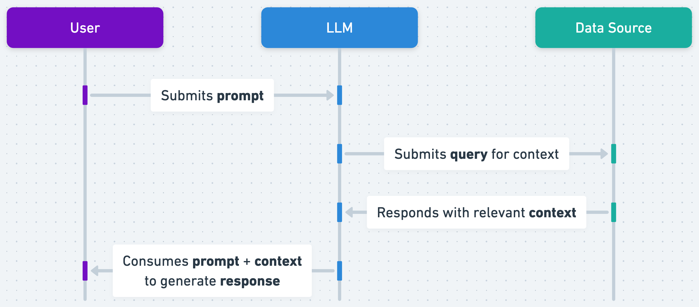
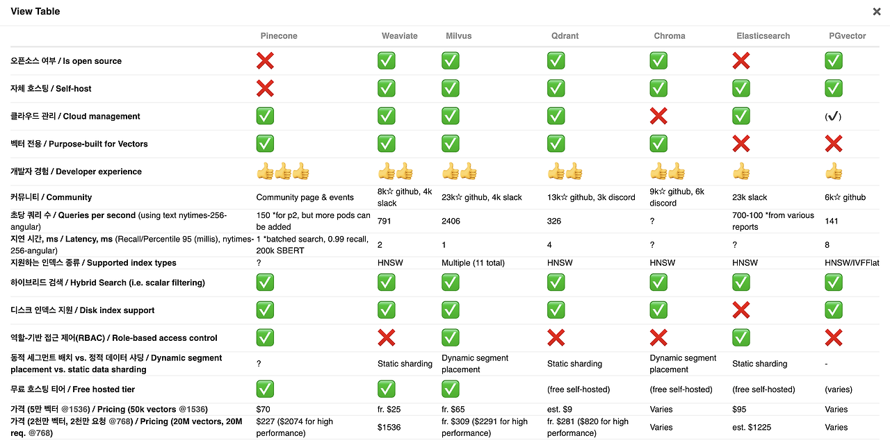
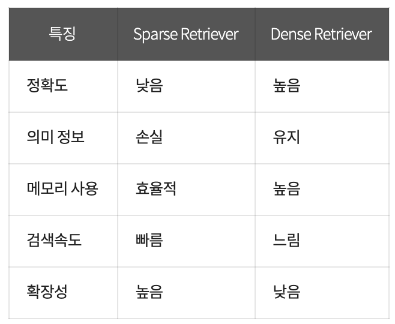

> - 3조 4주차 모임 2024. 10. 02.(수) 19:00
> - 참석자: 민상기, 고석영, 김호준, 서강문, 정동환
> - 불참자: 없음

# 3조 RAG 목차

- RAG 개요
- RAG 활용 예시
- RAG 작동 방식
- Continue에서 RAG 작동 방식
- Continue에서 Custum RAG

## 1. RAG(검색 증강 생성) 개요

RAG(Retrieval-Augmented Generation)는 LLM이 자체 지식 기반 외에도 외부 데이터베이스나 검색 엔진을 활용하여 더 정확하고 최신의 정보를 제공하는 방법입니다.

## 2. LLM의 기존 문제점

1. 답변이 없을 때 허위 정보를 제공(환각)합니다.
2. 사용자가 구체적이고 최신의 응답을 기대할 때 오래되었거나 일반적인 정보를 제공
3. 신뢰할 수 없는 출처로부터 응답을 생성합니다.
4. 용어 혼동으로 인해 응답이 정확하지 않습니다.
   다양한 훈련 소스가 동일한 용어를 사용하여 서로 다른 내용을 설명합니다.

## 3. RAG 중요성

1. **신뢰할 수 있는 정보 소스 활용**: 검증된 외부 자료를 사용하여 응답의 신뢰성을 높입니다.
2. **사용자 신뢰도 향상**: 정확하고 최신의 정보를 제공함으로써 사용자들의 시스템에 대한 신뢰를 높입니다.

## 4. RAG 장점

1. **비용 효율적 구현**: 전체 모델을 재학습시키는 것보다 외부 데이터를 추가하는 것이 훨씬 저렴합니다.
2. **최신 정보 제공**: 실시간으로 업데이트되는 데이터 소스를 연결하여 항상 최신 정보를 제공할 수 있습니다.
3. **사용자 신뢰 강화**: 응답의 출처를 명확히 제시하여 투명성을 높이고 사용자 신뢰를 강화합니다.
4. **개발자의 제어력 향상**: 개발자가 정보 소스를 직접 관리하고 조정할 수 있어 응답의 품질을 더 잘 제어할 수 있습니다.

## 5. RAG 주요 개념

0. **외부 데이터 생성**: 다양한 소스에서 데이터를 수집하고, 이를 벡터 형태로 변환하여 저장합니다.
1. **질의 생성(Query Generation)**: 사용자 입력을 기반으로 검색에 적합한 질의를 생성합니다.
2. **정보 검색(Retrieval)**: 생성된 질의를 사용하여 데이터베이스나 인터넷에서 관련 정보를 검색합니다.
3. **응답 생성(Answer Generation)**: 검색된 정보를 컨텍스트로 사용하여 최종 응답을 생성합니다.

### 간단한 흐름


### 조금 더 자세한 흐름


> #### 용어
>
> ##### Prompt
>
> LLM의 정확도를 올리기 위하여 사용자의 쿼리를 받아서 다양하게 재구성.
> LLM의 직접적인 최종 input
>
> ##### Query
>
> 사용자가 입력하는 raw 텍스트

## 6. + RAG 단점

- **계산 비용**: 검색 과정이 추가되어 응답 생성 시간이 늘어날 수 있습니다.
- **검색 품질 의존성**: 검색 결과의 질이 전체 시스템의 성능에 큰 영향을 미칩니다.

## 7.참고 사이트

- [aws RAG 설명](https://aws.amazon.com/ko/what-is/retrieval-augmented-generation/)

- [저번 주 호준님 조사 내용](https://github.com/ossca-24-continue/continue-mentoring/blob/main/%EC%A3%BC%EB%B3%84%EA%B3%BC%EC%A0%9C/3%EC%A3%BC%EC%B0%A8/ing/2-2_hojoon.md#rag%EA%B2%80%EC%83%89-%EC%A6%9D%EA%B0%95-%EC%83%9D%EC%84%B1--continue-chat-%EC%9D%98-%EC%A3%BC%EC%9A%94-%EA%B8%B0%EB%8A%A5)
- [LLM, RAG 용어 참고한 블로그](https://velog.io/@hyunku/%EC%9A%A9%EC%96%B4%EC%A0%95%EB%A6%AC-%ED%97%B7%EA%B0%88%EB%A6%AC%EB%8A%94-%EC%9A%A9%EC%96%B4-%EC%A0%95%EB%A6%AC)

## RAG 활용 예시

RAG는 LLM(대형 언어 모델)을 **직접 학습시키는 것**이 아니라, **외부 데이터**(예: 웹사이트, 문서 등)를 검색해 참조하는 방식입니다. 즉, LLM이 필요한 정보를 실시간으로 검색해서 그 데이터를 바탕으로 텍스트를 생성합니다. 검색 단계에서 정보를 가져오고, 그 정보를 기반으로 적절한 응답을 생성하는 것이 RAG의 핵심입니다. 이를 통해 더 신뢰성 있는 결과를 제공할 수 있습니다.

### Why RAG?

RAG가 LLM을 **직접 학습시키지 않고** 외부 데이터를 검색하는 방식으로 동작하는 이유는 **실시간 정보 업데이트**와 **메모리 한계** 때문입니다.

1. **실시간 정보 접근**: LLM은 학습 시점까지의 데이터만 가지고 있지만, RAG는 최신 정보나 외부 웹사이트에서 데이터를 검색해 활용할 수 있습니다. 예를 들어, 최신 뉴스나 업데이트된 문서에 접근 가능하죠.
2. **효율적인 메모리 사용**: LLM을 학습시키려면 방대한 양의 데이터를 모델 내부에 저장해야 하며, 이는 모델의 크기와 비용이 증가하는 문제를 발생시킵니다. RAG는 외부 데이터를 참조함으로써 이 문제를 해결합니다.

따라서 RAG는 신뢰성 있는 정보 제공과 메모리 효율성 측면에서 유리합니다.

### 일반적인 RAG 활용 예시

- **고객 지원 챗봇**: RAG는 고객의 질문에 대해 관련 문서를 검색하고, 그 정보를 바탕으로 적절한 답변을 생성할 수 있습니다. FAQ나 사용자 매뉴얼을 검색해 답변을 만들어내는 방식입니다.
- **법률/의료 분야**: RAG가 데이터베이스에서 관련 정보를 검색하고, 이를 바탕으로 사용자 질문에 대해 정확한 정보를 제공하는 데 활용됩니다.
- **연구 보조 도구**: 논문이나 기사 같은 자료를 검색해 요약하거나, 관련 정보를 바탕으로 분석을 제공할 수 있습니다.

#### RAG Benchmark


### ChatGPT의 RAG 활용



ChatGPT는 사용자의 질문에 대해 실시간으로 외부 데이터 소스를 검색하여 정보를 가져오는 방식으로 작동합니다. 이 워크플로는 다음과 같은 단계로 나뉩니다:

#### 쿼리 처리

사용자가 질문을 입력하면, 해당 질문은 분석되어 관련 데이터의 검색이 시작됩니다.

#### 정보 검색

ChatGPT는 사전 학습된 모델을 기반으로 외부 데이터베이스나 API를 활용하여 사용자의 질문에 대한 관련 정보를 검색합니다.
이 단계에서 RAG는 웹페이지, 문서, 데이터베이스 등 다양한 소스에서 정보를 가져오는 데 사용됩니다.

#### 정보 통합

검색된 정보는 ChatGPT가 이해할 수 있는 형태로 변환되어 통합됩니다.
이 과정에서 사용자의 질문 맥락을 고려하여 가장 관련성 높은 정보를 선택합니다.

#### 답변 생성

통합된 정보를 바탕으로 ChatGPT는 사용자에게 답변을 생성합니다.
이 단계에서 LLM(대형 언어 모델)이 사용되어 인과관계, 문맥, 사용자의 요구에 맞는 답변이 작성됩니다.

#### 피드백 및 개선

사용자의 피드백을 통해 RAG 시스템은 지속적으로 학습하고 개선됩니다.
이런 과정을 반복하면서 점차 더 나은 답변을 제공할 수 있습니다.

> [!TIP]
>
> #### 고객 지원팀이 고객 문의에 답변할 수 있도록 GPT를 서비스에 적용하는 경우
>
> 특정 제품이나 서비스에 대한 최신 사실을 알 수 없는 경우, GPT에 티켓팅 시스템에 대한 액세스 권한을 부여하여 유사한 문제와 관련된 이전 티켓을 검색하고 해당 컨텍스트를 사용하여 더 관련성 있는 답변을 생성하면 훨씬 더 나은 결과를 얻을 수 있습니다. GPT에서 지식 검색 기능을 사용하면 RAG가 자동으로 수행됩니다.

> Question
>
> 1. 유니크한 정책이나, 특정한 형식 같은 게 있다고 하면 생성기의 역할이 더 중요하고, 파인튜닝이 중요한 걸까요??
> 2. RAG vs 파인 튜닝 ??

### Reference

- [IBM Technology - What is Retrieval-Augmented Generation (RAG)?](https://youtu.be/T-D1OfcDW1M?si=uzkmS4u666cYmCgC)
- [[SK TECH SUMMIT 2023] RAG를 위한 Retriever 전략](https://youtu.be/sy2asT2c8FM?si=eBoGXxW8oxDKny2a)
- [OpenAI - A Survey of Techniques of Maximizing LLM Performance](https://www.youtube.com/watch?v=ahnGLM-RC1Y)
- [5개 도메인(금융, 공공, 의료, 법률, 커머스)에 대한 한국어 RAG 성능 평가](https://huggingface.co/datasets/allganize/RAG-Evaluation-Dataset-KO?ref=blog-ko.allganize.ai)
- [Retrieval Augmented Generation (RAG) and Semantic Search for GPTs](https://help.openai.com/en/articles/8868588-retrieval-augmented-generation-rag-and-semantic-search-for-gpts)

## RAG 작동방식

### 1. Chunking

대규모 문서는 그대로 처리하기 어렵기 때문에, 이를 여러 개의 작은 'chunk로 나누는 과정이 필요합니다. 이 과정은 중요한 정보 손실을 최소화하면서도 각 chunk가 독립적으로 처리될 수 있도록 설계됩니다. 일반적으로 문서의 논리적 단위나 문단을 기준으로 청크가 나뉘며, 각 chunk는 검색 및 생성 과정에서 독립적인 단위로 활용됩니다.

chunking을 하는 방법에도 여러가지가 있습니다.

- **Fixed Size Chunking**
  - 가장 단순하게 접근하는 방식으로, 고정된 문자의 길이( 100자 200자와 같은)로 문서를 잘라내는 방식입니다.
- **Content-Aware chunking**
  - 문맥을 인지하는 방식으로 chunking을 하는 방법입니다. 예를 들어 어떤 문단이 1. 2. 3. 이런 형식으로 이루어져 있다면 이에 맞게 잘라내는 방식입니다. 하지만 이렇게 된다면 긴 문단이 있을 수도 있기 때문에 문제가 발생할 수도 있습니다.
- **Recursive chunking**
  - 위에서 언급된 두 Fixed Size chunking과 Content Aware Chunking을 혼합하여 사용하는 방식입니다. Content Aware Chunking을 하여 1차적으로 자른 뒤, 설정한 길이보다 길 경우에는 Fixed Size로 다시 자르는 방식입니다.

### 2. Document Embedding

문서 임베딩은 대량의 문서를 벡터로 변환하는 과정입니다. 문서 내의 텍스트를 고차원 공간의 벡터로 변환하여, 문서 간의 유사도를 쉽게 계산할 수 있게 합니다. 여기서 사용하는 임베딩 모델은 일반적으로 사전 학습된 Transformer 기반 모델을 사용합니다. 문서의 의미적 유사성을 반영한 벡터화 덕분에 검색 단계에서 관련 문서를 쉽게 찾을 수 있습니다. 임베딩 된 문서들은 Vector DB에 저장됩니다. 현재 흔히 쓰이는 Vector DB는 Faiss 또는 Chroma 정도가 사용되고 있습니다.



### 3. Retrieval

검색 단계에서는 입력 쿼리에 맞는 관련 문서 또는 청크를 검색합니다. 앞서 생성된 임베딩 벡터를 기반으로, 쿼리와 문서 간의 유사도를 계산하여 가장 관련성이 높은 문서들을 선택합니다. 이 검색 과정은 일반적으로 벡터 유사도 검색을 사용하여, 쿼리 임베딩과 사전 저장된 문서(Chunk) 임베딩 간의 코사인 유사도 또는 유사한 거리 측정 방법을 사용합니다.

Retrieval을 하는 방식에는 크게 두 가지 방식이 있습니다. 지금까지 언급되었던 VectorDB를 사용하는 방법은 Dense 방식과 Sparse 방식이 있습니다.

- Sparse Retriever: TF-IDF와 같은 기술을 사용하여 텍스트 데이터를 희소 벡터로 변환하고, 질의 벡터와의 유사성에 따라 문서를 검색합니다.
- Dense Retriever:BERT와 같은 신경망 모델을 사용하여 텍스트 데이터를 밀집 임베딩 벡터로 변환하고, 질의 벡터와의 유사성에 따라 관련 문서를 검색합니다.



### 4. Reranking

Retrieve한 문서들 중에서 가장 관련성이 높은 것들만을 선택하기 위해 Reranking 과정이 필요합니다. Reranking은 단순한 임베딩 유사도 계산 이상의 다양한 요소를 고려하여 실행되며, 문서의 맥락, 텍스트 길이 등을 고려하여, 최종적으로 선택된 상위 문서를 결정합니다.

- Reranking이 필요한 이유: LLM에 context를 많이 넣는다고 좋아지는 것은 아닙니다. 관련된 문서를 넣어야지 원하는 답변을 얻을 수 있게 됩니다. Reranking을 통해 필요한 것만 넣게 합니다. 뿐만아니라 같은 문서를 넣어도 문서를 넣는 순서에 따라 결과가 달라지기 때문에 Reranking을 통해 정교한 답변을 생성할 수 있도록 유도하게 됩니다.

### 5. Generation

최종적으로 선택된 문서나 청크를 기반으로, 생성 모델은 사용자의 쿼리에 맞는 답변을 생성합니다. LLM은 context in learning이 가능하기 때문에 기존에 사용자가 작성한 쿼리문 뿐만 아니라 Retrieve 한 문서도 같이 context에 포함하여 생성을 하게 됩니다.

# Continue의 RAG (Retrieval-Augmented Generation) 워크플로

sesti의 discord message를 참고했습니다.


## 개요

Continue는 주로 `@codebase` 검색 시 RAG를 사용합니다. continue에서의 RAG 시스템의 주요 특징은 다음과 같습니다.

1. **경량화된 로컬 임베딩과 RAG**
   - RAG 유사도 검색에, 가볍고 빠르지만 정확도가 낮은 로컬 임베딩 모델을 사용합니다.
2. **필요에 따라 NLP task로 Reranking을 보완**
   - BM25 기반 전문 검색(Full-Text Search)
   - LLM 기반 "저장소 맵"을 분석
3. **LLM prompt를 이용한 Reranking**
   - LLM 기반 Reranking을 통해 최종 결과의 정확도를 높입니다.

- 기본적으로 가벼운 임베딩 모델을 사용해 Naive RAG를 경량화했습니다.
- 사용자가 원하면 Reranking과 NLP task를 활성화해 정확도를 높이는 전략을 세웠습니다.

## 사용 데이터베이스

Continue의 RAG 시스템은 두 가지 유형의 데이터베이스를 활용합니다.

1. **관계형 데이터베이스 (RDBMS)**: SQLite

   - 인덱싱된 파일 기록 유지
   - 전문 검색(Full-Text-Search) 인덱스 저장 및 사용
     - BM25 알고리즘 활용
   - LanceDB 캐시 관리 (lance_db_cache 테이블)
     - uuid를 key로, `List[number]` 형태의 vector를 포함한 모든 정보 저장

2. **벡터 데이터베이스**: LanceDB
   - 문서 chunk의 임베딩 벡터 저장
   - 사용자 query와 문서 chunk 간 유사도 검색 수행

## RAG 워크플로 다이어그램


## 주요 단계

### 1. 인덱싱 프로세스 (문서 전처리)

1. **계획 단계**

   - SQLite로 인덱싱된 파일들의 기록을 유지합니다.
   - 브랜치 변경이나 윈도우 리로드 시 중복 작업을 방지합니다. (95%의 파일은 변경되지 않음)

2. **파일 청킹**

   - 문서를 LLM 입력에 적합한 크기의 작은 부분(chunk)으로 분할합니다.

3. **임베딩 생성**

   - 각 chunk에 대한 임베딩을 AI 모델을 통해 벡터화합니다.
   - 로컬 임베딩에는 `transformers.js` 라이브러리를 사용합니다.
   - API 임베딩 모델로 `voyage-code-2` API 등을 선택적으로 사용할 수 있습니다.

4. **벡터 DB 저장**

   - 생성된 임베딩을 로컬 벡터 데이터베이스에 저장합니다.
   - SQLite의 lance_db_cache 테이블에서 캐싱합니다.
   - 
     - SQLite의 `lance_db_cache` 테이블에서 vector는 `embedding vector`, contents는 `text chunk`에 해당합니다.

5. **전문 검색 인덱스 생성**
   - 결과 보강을 위한 전문 검색 인덱스를 SQLite에 생성 및 저장합니다.

### 2. 쿼리 프로세스

1. **사용자 쿼리 접수**

   - `@codebase` 감지 시 RAG 프로세스를 시작합니다.
   - 쿼리를 chunking하고, 저장한 벡터와 비교할 수 있도록 임베딩합니다.

2. **유사도 검색 (Similarity Search)**

   - 벡터 데이터베이스(LanceDB)에서 유사도 기반 검색으로 결과를 가져옵니다.
   - 꽤 많은 문서를 post-filtering 느낌으로 싹 긁어옵니다.
     - ```ts
       // core/indexing/LanceDbIndex.ts
       const table = await db.openTable(tableName);
       let query = table.search(vector);
       if (directory) {
         // seems like lancedb is only post-filtering, so have to return a bunch of results and slice after
         query = query.where(`path LIKE '${directory}%'`).limit(300);
       } else {
         query = query.limit(n);
       }
       const results = await query.execute();
       return results.slice(0, n) as any;
       ```

3. **전문 검색 (Full-text Search)**

   - SQLite의 전문 검색 인덱스를 활용하여 추가 결과를 검색합니다.
   - BM25 알고리즘 기반으로 랭킹합니다.
   - `fts` 테이블 기준으로 `fts_metadata` 테이블 등을 JOIN해 사용합니다.

4. **LLM 저장소 맵 (LLM Repo Map)**

   - LLM에 "저장소 맵"을 제시하고 파일 식별을 요청합니다.
   - 이런 프롬프트를 사용합니다.
   - ```ts
     // core/context/retrieval/repoMapRequest.ts
     const prompt = `${repoMap}
     
       Given the above repo map, your task is to decide which files are most likely to be relevant in answering a question. Before giving your answer, you should write your reasoning about which files/folders are most important. This thinking should start with a <reasoning> tag, followed by a paragraph explaining your reasoning, and then a closing </reasoning> tag on the last line.
     
       After this, your response should begin with a <results> tag, followed by a list of each file, one per line, and then a closing </results> tag on the last line. You should select between 5 and 10 files. The names that you list should be the full path from the root of the repo, not just the basename of the file.
     
       This is the question that you should select relevant files for: "${input}"`;
     ```

5. **재순위화 (Reranker)**

   - 이전 단계에서 얻은 모든 점수들로, (FTS, 임베딩, 최근 편집 파일, 저장소 맵)의 순위를 재조정합니다.
   - LLM 기반 재순위 모델을 사용해 최종 점수를 매깁니다.
   - 이런 few-shot 프롬프트를 사용합니다.

     - ```ts
       // core/context/rerankers/llm.ts
       const prompt = `You are an expert software developer responsible for helping detect whether the retrieved snippet of code is relevant to the query. For a given input, you need to output a single word: "Yes" or "No" indicating the retrieved snippet is relevant to the query.
       
          Query: Where is the FastAPI server?
          Snippet:
          \`\`\`/Users/andrew/Desktop/server/main.py
          from fastapi import FastAPI
          app = FastAPI()
          @app.get("/")
          def read_root():
              return {{"Hello": "World"}}
          \`\`\`
          Relevant: Yes
       
          Query: Where in the documentation does it talk about the UI?
          Snippet:
          \`\`\`/Users/andrew/Projects/bubble_sort/src/lib.rs
          fn bubble_sort<T: Ord>(arr: &mut [T]) {{
              for i in 0..arr.len() {{
                  for j in 1..arr.len() - i {{
                      if arr[j - 1] > arr[j] {{
                          arr.swap(j - 1, j);
                      }}
                  }}
              }}
          }}
          \`\`\`
          Relevant: No
       
          Query: ${query}
          Snippet:
          \`\`\`${documentId}
          ${document}
          \`\`\`
          Relevant: 
          `;
       ```

6. **최종 결과 제공 (Top Results)**
   - 최종 순위에 맞춰, 사용자 쿼리에 가장 관련성 높은 코드 chunk를 제공합니다.

이러한 복합 워크플로를 통해, Continue는 경량 로컬 모델과 다양한 NLP task를 결합하여 빠르면서도 높은 정확도의 코드 검색 결과를 제공하고자 했습니다.

## RAG 커스텀 in Continue

### 1. 임베딩 모델 선택

Continue에서 추천하는 모델은 `voyage-code-2`  
(코드 임베딩 모델 중 성능이 우수)

### 2. 벡터 DB 선택

- 대부분 벡터 DB 사용해도 무방하기 때문에 사용성이 좋은 DB를 권장
- Continue 권장 DB는 `LanceDB`: 인 메모리 DB

### 3. 청킹 전략 선택

`votage-code-2` 모델은 최대 16,000 토큰

- Truncate: 넘치는 건 잘라서 버림. 1파일 1청크.
- chunks of a fixed length: 고정된 길이로 청크
- recursive, (AST)-based strategy: 정확하지만, 복잡. 소스 코드를 함수, 조건문, 블록 단위로 나눌 수 있음.

### 4. 인덱싱 스크립트 작성

: 데이터를 검색 가능하도록 구조화하여 저장하는 과정
청킹 -> 임베딩 생성 -> 벡터 DB 삽입

```python
from lancedb.pydantic import LanceModel, Vector
from lancedb.embeddings import get_registry

db = lancedb.connect("/tmp/db")
func = get_registry().get("openai").create(
    name="voyage-code-2",
    base_url="https://api.voyageai.com/v1/",
    api_key=os.environ["VOYAGE_API_KEY"],
)

class CodeChunks(LanceModel):
    filename: str
    text: str = func.SourceField()
    # 1536 is the embedding dimension of the `voyage-code-2` model.
    vector: Vector(1536) = func.VectorField()

table = db.create_table("code_chunks", schema=CodeChunks, mode="overwrite")
table.add([
    {"text": "print('hello world!')", filename: "hello.py"},
    {"text": "print('goodbye world!')", filename: "goodbye.py"}
])

query = "greetings"
actual = table.search(query).limit(1).to_pydantic(CodeChunks)[0]
print(actual.text)
```

### 5. 인덱싱 스크립트 실행

- 파일이 변경될 때 해당 파일만 자동으로 인덱싱하는 게 완벽함.
- 하지만 주기적으로 전체 인덱스를 새로 고치는 것도 충분히 효과적임.
  (일주일에 한 번, 또는 한 달에 한 번 정도도 충분할 수 있습니다.)

### 6. 서버 설정

- 커스텀 RAG에 접속하기 위한 서버를 띄워야 함.
- `[POST] /retrieve`

```python
@app.post("/retrieve")
async def create_item(item: ContextProviderInput):
    results = [] # TODO: Query your vector database here.

    # Construct the "context item" format expected by Continue
    context_items = []
    for result in results:
        context_items.append({
            "name": result.filename,
            "description": result.filename,
            "content": result.text,
        })

    return context_items
```

### 7. (옵션) 리랭킹

- Continue는 `rerank-1` 모델을 추천하나 Voyage AI는 `rerank-2` 모델을 추천함.
- 리랭킹를 위한 별도의 서버 띄어야 함. (e.g. `/rerank`)

## RAG 관련 질문

### 왜 커스텀 RAG는 별도 서버가 필요?

all embeddings are calculated locally with `all-MiniLM-L6-v2` and stored locally in `~/.continue/index`.

### RAG의 트레이드 오프는?

- 작은 청크는 원본 문서의 의미를 불완전하게 나타낼 수 있음.
- 청킹 크기를 줄이면 검색 속도가 빨라진다. 하지만 정확도가 떨어질 수 있다.(반대 관계 존재)

### 임베딩된 벡터는 보안적으로 안전할까?

- 벡터는 수치적 표현이며 데이터 그 자체가 아님.
- 벡터를 통해 유사한 원본 문서 또는 데이터를 검색하여 그것을 반환하는 것.
