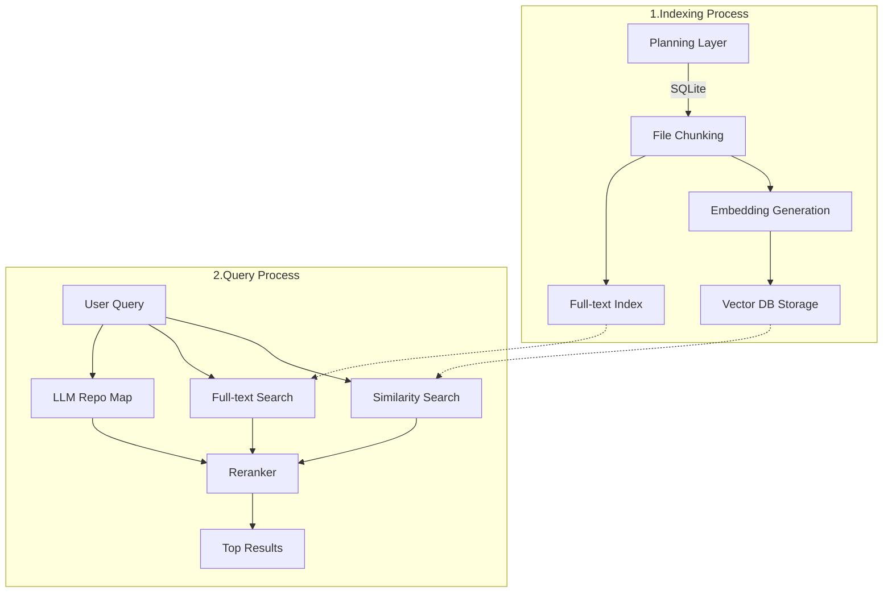

# 5주차 개인 과제

- [5주차 개인 과제](#5주차-개인-과제)
  - [1. AI Coding Assitant 도구 조사 및 비교 분석](#1-ai-coding-assitant-도구-조사-및-비교-분석)
    - [1-1. Amazon CodeWhisperer](#1-1-amazon-codewhisperer)
    - [1-2. Codex](#1-2-codex)
    - [1-3. Cursor](#1-3-cursor)
    - [1-4. Tabnine](#1-4-tabnine)
    - [1-5. Codeium](#1-5-codeium)
    - [1-6. GitHub Copilot](#1-6-github-copilot)
    - [1-7. replit GhostWriter](#1-7-replit-ghostwriter)
  - [2. Continue의 특징, 장점](#2-continue의-특징-장점)
  - [3. Continue 설치/설정](#3-continue-설치설정)
    - [3-1. Continue에서 사용하는 Model 유형/연동 유형](#3-1-continue에서-사용하는-model-유형연동-유형)
      - [3-1-1. Autocomplete Model](#3-1-1-autocomplete-model)
      - [3-1-2. Chat model](#3-1-2-chat-model)
      - [3-1-3. Embeddings model](#3-1-3-embeddings-model)
      - [3-1-4. Reranking model](#3-1-4-reranking-model)
    - [3-2. Continue 모델 연동 유형](#3-2-continue-모델-연동-유형)
      - [3-2-1. AI 모델 제공 및 개발 플랫폼](#3-2-1-ai-모델-제공-및-개발-플랫폼)
      - [3-2-2. 클라우드 AI 서비스](#3-2-2-클라우드-ai-서비스)
      - [3-2-3. AI 모델 배포 및 서버리스 플랫폼](#3-2-3-ai-모델-배포-및-서버리스-플랫폼)
      - [3-2-4. 로컬 AI 실행 도구](#3-2-4-로컬-ai-실행-도구)
      - [3-2-5. AI 워크플로우 및 통합 도구](#3-2-5-ai-워크플로우-및-통합-도구)
      - [3-2-6. 특화된 AI 서비스](#3-2-6-특화된-ai-서비스)
    - [3-3. Free-Trial](#3-3-free-trial)
  - [4. LLM completion options \& continue에서 설정하기, 챗 잘사용하기 - 효과적인 프롬프팅(system, user)](#4-llm-completion-options--continue에서-설정하기-챗-잘사용하기---효과적인-프롬프팅system-user)
    - [4-1. Continue에서 completionOption 설정하는 법](#4-1-continue에서-completionoption-설정하는-법)
      - [4-1-1. config.json \> completionOption](#4-1-1-configjson--completionoption)
      - [4-1-2. config.json \> models \> completionOptions](#4-1-2-configjson--models--completionoptions)
    - [4-2. Context Provider 커스텀하기](#4-2-context-provider-커스텀하기)
      - [Custom Context Provider](#custom-context-provider)
    - [4-3. Custom slash commands](#4-3-custom-slash-commands)
      - [4-3-1. .prompt 파일 생성하기](#4-3-1-prompt-파일-생성하기)
      - [4-3-2. 자연어 프롬프트 (customCommands 속성, config.json)](#4-3-2-자연어-프롬프트-customcommands-속성-configjson)
      - [4-3-3. 함수를 작성하는 프롬프트 (slashCommands 속성, config.ts)](#4-3-3-함수를-작성하는-프롬프트-slashcommands-속성-configts)
    - [4-4. 효과적인 프롬프트 엔지니어링](#4-4-효과적인-프롬프트-엔지니어링)
      - [4-4-1. LLM의 응답의 품질을 더욱 향상시키기](#4-4-1-llm의-응답의-품질을-더욱-향상시키기)
      - [4-4-2. Continue와 함께 개발에 활용하는 법](#4-4-2-continue와-함께-개발에-활용하는-법)
  - [5. Chat, Autocomplete](#5-chat-autocomplete)
    - [5-1. Chat](#5-1-chat)
      - [5-1-1. Chat\_코드 하이라이팅](#5-1-1-chat_코드-하이라이팅)
      - [5-1-2. 레퍼런스하기](#5-1-2-레퍼런스하기)
      - [5-1-3. 제안 코드 적용하기](#5-1-3-제안-코드-적용하기)
      - [5-1-4. 새로운 세션 시작하기](#5-1-4-새로운-세션-시작하기)
      - [5-1-5. 모델 변경하기](#5-1-5-모델-변경하기)
      - [5-1-6. Chat\_Model Setup](#5-1-6-chat_model-setup)
      - [5-1-7. Chat\_Context Selection](#5-1-7-chat_context-selection)
      - [5-1-8. Chat\_How it works](#5-1-8-chat_how-it-works)
      - [챗은 어떻게 동작할까?](#챗은-어떻게-동작할까)
      - [5-1-9. FAQ](#5-1-9-faq)
  - [5-2. Autocomplete](#5-2-autocomplete)
      - [5-2-1. Autocomplete\_Model setup](#5-2-1-autocomplete_model-setup)
      - [5-2-2. Autocomplete\_Local\&Offline / Self-Hosted\_ Experience](#5-2-2-autocomplete_localoffline--self-hosted_-experience)
      - [Autocomplete\_Context\_Selection](#autocomplete_context_selection)
  - [6. RAG, RAG in continue](#6-rag-rag-in-continue)
    - [6-1. RAG 주요 개념](#6-1-rag-주요-개념)
    - [6-2. RAG 활용 예시](#6-2-rag-활용-예시)
    - [6-3. RAG 작동방식](#6-3-rag-작동방식)
      - [6-3-1. Chunking](#6-3-1-chunking)
      - [6-3-2. Document Embedding](#6-3-2-document-embedding)
      - [6-3-3. Retrieval](#6-3-3-retrieval)
      - [6-3-4. Reranking](#6-3-4-reranking)
      - [6-3-5. Generation](#6-3-5-generation)
    - [6-4. Continue의 RAG (Retrieval-Augmented Generation) 워크플로](#6-4-continue의-rag-retrieval-augmented-generation-워크플로)
      - [6-4-1. RAG의 사용 데이터베이스](#6-4-1-rag의-사용-데이터베이스)
      - [6-4-2. RAG 워크플로 다이어그램](#6-4-2-rag-워크플로-다이어그램)
    - [6-5. 주요 단계](#6-5-주요-단계)
      - [6-5-1. 인덱싱 프로세스 (문서 전처리)](#6-5-1-인덱싱-프로세스-문서-전처리)
      - [6-5-2. 쿼리 프로세스](#6-5-2-쿼리-프로세스)
    - [6-6. Custom RAG in Continue](#6-6-custom-rag-in-continue)
      - [6-6-1. 임베딩 모델 선택](#6-6-1-임베딩-모델-선택)
      - [6-6-2. 벡터 DB 선택](#6-6-2-벡터-db-선택)
      - [6-6-3. 청킹 전략 선택](#6-6-3-청킹-전략-선택)
      - [6-6-4. 인덱싱 스크립트 작성 :](#6-6-4-인덱싱-스크립트-작성-)
      - [6-6-5. 인덱싱 스크립트 실행](#6-6-5-인덱싱-스크립트-실행)
      - [6-6-6. 서버 설정](#6-6-6-서버-설정)
    - [6-7. FAQ](#6-7-faq)
      - [Custom RAG에 별도 서버가 필요한 이유](#custom-rag에-별도-서버가-필요한-이유)
      - [RAG의 트레이드 오프는?](#rag의-트레이드-오프는)
      - [임베딩된 벡터는 보안적으로 안전할까?](#임베딩된-벡터는-보안적으로-안전할까)
    - [6-8. Chat\_Customize\_with\_RAG](#6-8-chat_customize_with_rag)
      - [커스텀 RAG 생성](#커스텀-rag-생성)
      - [`@docs` 설정](#docs-설정)
      - [`context provider` 생성](#context-provider-생성)
    - [6-9. Chat\_LLM](#6-9-chat_llm)
      - [6-9-1. 데이터 수집](#6-9-1-데이터-수집)
      - [6-9-2. 데이터 전처리](#6-9-2-데이터-전처리)
      - [6-9-3. 모델 학습](#6-9-3-모델-학습)
      - [6-9-4. 미세 조정(Fine-tuning)](#6-9-4-미세-조정fine-tuning)
      - [6-9-5. Multi-turn](#6-9-5-multi-turn)
  - [7. Edit, Actions](#7-edit-actions)
    - [7-1. Edit](#7-1-edit)
    - [7-2. Actions](#7-2-actions)
      - [7-2-1. 사용 방법](#7-2-1-사용-방법)
      - [7-2-2. 기타 트리거](#7-2-2-기타-트리거)
    - [7-3. 주의사항 및 사용팁](#7-3-주의사항-및-사용팁)
    - [Edit 팁](#edit-팁)
    - [Actions 팁](#actions-팁)

## 1. AI Coding Assitant 도구 조사 및 비교 분석
   - Amazon CodeWhisperer
   - Code
   - Cursor
   - Tablin
   - Codeium
   - GitHub Copilot
   - replit GhostWriter
  

### 1-1. Amazon CodeWhisperer
AWS 환경에서의 개발을 최적화한다는 특징을 가지고 있다.

  `주요 특징` : 자동 완성, 다양한 프로그래밍 언어 지원, 주석 기반 코드 생성, AWS 서비스와의 통합


### 1-2. Codex
현재 Github Copilot, TabNine등과 같은 AI coding assistant도 Third-party extensions로서 Codex를 사용(leverage)하고 있다.

 `주요 특징` : Coding assistant에 특화된 모델을 사용, 12개 이상의 언어, 자연어 처리

### 1-3. Cursor

Cursor는 기존 플러그인 방식이 아닌 VS Code를 기반으로 만들어진 편집기이다.

 `주요 특징` : 자동 완성, 코드 생성, 편집 및 리팩토링, Chat, 실시간 오류 감지 및 수정, 멀티 파일 분석

### 1-4. Tabnine

Tabnine은 사용자가 입력하는 코드를 공개하지 않고 정해진 범위 안에서 소프트웨어 개발을 쉽고 빠르게 할 수 있다.

 `주요 특징` :
|제목|주요기능|가격|
|---|---|---|
|PRO|*최고의 AI모델 적용, AI채팅 에이전트, 보안취약점 필터링, 개인정보보호, 영업 시간 지원*|월 $12|
|Enterprise|*SaaS 또는 On-premise에서 구축 가능, 개인화 AI 채팅 에이전트, Confluence 통합, 영업시간 지원 및 관련 교육*|월 $39|
|Basic|*무료, AI채팅(속도 제한)*|월 $ 0|


### 1-5. Codeium
전반적으로 Github Copilot와 유사한 기능들을 제공하면서 무료 티어로 사용할 수 있다.

 `주요 특징` : 자동 완성, 자연어로 Command 작성, Chat, 우클릭으로 옵션 접근 가능

### 1-6. GitHub Copilot
Github 과 밀접한 기능을 제공한다.

 `주요 특징` : 자동 완성, Chat, Pull request 요약


### 1-7. replit GhostWriter
Replit 플랫폼에서만 사용할 수 있으며, 로컬 개발 환경에서는 사용할 수 없는 대신 팀원과 실시간 협업이 가능하다는 특징이 있다.

 `주요 특징` : 자동 완성, 편집 및 리팩토링, 디버깅, 실시간 협업

## 2. Continue의 특징, 장점
Continue는 VSCode, JetBrains 등의 개발 환경과 통합되어 사용자의 코딩 작업을 지원하는 도구이다.
GitHub Copilot과 유사한 기능을 제공하면서도, 완전한 오픈소스 형태로 사용자가 AI 모델을 커스터마이징할 수 있는 점이 특징이다.

 `주요 특징` : 문맥 인식 대화, Chat, Command, Customize code, 자동 완성
 `장점` : 자동 데이터 수집, 오픈소스, 무료, 모델 선택의 유연성, 컨텍스트 다양성, 확장성

> [!TIP]
>
> 도구 선택 가이드라인 및 추천
>  1. 교육 및 기술 지원 필요성
     - 회사에서 도입하고자 할 때에는 코드 어시스턴트 사용 방법에 대한 교육 및 이슈 지원을 받을 수 있는 코드 어시스턴트를 선택해야 한다.

>  2. 보안 수준 검토
     - 개인이 취미 등으로 사용 시에는 보안 이슈가 없어 자유롭게 선택이 가능하겠지만 기업에서 도입하는 경우 코드의 외부 유출 우려가 있으므로 이를 해결하기 위해 독립적으로 구성이 가능해야 하고, 회사에서 작성한 코드를 저장 및 공유 되거나 학습에 사용하지 않는 어시스턴트를 선택해야 한다.

## 3. Continue 설치/설정
**설치 :**
VSCode/JetBrains 중 사용하는 IDE에서 각 익스텐션/플러그인 탭에서 설치

### 3-1. Continue에서 사용하는 Model 유형/연동 유형

- Autocomplete Model
- Chat Model
- Embeddings Model
- Reranking Model

#### 3-1-1. Autocomplete Model

중간 채우기-FIM-기법으로 훈련된 특수한 언어 모델. 코드 파일의 시작과 끝 부분이 주어졌을 때 중간에 들어갈 내용을 예측하도록 설계된 덕분에 상대적으로 작은 규모-3B  매개변수-의 모델로도 우수한 성능을 발휘할 수 있다. (반면, 일반적인 대화형 모델은 규모가 더 크더라도 이 특정 작업에서는 성능이 떨어질 수 있다.)

Continue에서는 주로 코드 작성 시 실시간으로 인라인 제안을 제공하는 데 활용된다.

> [!TIP]
>
> **추천 모델**
> 
> Continue에서는 자동 완성 모델로 Mistral의 Codestral 모델을 추천하며, 로컬 모델로는 Ollama Provider와 함께 `Starcoder2-3B` 모델을 사용하는 것을 권장한다.

#### 3-1-2. Chat model

- 대화 형식으로 응답하도록 학습된 LLM.
- 일반적인 질문에 답변하고 복잡한 코드를 생성할 수 있어야 해서 최고 성능의 채팅 모델은 보통 405B 이상의 매개변수를 가진 대형 모델이다.
- Chat, Edit, Action 기능에 사용한다.

> [!TIP]
>
> **추천 모델**
> 
> [Claude 3.5 Sonnet](https://docs.continue.dev/customize/model-providers/anthropic)을 가장 추천하며, 다른 옵션으로는 [GPT-4o](https://docs.continue.dev/customize/model-providers/openai), [Gemini 1.5 Pro](https://docs.continue.dev/customize/model-providers/gemini), [Llama3.1 405B](https://docs.continue.dev/customize/tutorials/llama3.1)를 권장한다.

#### 3-1-3. Embeddings model

- 텍스트를 벡터로 변환하도록 훈련된 모델. 
- 생성된 벡터는 나중에 다른 벡터들과 빠르게 비교하여 텍스트 간의 유사성을 판단하는 데 사용된다. 
- 임베딩 모델은 일반적으로 LLM보다 훨씬 작은 모델이며, 따라서 비교적으로 매우 빠르고 저렴하다.

Continue에서는 인덱싱 과정 중에 임베딩을 생성하고, 이를 @codebase 기능에서 활용하여 코드베이스 전체에 대한 유사성 검색을 수행하는 것을 통해 가장 관련성 있는 컨텍스트를 워크스페이스에서 자동으로 가져올 수 있다.

> [!TIP]
>
> **추천 모델**
> 
> 어떤 모델이든 쓸 수 있다면 voyage-code-2를 추천하며, 로컬 환경에서 임베딩을 생성하고 싶다면 Ollama와 함께 nomic-embed-text를 사용하는 것을 권장한다.
>
> 이외에 Transformers.js를 사용해 로컬 임베딩을 생성할 수 있으며, 자체 임베딩 엔드포인트를 구축하고 싶을 경우 Hugging Face Text Embeddings Inference를 사용할 수 있다.

#### 3-1-4. Reranking model
- 두 개의 텍스트-주로 사용자의 질문과 문서-를 입력받아 해당 문서가 질문에 답변하는 데 얼마나 유용할지 0에서 1 사이의 관련성 점수를 반환하도록 훈련된 모델.
- 일반적으로 LLM보다 훨씬 작고 빠르고 저렴하다.
- [@codebase](https://docs.continue.dev/customize/deep-dives/codebase) 기능에서 리랭킹 모델을 사용한다.  

> [!TIP]
>
> **추천 모델**
> 
> 어떤 모델이든 사용할 수 있다면, Voyage AI의 `rerank-1`을 추천한다. 혹은 [Cohere](https://docs.cohere.com/docs/rerank-2)에서 제공하는 리랭킹 모델을 사용할 수도 있다.
>
> 만약 LLM만 사용할 수 있는 상태라면 LLM 모델을 리랭킹 모델로 사용할 수는 있지만, 훨씬 비싸고 정확도가 떨어지므로 꼭 필요한 경우가 아니면 권장하지 않는다. 그리고 너무 많은 병렬 요청을 수행해야 하기 때문에 Ollama와 같은 로컬 모델에서는 사용할 수 없다. 

### 3-2. Continue 모델 연동 유형

Continue에서 사용자는 Provider를 설정하여 모델과 연동할 플랫폼을 선택하고, 각 Provider가 제공하는 AI 모델을 선택할 수 있다.

서비스의 주요 기능, 실행 환경, 특화된 기능을 기준으로 다음과 같이 여섯 가지 유형으로 분류했다.
- AI 모델 제공 및 개발 플랫폼
- 클라우드 AI 서비스
- AI 모델 배포 및 관리 도구
- 로컬 AI 실행 도구
- AI 워크플로우 및 통합 도구
- 특화된 AI 서비스

#### 3-2-1. AI 모델 제공 및 개발 플랫폼

자체 AI 모델을 개발하고 개발한 모델에 대한 API를 제공한다.

1. [**Mistral**](https://mistral.ai/)  
  
    - `Mistral Large`는 복잡한 작업에 가장 좋은 추론이 가능한 모델로 한국어를 포함해 다양한 언어를 지원하고 128K 토큰을 한번에 처리할 수 있다.(Context window)
    - `Codestra Codestra`는 코드 작업을 위해 프로그래밍 언어 80개 이상에 대해 학습한 모델로 다른 모델보다 응답이 빠르다. 32K 토큰을 처리할 수 있다.    
    - `Mistral Embed Mistral Embbed`는 텍스트를 추출하기 위해 사용되는 모델로서 현재는 영어만 지원한다.  
  
2. **[Anthropic](https://www.anthropic.com/)** 

    - Claude의 모델은 3가지로, `Haiku`는 가볍고 빠르게 사용하기 위한 모델, `Sonnet`은 성능과 속도의 적절한 수준의 모델, `Opus`는 성능이 가장 우수한 모델로 어려운 수학과 프로그래밍에 사용하는 모델이 있다.  
 
3. **[Deepseek](https://www.deepseek.com/)**   
    -  Continue에서는 채팅 모델로`deepSeek-chat`, 자동완성 모델에는 `deepseek-coder` 사용을 추천하며 임베딩, re-Ranking 모델은 제공하지 않는다.  

4. **[Gemini](https://gemini.google.com/?hl=ko)**  
    - 구글이 만든 AI 챗봇이며 Continue에서는 채팅 모델로 `Gemini 1.5 Pro`, 임베딩 모델에는 `models/text-embedding-004` 사용을 추천하며 자동완성, re-Ranking 모델은 제공하지 않는다.  

5. **[Ollama](https://ollama.com/)**
    - Ollama는 로컬에서 LLM을 구동할 수 있도록 하는 오픈소스이다. Continue에서는 채팅 모델로 `llama3.1:8`, 자동완성 모델로 `starcoder2:3b`, 임베딩 모델로 `nomic-embed-text`를 추천하며 re-Rankig 모델은 제공하지 않는다.
  
6. **[OpenAI](https://openai.com/)**  
    - OpenAI는 미국의 인공지능 기업으로 chatGPT로 유명해졌다. Continue에서는 채팅 모델로 `GPT-4o`, 자동완성 모델로 `starcoder2:3b`, 임베딩 모델로 `text-embedding-3-large`를 추천하며 re-Rankig 모델은 제공하지 않는다.


#### 3-2-2. 클라우드 AI 서비스

대규모 클라우드 제공업체가 제공하는 AI 및 머신러닝 서비스이고, 모델 훈련/배포/관리를 위한 종합적인 플랫폼을 제공해 주는 서비스이다.

다음은 대표적인 플랫폼 두 개이다. 

1. **[Azure OpenAI](https://azure.microsoft.com/ko-kr)**  
  
    - Azure는 Microsoft사의 Public Cloud 서비스를 제공하는 CSP사이다. 여러 AI 모델 공급사로부터 모델을 공급받아 서비스를 하는 형태이다.  
    - Continue에서는 채팅 모델로 `GPT-4o` 모델을 추천하며 자동완성 모델로 `Codestral`, 임베딩에는 `text-embedding-3-large` 모델 사용을 추천한다. re-Ranking 모델은 제공하지 않는다.
  
2. **[Amazon Bedrock](https://aws.amazon.com/ko/bedrock/?gclid=Cj0KCQjwmOm3BhC8ARIsAOSbapXJzJtKJf-adSQvzrKZ32ICT4sj4d8cLZGrvUvXJD6VpAV5i8Zy1ZIaAreUEALw_wcB&trk=24a8f13a-f5db-4127-bcb7-8b2876aa4265&sc_channel=ps&ef_id=Cj0KCQjwmOm3BhC8ARIsAOSbapXJzJtKJf-adSQvzrKZ32ICT4sj4d8cLZGrvUvXJD6VpAV5i8Zy1ZIaAreUEALw_wcB:G:s&s_kwcid=AL!4422!3!692062155749!e!!g!!amazon%20bedrock!21058131112!157173586057)** 
  
   - Amazon Bedrock은 AWS 환경에서 LLM을 개발하고 배포할 수 있는 플랫폼이다.   
   - Continue에서는 채팅 모델로 `Claude 3.5 Sonnet` 모델을 추천하며 임베딩에는 `amazon.titan-embed-text-v2:0` 모델 사용을 추천한다. 자동완성, re-Ranking 모델은 제공하지 않는다.
  
 
**클라우드 AI 사용의 장단점**

**장점 :**

    - 클라우드 AI Provider를 사용할 경우, 물리적인 인프라를 구축할 필요없이 사용한만큼만 지불하는 구조(Pay-as-you-go)를 통해 초기 투자 비용을 크게 절감할 수 있다.

**단점 :**

    - API를 이용해서 데이터를 전송하기 때문에 데이터가 제3자와 공유될 수 있는 위험성이 존재한다. 다만, OpenAI 엔터프라이즈 고객의 데이터를 사용하여 서비스 개선이나 모델 훈련에 사용하지 않겠다고 명시하는 등 보호 조치가 존재한다.
    - 장기적으로 볼 경우에는 사용량이 증가하면 지속적으로 발생하는 비용이 더 들 수도 있다. 


#### 3-2-3. AI 모델 배포 및 서버리스 플랫폼

- `Cloudflare Workers AI` 
- `HuggingFace Inference Endpoints` 

- `DeepInfra` 
- `Together` 

- `vLLM` 
 

#### 3-2-4. 로컬 AI 실행 도구

- Ollama
- LlamaCpp
- LlamaFile  
- LM Studio
- TextGenWebUI

#### 3-2-5. AI 워크플로우 및 통합 도구

AI 모델을 기존의 시스템이나 워크플로우에 쉽게 통합할 수 있게 해주는 도구이며 해당 유형의 서비스들은 AI 기술의 접근성을 높이고 활용도를 증가시킨다.

- flowise 
- Kindo

#### 3-2-6. 특화된 AI 서비스

특정 분야나 기술에 특화된 AI 서비스. 멀티모달 AI, 고성능 추론, 하드웨어 최적화 등 특정 니즈를 충족시키는 솔루션을 제공한다.
 
- Gemini
- Groq  
- IPES LLM 
- Replicate 

### 3-3. Free-Trial

Continue는 아래 Chat Model에 대해 최대 50회 사용 가능한 **Free-Trial** 을 제공한다.

- Claude 3 Sonnet
- GPT-4o
- Llama3 70b
- Codestral

```json
"models": [
    {
      "title": "Claude 3 Sonnet (Free Trial)",
      "provider": "free-trial",
      "model": "claude-3-sonnet-20240229"
    },
  ],
```

## 4. LLM completion options & continue에서 설정하기, 챗 잘사용하기 - 효과적인 프롬프팅(system, user)

**LLM 이란**

"대규모 언어 모델"로, 굉장히 많은 데이터를 학습한 AI 모델. 대표적인 LLM은 ChatGPT가 있다.

**LLM Completion Options 란**

언어 모델이 텍스트를 생성하는 방식을 조정하는 설정들로, 출력되는 텍스트의 **길이, 다양성, 일관성** 등에 영향을 미친다. 단, 각 모델들이 지원하는 Option들도 약간씩 상이하며 동일한 값을 주더라도 모델마다 응답 변화에 편차가 있을 수 있다.

### 4-1. Continue에서 completionOption 설정하는 법


Continue에서 Completion Options를 수정하고 싶다면 `config.json`를 통해 수정해야 한다.

```json
"completionOptions": {
  "stream": "boolean",
  "teperature": "number",
  "topP": "number",
  "topK": "integer",
  "presencePenalty": "number",
  "frequencePenalty": "number",
  "mirostat": "number",
  "stop": "string[]",
  "maxTokens": "number",
  "numThreads": "integer",
  "keepAlive": "integer",
}
```

- `stream` : LLM 응답을 streaming으로 받을지 선택하는 옵션
- `temperature` : 모델이 생성하는 응답의 창의성이나 랜덤성을 조정
- `topP` : LLM에서 생성할 단어를 선택하는 과정에서 확률 분포 상위 P%의 단어들만 선택하여 응답을 생성하는 방식.
- `topK` : LLM에서 응답을 생성할 때 고려할 후보 단어들의 개수를 제한하는 옵션
- `presencePenalty` : 모델이 이미 언급한 단어를 다시 사용하는 것을 얼마나 억제할지 조절하는 옵션
- `frequencePenalty` : 단어의 빈도를 억제하거나 허용할 수 있으며, 모델이 같은 단어나 문구를 반복적으로 사용하지 않도록 제어하는 옵션
- `mirostat` : LLM에서 실시간으로 응답의 일관성과 품질을 지속적으로 조정하기 위한 동적 샘플링 알고리즘
- `stop` : 모델이 텍스트를 생성하는 도중 특정 토큰이나 문자열이 등장하면 응답 생성을 중단하는 옵션
- `maxTokens` : 모델이 하나의 프롬프트에 대해 응답할 때 생성할 텍스트의 길이를 제한
- `numThreads` : 생성 과정에서 사용되는 스레드의 수를 조절하는 옵션
- `keepAlive` : 요청이 없는 경우 모델을 메모리에서 언로드하기까지의 시간. (기본 값: `60 * 30 = 30분`)


#### 4-1-1. config.json > completionOption

전역적으로 설정하는 방법. 여기서 설정한 `completionOption` 값들은 모델에 상관없이 Continue에서 모든 작업에 동일하게 적용된다.

```json
{
  "completionOptions": {
    "temperature": 0.7,
    "topP": 0.9,
    "maxTokens": 150
  }
}
```

#### 4-1-2. config.json > models > completionOptions

모든 모델에 대한 기본값이 아니라 특정 모델에 대한 설정을 별도로 정의하고 싶을 때 사용한다.

예를 들면 `Msty`와 `gpt-4o-mini`에 각각 다른 `completionOptions` 설정을 부여할 수도 있다.

```json
{
  "models": [
    {
      "title": "Msty",
      "provider": "msty",
      "model": "deepseek-coder:6.7b",
      "completionOptions": {
        "temperature": 0.9,
        "topP": 0.7,
        "maxTokens": 100
      }
    },
    {
      "title": "GPT-4o Mini",
      "provider": "openai",
      "model": "gpt-4o-mini",
      "completionOptions": {
        "temperature": 0.6,
        "topP": 0.8,
        "maxTokens": 200
      }
    }
  ]
}
```

### 4-2. [Context Provider](https://docs.continue.dev/customize/context-providers) 커스텀하기

**Context Provider 란**

LLM에 특정한 콘텐츠를 제공하는 기능으로, `@`를 입력하면 LLM에 context로 제공할 수 있는 콘텐츠 드롭다운-LLM에게 제공되는 추가 정보(파일 내용, 프로젝트 코드, 깃 변경 사항, 깃 이슈, 터미널 출력, 웹 페이지 내용, 문서 등)-을 볼 수 있다.


Continue는 기본적으로 아래와 같은 built-in context provider를 제공한다.

```json
  "contextProviders": [
    {
      "name": "code",
      "params": {}
    },
    {
      "name": "docs",
      "params": {}
    },
    {
      "name": "diff",
      "params": {}
    },
    { "name": "open", "params": { "onlyPinned": true } },
    {
      "name": "issue",
      "params": {
        "repos": [
          {
            "owner": "continuedev",
            "repo": "continue"
          }
        ],
        "githubToken": "ghp_xxx"
      }
    }
    ...
  ]
```

**Built-in Context Providers :**

- `@file`: 현재 워크스페이스의 파일을 context로 제공.
- `@code`: 프로젝트 내 특정 함수나 클래스를 context로 제공.
- `@Git Diff`: 현재 브랜치의 변경 사항을 context로 제공.
- `@terminal`: IDE의 터미널 내용을 context로 제공.
- `@open`: 현재 열려 있는 파일의 내용들을 context로 제공.
- `@folder`: 현재 워크스페이스의 폴더를 context로 제공. `@codebase` 와 동일한 검색 메커니즘을 사용하지만 단일 폴더에서만 검색할 수 있다.
- `@codebase`: 워크스페이스 전체에서 가장 관련성 높은 콘텐츠를 자동으로 가져올 수 있도록 codebase 를 색인화
- `@url`: 특정 URL의 내용을 markdown 형식으로 context로 제공.
- `@issue`: GitHub issue의 대화를 context로 제공 (개인 접근 토큰 필요).
- `@docs`: Continue에서 문서와 상호 작용할 수 있게 해줌. 정적 사이트나 GitHub 페이지를 색인화하여 쉽게 접근 가능.


#### [Custom Context Provider](https://docs.continue.dev/customize/tutorials/build-your-own-context-provider)

모든 Context Provider는 플러그인으로, 기본으로 제공하는 플러그인 외에도 필요한 소스를 제공하지 않는 경우 새로운 Context Provider를 요청 혹은 개발할 수 있고, REST API를 통해 외부 데이터베이스에서 정보를 검색하고 결과를 받아 `CustomContextProvider`를 구현할 수 있다.

`context provider`의 3가지 종류(`ContextProviderType`) :

1. **normal**: 기본 설정. 별도의 선택(submenu) 및 쿼리 없이 사용.
2. **query**: 유저가 텍스트 박스로 입력하여 context 항목 생성. `"type": "query"`로 설정.
3. **submenu**: 유저가 선택할 수 있는 항목을 제공. `"type": "submenu"`로 설정해야 하며, `loadSubmenuItems`와 `getContextItems` 모두 구현해야 함.

```typescript
// ~/.continue/config.ts
interface CustomContextProvider {
  title: string;
  displayTitle?: string;
  description?: string;
  renderInlineAs?: string;
  type?: ContextProviderType;
  getContextItems(
    query: string,
    extras: ContextProviderExtras
  ): Promise<ContextItem[]>;
  loadSubmenuItems?: (
    args: LoadSubmenuItemsArgs
  ) => Promise<ContextSubmenuItem[]>;
}

const RagContextProvider: CustomContextProvider = {
  title: "rag",
  displayTitle: "RAG",
  description:
    "Retrieve snippets from our vector database of internal documents",

  getContextItems: async (
    query: string,
    extras: ContextProviderExtras
  ): Promise<ContextItem[]> => {
    const response = await fetch("https://internal_rag_server.com/retrieve", {
      method: "POST",
      body: JSON.stringify({ query }),
    });

    const results = await response.json();

    return results.map((result) => ({
      name: result.title,
      description: result.title,
      content: result.contents,
    }));
  },
};

export function modifyConfig(config: Config): Config {
  if (!config.contextProviders) {
    config.contextProviders = [];
  }
  config.contextProviders.push(RagContextProvider);
  return config;
}
```


### 4-3. Custom slash commands

#### 4-3-1. [.prompt 파일 생성하기](https://docs.continue.dev/customize/deep-dives/prompt-files)

- 워크스페이스 최상단에 `.prompts/` 폴더를 직접 생성하거나, chat box 밑의 Build a custom prompt를 누르면 워크스페이스 최상단에 `.prompts`라는 폴더가 생성된다.
- `.prompts` 폴더에서 생성한 .prompt 파일의 이름은 프롬프트를 생성하는 데 사용할 슬래시 명령어의 이름이 된다. ( e.g., `test.prompt` ⇒ `/test` )
- 파일에 프롬프트 내용을 작성하면 chat 화면에서 슬래시(/)+ 프롬프트파일명 + ENTER를 통해 프롬프트에서 지시한 내용을 따르게 된다.

```text
temperature: 0.5
maxTokens: 4096
---
<system>
You will be acting as a senior software engineer helping a colleague document their code.
</system>
You will follow the guidelines for writing great code comments:
{{{ url "https://stackoverflow.blog/2021/12/23/best-practices-for-writing-code-comments/" }}}
---
Using this information, write a comment for the following code:
{{{ input }}}
```

- **서문** 
- **System 태그**
- **Context Provider**
- **내장 변수** : 현재 사용 가능한 기본 제공 변수는 다음과 같습니다. `{{{ input }}}`, `{{{ currentFile }}}`, `{{{ ./path/to/file.js }}}`

</br>

#### 4-3-2. 자연어 프롬프트 (customCommands 속성, config.json)

`config.json` 파일에 `customCommands` 속성을 추가하는 것으로, 자연어로 작성된 명령어를 정의하는 custom slash commands를 만들 수 있다.

```json
customCommands=[{
  "name": "check",
  "description": "Check for mistakes in my code",
  "prompt": "{{{ input }}}\n\nPlease read the highlighted code and check for any mistakes. You should look for the following, and be extremely vigilant:\n- Syntax errors\n- Logic errors\n- Security vulnerabilities\n- Performance issues\n- Anything else that looks wrong\n\nOnce you find an error, please explain it as clearly as possible, but without using extra words. For example, instead of saying 'I think there is a syntax error on line 5', you should say 'Syntax error on line 5'. Give your answer as one bullet point per mistake found."
}]
```

- `name` : 슬래시 명령을 호출하는 데 입력할 이름
- `description` : 드롭다운 메뉴에 표시되는 설명
- `prompt` : Handlebars 구문을 사용한 템플릿 작성을 지원
- `input` : 슬래시 명령으로 입력한 추가 입력. 
- `file name`: 절대 경로나 현재 작업 디렉토리를 기준으로 한 상대 경로를 제공하여 모든 파일을 참조할 수 있습니다.

</br>

#### 4-3-3. 함수를 작성하는 프롬프트 (slashCommands 속성, config.ts)

`customCommands`로 사용자 지정 명령을 작성하는 것보다 한 단계 더 나아가려면 응답을 반환하는 사용자 지정 함수를 작성할 수 있습니다.

이를 위해서는 `config.json` 대신 `config.ts`를 사용해야 하는데, 이곳에서 `slashCommands` 배열에 새로운 `slashCommand` 객체를 추가합니다.

```typescript
export function modifyConfig(config: Config): Config {
  config.slashCommands?.push({
    name: "commit",
    description: "Write a commit message",
    run: async function* (sdk) {
      const diff = await sdk.ide.getDiff();
      for await (const message of sdk.llm.streamComplete(
        `${diff}\n\nWrite a commit message for the above changes. Use no more than 20 tokens to give a brief description in the imperative mood (e.g. 'Add feature' not 'Added feature'):`,
        {
          maxTokens: 20,
        }
      )) {
        yield message;
      }
    },
  });
  return config;
}
```

### 4-4. 효과적인 프롬프트 엔지니어링

#### 4-4-1. LLM의 응답의 품질을 더욱 향상시키기

사용자는 `프롬프트 디자인의 다양한 전략과 기법`을 통해 효과적으로 질문함으로써, LLM의 성능을 최적화하여 더 나은 응답 결과를 도출할 수 있다.

- **질문하기 전 생각 구조화하기**
  - 질문을 하기 전에 생각의 연결고리(Chain-of-Thought, CoT)를 통해 대답을 유도 
    - `"차근차근 단계적으로 생각해 줘"`
- **프롬프트에게 페르소나 부여하기**
  - 프롬프트에게 역할, 맥락과 배경을 부여 
    - `"너는 ~ 역할이고, 나는 이러한 답변이 필요한 ~ 사람이야."`
  - 답변 난이도를 결정하는 문체를 지정 
    - `"졸업 논문에 작성할 수 있을 정도로 전문적으로 알려줘" 또는 "초등학생도 쉽게 이해할 수 있을 정도로 설명해줘"`
- **명확하고 구체적으로 지시하기**
  - 범위를 좁혀서 질문 
  - 어떤 포맷으로 출력할지 명시 
  - 어떤 방법으로 추출할지 명확히 지시
    - `"300자 이내의 서론, 본론, 결론으로 알려줘", "표로 알려줘", "~ 관련해서 10가지를 알려줘"`
- **영어로 번역해서 질문하기**
  - 대부분의 AI가 영어를 기반으로 작성되었기 때문에 영어로 질문할 때 답변의 퀄리티가 더 좋을 때가 많다. 
- **보상 제시하기**
  - 질문에 응답할 때 동기를 부여하기 위해 보상을 제안 
    - `"이 문제를 해결하면 다음 단계로 넘어갈 수 있어."`
- **처벌 언급하기**
  - 응답이 없거나 부정확할 경우의 결과를 언급하여 정확한 응답을 유도 
    - `"답변이 틀리면 시간이 낭비될 거야."`
- **자연스러운 대화 유도하기**
  - 인간적인 대화 스타일을 유도하여 보다 더 자연스러운 답변을 요청 
    - `"친근하게 이야기하듯 설명해 줘."`
- **정보 충분히 요구하기**
  - 질문이 불완전할 경우 더 많은 정보를 요청 
    - `"더 많은 세부사항을 제공해 줄 수 있어?"`
- **테스트 포함 요청하기**
  - 생성된 답변을 테스트할 수 있는 형식으로 제공 
    - `"이 코드를 실행 가능한 상태로 제공해 줘."`
- **구분 기호 사용하기**
  - 특정 단어를 강조하거나 구조화된 답변을 요청할 때 구분 기호를 사용 
    - `"각 항목을 '•' 기호로 구분해서 나열해 줘."`
- **단어 반복 사용하기**
  - 특정 단어를 강조하거나 주요 개념을 반복하여 설명하도록 요청 
    - `"이 개념을 여러 번 반복해서 강조해 줘."`
- **출력문 포함하기**
  - 답변이 특정 형식으로 출력되도록 지시 
    - `"이 코드를 출력 형식으로 작성해 줘."`
- **자세한 내용 요청하기**
  - 더 구체적인 정보를 포함하여 글을 작성하도록 요청 
    - `"좀 더 자세하게 설명해 줘."`
- **수정 요청하기**
  - 이미 생성된 내용을 수정하여 더 나은 결과를 요구 
    - `"이 내용을 더 간결하게 다듬어 줘."`
- **코드 생성 요청하기**
  - 여러 파일에 걸친 코드를 작성하거나 특정 구조로 제공 
    - `"이 코드의 각 함수는 별도의 파일로 분리해 줘."`
- **특정 텍스트로 시작하기**
  - 주어진 텍스트나 문구를 바탕으로 답변을 요청 
    - `"이 문장을 바탕으로 추가 설명을 작성해 줘."`
- **요구 사항 명시하기**
  - 텍스트나 코드 생성에 필요한 특정 요구 사항을 명확히 지시
    - `"이 요구 사항에 맞춰 텍스트를 작성해 줘."`
- **제공된 예시 기반 텍스트 생성**
  - 제공된 예시와 유사한 스타일이나 형식으로 텍스트를 생성하도록 요청 
    - `"이 예시와 같은 형식으로 텍스트를 작성해 줘."`

#### 4-4-2. Continue와 함께 개발에 활용하는 법

- **@Codebases, @Files**
  - 특정 함수 내용 등 코드 분석
  - 버그나 에러 찾기
- **Comment**
  - 주석 작성
- **@Docs**
  - 공식 문서 예제를 바로 참고하여 작성
- **/Build a custom propmpt or command**
  - 테스트 케이스 작성 및 검사
  - 반복해야 하는 작업을 자동화
- **/Chat, /Autocomplete**
  - 개발 문서나 양식 초안 작성

>  초기 질문 지시사항을 어떻게 주느냐에 따라 시간과 비용이 크게 차이나기 때문에 내가 모르는 것이 무엇이고, 어떻게 잘 도움을 받을 수 있을지에 대한 '메타 인지'가 필요하다.


**참고 자료**

- [ChatGPT에게서 좋은 대답을 이끌어 내는 방법 7가지](https://tech.kakaobank.com/posts/2312-drawing-out-good-responses-from-ai/)
- [좋은 질문을 하는 방법, 구조화 방법](https://www.gotai.co.kr/%EC%B1%97%EC%A7%80%ED%94%BC%ED%8B%B0-2/)
- [Principled Instructions Are All You Need for Questioning](https://arxiv.org/abs/2312.16171)
- [ATLAS: An LLM Inquiry Principle Benchmark](https://github.com/VILA-Lab/ATLAS)

## 5. Chat, Autocomplete
### 5-1. Chat 
#### 5-1-1. Chat_코드 하이라이팅

코드 블록이 필요한 구문을 드래그한 뒤, `cmd/ctrl+L`(VS Code) 혹은 `md/ctrl+L`(JetBrains)를 이용하여 대화 안에 포함한다.

> [!TIP]
>  키보드 숏컷 충돌로 `cmd+L` 인식이 안 되는 경우 
>
> - 1) `shift+cmd+L`를 시도
> - 2) `코드 드래그 후 → 우클릭 → Continue → Add Highlighted Code to Context` 시도

#### 5-1-2. 레퍼런스하기

`@`를 이용해 코드베이스, 문서, IDE, 혹은 third-party의 정보를 컨텍스트에 포함시킬 수 있다.

#### 5-1-3. 제안 코드 적용하기
 적용 방식은 코드 블럭 우측 상단 아이콘에 따라 선택할 수 있다.

- Apply to current file 
- Insert at cursor 
- Copy 

#### 5-1-4. 새로운 세션 시작하기

 `cmd/ctrl+L`(VS Code) 혹은 `md/ctrl+L`(JetBrains)으로 새로운 세션이 시작된다. 

#### 5-1-5. 모델 변경하기

드롭다운을 사용하거나 `cmd/ctrl + ’` 을 입력하여 설치한 모델을 전환할 수 있다.
 
#### 5-1-6. Chat_Model Setup

> [!NOTE]
> 전반적인 채팅 환경을 최적화하려면 **400B+ 매개 변수 모델 또는 프론티어 모델 중 하나를 사용**하는 것을 추천
>
> - 프론티어 AI: 고도화된, 고성능 모델
> - Continue 공식 권장 모델: Claude Sonnet 3.5 (Anthropic)
 
 **open-weight/open-source model**

- open-weight model: 만드는 법, 모델 구조, 사용한 데이터 제반 내용 모두를 공개하지 않고 완성된 모델
- open source model: 만드는 법, 모델 구조, 사용한 데이터 등 모델과 관련된 대부분의 내용을 공개하여 공유하는 모델


#### 5-1-7. Chat_Context Selection

> [!NOTE]
>
> 채팅은 사용자가 현재 작업 중인 컨텍스트(context)를 선택할 수 있다. 채팅의 응답 정확도를 높이려면 컨텍스트를 잘 관리해야 한다.

- 컨텍스트 관리
  - 자동 컨텍스트: 프로젝트 파일, 코드베이스 등의 정보를 자동으로 컨텍스트로 포함할 수 있다.
  - 수동 컨텍스트: 필요한 경우 사용자가 직접 컨텍스트를 지정해 AI의 응답을 조정할 수 있다.
 
 **컨텍스트 최적화 방법**

- 작업 중인 파일이나 코드베이스를 정확히 설정해 두면 관련된 내용에 더 정확하게 답할 수 있다.
- 불필요한 컨텍스트를 최소화하는 것이 중요


**입력 심볼**

> [!NOTE]
>
> 입력창에 질문하는 것이 유일한 필수 컨텍스트이고 그 외에 나머지는 선택 사항 

- 하이라이팅 코드 블럭: `cmd/ctrl + L(VS Code)` 또는 `cmd/ctrl + J(JetBrains)`
- 현재 실행 파일: `cmd/ctrl + opt + enter`
- 특정 파일: `@files`
- 특정 폴더: `@directory`
- 전체 코드베이스: `@codebase`
- 문서 사이트: `@docs`
- IDE 내 터미널: `@terminal`
- Git diff: `@diff`

#### 5-1-8. Chat_How it works

#### 챗은 어떻게 동작할까?

1. 에디터 창에서 `cmd + L` 또는 사이드바 채팅창에서 `@`로 Context를 전달한다.
2. 사이드 바에서 추가적인 Prompt를 전달한다.
3. LLM 모델은 전달받은 `Context`와 `Prompt`를 기반으로 응답을 스트리밍한다.

#### 5-1-9. FAQ

**'그게 아니고~' 식으로 코드는 안 보내고 후속 조치만 보내면 어떻게 될까?**

- 이전 세션 컨텍스트도 일부 포함된다.
- 추가 컨텍스트를 제공하지 않아도 모델이 대화의 흐름과 맥락을 기억한다.


**받은 응답을 어떻게 적용할까?**

- 응답에 포함된 코드는 해당 블록에 배치되며 `현재 파일에 적용`, `커서에 삽입`, `복사`를 선택할 수 있습니다.


**지금까지 맥락을 무효화하고 새로운 세션을 시작하고 싶다면?**

- `cmd + L` 또는 사이드바 채팅창에서 `새로운 채팅`을 클릭합니다.


**채팅 모델 중에 전송된 프롬프트를 볼 수 있을까?**

- A. 터미널 옆에 `Output` 열기
- B. 드롭다운에서 `Continue - LLM Prompts/Completions` 선택
- C. 전송된 프롬프트 확인


**개발과 무관한 내용을 요청하면? (e.g., 김치찌개 레시피 알려줘)**

- Continue는 매우 성실하게 알려줍니다.
- 반면, Copilot은 `"Sorry, I can't assist with that."` 라고 응답합니다.


## 5-2. Autocomplete
- 타이핑하는 동안 인라인 코드 제안을 제공한다.
- 활성화하려면 IDE 하단 오른쪽의 상태 표시줄에 있는 "Continue" 버튼을 클릭하거나 IDE 설정에서 "Enable Tab Autocomplete" 옵션을 체크한다.
- Accepting a full suggestion (press TAB key)
- Rejecting a full suggestion (press ESC key) 
- Partially accepting a suggestion (cmd/ctrl + →)

 
#### 5-2-1. Autocomplete_Model setup

Continue 공식문서에서는 자동완성 기능을 사용할 때 Mistral API 에서 제공하는 Codestral 모델을 사용하는 것을 추천한다.
 
만약 팀과 api key를 공유하거나 mistral api를 사용하려면 아래처럼 apiBase를 설정해야 합니다.

```json title="config.json""
{
  "tabAutocompleteModel": {
    "title": "Codestral",
    "provider": "mistral",
    "model": "codestral-latest",
    "apiKey": "YOUR_API_KEY",
    "apiBase": "https://api.mistral.ai/v1" // 이부분 추가
  }
}
```

#### 5-2-2. Autocomplete_Local&Offline / Self-Hosted_ Experience

로컬과 자체 호스팅에서는 `StarCoder2-3b` 모델을 추천한다.

```json title="config.json""
{
  "tabAutocompleteModel": {
    "title": "StarCoder2-3b",
    "model": "starcoder2:3b",
    "provider": "ollama"
  }
}
```
 **Alternative experiences**

- 하드웨어가 좋지 않다면 `deepseek-coder:1.3b-base`를 추천 
- 하드웨어가 좋다면 `deepseek-coder:6.7b-base` 모델을 사용하면 더욱 고품질의 자동완성을 제공한다.

> [!NOTE]
>
> LM Studio 사용자의 경우 "My Models" 섹션으로 이동하여 원하는 모델을 찾고 경로를 복사하세요(예: second-state/StarCoder2-3B-GGUF/starcoder2-3b-Q8_0.gguf). 이 경로를 config의 `model` 값으로 사용하세요.
 
#### Autocomplete_Context_Selection

- 자동 완성기능은 현재 커서 위치를 기반으로 자동으로 맥락(context)을 결정합니다.
- 프롬프트에 포함할 내용을 결정하기 위해 사용하는 기술
  - File prefix/suffix
  - Definitions from the Language Server Protocol

## 6. RAG, RAG in continue


**RAG(Retrieval-Augmented Generation) :**

LLM이 자체 지식 기반 외에도 외부 데이터베이스나 검색 엔진을 활용하여 더 정확하고 최신의 정보를 제공하는 방법

**LLM의 기존 문제점 :**

- 답변이 없을 때 허위 정보를 제공한다. 
- 사용자가 구체적이고 최신의 응답을 기대할 때 오래되었거나 일반적인 정보를 제공한다.
- 신뢰할 수 없는 출처로부터 응답을 생성한다. 
- 용어 혼동으로 인해 응답이 정확하지 않다.
 
**RAG가 중요한 이유 :**
- 신뢰할 수 있는 정보 소스 활용  
- 사용자 신뢰도 향상 

**RAG 장점 :**
- 비용 효율적 구현 
- 최신 정보 제공 
- 사용자 신뢰 강화 
- 개발자의 제어력 향상 

### 6-1. RAG 주요 개념

- 외부 데이터 생성 
- 질의 생성(Query Generation) 
- 정보 검색(Retrieval) 
- 응답 생성(Answer Generation)

**Flow**


**Flow2**


**용어**

- Prompt : 
  - LLM의 직접적인 최종 input
  - LLM의 정확도를 올리기 위하여 사용자의 쿼리를 받아서 다양하게 재구성.
 
- Query :
  - 사용자가 입력하는 raw 텍스트


**RAG 단점**

- 계산 비용 
- 검색 품질 의존성 
 
### 6-2. RAG 활용 예시

RAG는 LLM(대형 언어 모델)을 직접 학습시키는 것이 아니라, 외부 데이터를 검색해 참조하는 방식. 즉, LLM이 필요한 정보를 실시간으로 검색해서 그 데이터를 바탕으로 텍스트를 생성한다. 검색 단계에서 정보를 가져오고, 그 정보를 기반으로 적절한 응답을 생성하는 것이 RAG의 핵심입니다. 이를 통해 더 신뢰성 있는 결과를 제공할 수 있다.

 
**RAG를 사용하는 이유 :**

RAG가 LLM을 직접 학습시키지 않고 외부 데이터를 검색하는 방식으로 동작하는 이유는 실시간 정보 업데이트와 메모리 한계 때문이다.

- 실시간 정보 접근 가능
  
- 효율적인 메모리 사용 가능
 
**일반적인 RAG 활용 예시 :**

- 고객 지원 챗봇 
- 법률/의료 분야 
- 연구 보조 도구 
 

### 6-3. RAG 작동방식

#### 6-3-1. Chunking

- 대규모 문서는 그대로 처리하기 어렵기 때문에, 이를 여러 개의 작은 'chunk로 나누는 과정이 필요하다.
- 이 과정은 중요한 정보 손실을 최소화하면서도 각 chunk가 독립적으로 처리될 수 있도록 설계된다.
- 일반적으로 문서의 논리적 단위나 문단을 기준으로 청크가 나뉘며, 각 chunk는 검색 및 생성 과정에서 독립적인 단위로 활용된다.

**Chunking 하는 방법 :** 

1. Fixed Size Chunking 
     - 가장 단순하게 접근하는 방식으로, 고정된 문자의 길이로 문서를 잘라내는 방식 
2. Content-Aware chunking 
   - 문맥을 인지하는 방식으로 chunking을 하는 방법 
3. Recursive chunking 
  -  위에서 언급된 두 Fixed Size chunking과 Content Aware Chunking을 혼합하여 사용하는 방식. Content Aware Chunking을 하여 1차적으로 자른 뒤, 설정한 길이보다 길 경우에는 Fixed Size로 다시 자르는 방식이다.

#### 6-3-2. Document Embedding

- 문서 임베딩은 대량의 문서를 벡터로 변환하는 과정 
- 문서 내의 텍스트를 고차원 공간의 벡터로 변환하여 문서 간의 유사도를 쉽게 계산할 수 있도록 한다. 여기서 사용하는 임베딩 모델은 일반적으로 사전 학습된 Transformer 기반 모델을 사용한다.
- 문서의 의미적 유사성을 반영한 벡터화 덕분에 검색 단계에서 관련 문서를 쉽게 찾을 수 있다.
- 임베딩 된 문서들은 Vector DB에 저장됩니다. (현재 흔히 쓰이는 Vector DB는 Faiss 또는 Chroma 정도이다.)
 
#### 6-3-3. Retrieval

- 검색 단계에서는 입력 쿼리에 맞는 관련 문서 또는 청크를 검색하고 앞서 생성된 임베딩 벡터를 기반으로 쿼리와 문서 간의 유사도를 계산하여 가장 관련성이 높은 문서들을 선택한다.  
- 일반적으로 벡터 유사도 검색을 사용하여, 쿼리 임베딩과 사전 저장된 문서(Chunk) 임베딩 간의 코사인 유사도 또는 유사한 거리 측정 방법을 사용한다.

**Retrieval을 하는 방식 :** 

VectorDB를 사용하는 방법은 Dense 방식과 Sparse 방식이 있다.

- Sparse Retriever : TF-IDF와 같은 기술을 사용하여 텍스트 데이터를 희소 벡터로 변환하고, 질의 벡터와의 유사성에 따라 문서를 검색한다.
- Dense Retriever : BERT와 같은 신경망 모델을 사용하여 텍스트 데이터를 밀집 임베딩 벡터로 변환하고, 질의 벡터와의 유사성에 따라 관련 문서를 검색한다.


#### 6-3-4. Reranking
  Reranking은 단순한 임베딩 유사도 계산 이상의 다양한 요소를 고려하여 실행되며, 문서의 맥락, 텍스트 길이 등을 고려하여 최종적으로 상위 문서를 결정한다.

**Reranking이 필요한 이유 :** 
  - LLM에 context를 많이 넣는다고 좋아지는 것이 아니고 관련된 문서를 넣어야지 원하는 답변을 얻을 수 있게 된다. 뿐만 아니라 같은 문서를 넣어도 문서를 넣는 순서에 따라 결과가 달라지기 때문에 Reranking을 통해 정교한 답변을 생성할 수 있도록 유도할 수 있다.

#### 6-3-5. Generation

최종적으로 선택된 문서나 청크를 기반으로 생성 모델은 사용자의 쿼리에 맞는 답변을 생성한다.
### 6-4. Continue의 RAG (Retrieval-Augmented Generation) 워크플로


**특징**

Continue는 주로 `@codebase` 검색 시 RAG를 사용한다.
 
- **경량화된 로컬 임베딩과 RAG**

- **필요에 따라 NLP task로 Reranking을 보완**
- **LLM prompt를 이용한 Reranking**

- 기본적으로 가벼운 임베딩 모델을 사용해 Naive RAG를 경량화했다.
- 사용자가 원하면 Reranking과 NLP task를 활성화해 정확도를 높이는 전략을 세웠다.

#### 6-4-1. RAG의 사용 데이터베이스


- **관계형 데이터베이스 (RDBMS)**: SQLite

   - 인덱싱된 파일 기록 유지
   - 전문 검색(Full-Text-Search) 인덱스 저장 및 사용
     - BM25 알고리즘 활용
   - LanceDB 캐시 관리 (lance_db_cache 테이블)
     - uuid를 key로, `List[number]` 형태의 vector를 포함한 모든 정보 저장

- **벡터 데이터베이스**: LanceDB
   - 문서 chunk의 임베딩 벡터 저장
   - 사용자 query와 문서 chunk 간 유사도 검색 수행

#### 6-4-2. RAG 워크플로 다이어그램



### 6-5. 주요 단계

#### 6-5-1. 인덱싱 프로세스 (문서 전처리)

1. **계획 단계**

   - SQLite로 인덱싱된 파일들의 기록을 유지 
   - 브랜치 변경이나 윈도우 리로드 시 중복 작업을 방지한다. (95%의 파일은 변경되지 않음)

2. **파일 청킹**

   - 문서를 LLM 입력에 적합한 크기의 작은 부분(chunk)으로 분할 

3. **임베딩 생성**

   - 각 chunk에 대한 임베딩을 AI 모델을 통해 벡터화 
   - 로컬 임베딩에는 `transformers.js` 라이브러리를 사용 
   - API 임베딩 모델로 `voyage-code-2` API 등을 선택적으로 사용 가능

4. **벡터 DB 저장**

   - 생성된 임베딩을 로컬 벡터 데이터베이스에 저장 
   - SQLite의 lance_db_cache 테이블에서 캐싱 
     - SQLite의 `lance_db_cache` 테이블에서 vector는 `embedding vector`, contents는 `text chunk`에 해당한다. 

5. **전문 검색 인덱스 생성**
   - 결과 보강을 위한 전문 검색 인덱스를 SQLite에 생성 및 저장 

#### 6-5-2. 쿼리 프로세스

1. **사용자 쿼리 접수**

   - `@codebase` 감지 시 RAG 프로세스를 시작 
   - 쿼리를 chunking하고, 저장한 벡터와 비교할 수 있도록 임베딩 

2. **유사도 검색 (Similarity Search)**

   - 벡터 데이터베이스(LanceDB)에서 유사도 기반 검색으로 결과 도출
     - ```ts
       // core/indexing/LanceDbIndex.ts
       const table = await db.openTable(tableName);
       let query = table.search(vector);
       if (directory) {
         // seems like lancedb is only post-filtering, so have to return a bunch of results and slice after
         query = query.where(`path LIKE '${directory}%'`).limit(300);
       } else {
         query = query.limit(n);
       }
       const results = await query.execute();
       return results.slice(0, n) as any;
       ```

3. **전문 검색 (Full-text Search)**

   - SQLite의 전문 검색 인덱스를 활용하여 추가 결과를 검색 
   - BM25 알고리즘 기반으로 랭킹 
   - `fts` 테이블 기준으로 `fts_metadata` 테이블 등을 JOIN 해 사용 

4. **LLM 저장소 맵 (LLM Repo Map)**

   - LLM에 "저장소 맵"을 제시하고 파일 식별을 요청 
   - 다음과 같은 프롬프트를 사용 
   - ```ts
     // core/context/retrieval/repoMapRequest.ts
     const prompt = `${repoMap}
     
       Given the above repo map, your task is to decide which files are most likely to be relevant in answering a question. Before giving your answer, you should write your reasoning about which files/folders are most important. This thinking should start with a <reasoning> tag, followed by a paragraph explaining your reasoning, and then a closing </reasoning> tag on the last line.
     
       After this, your response should begin with a <results> tag, followed by a list of each file, one per line, and then a closing </results> tag on the last line. You should select between 5 and 10 files. The names that you list should be the full path from the root of the repo, not just the basename of the file.
     
       This is the question that you should select relevant files for: "${input}"`;
     ```

5. **재순위화 (Reranker)**

   - 이전 단계에서 얻은 모든 점수들로, (FTS, 임베딩, 최근 편집 파일, 저장소 맵)의 순위를 재조정 
   - LLM 기반 재순위 모델을 사용해 최종 점수 
   - 다음과 같은 few-shot 프롬프트를 사용한다.

     - ```ts
       // core/context/rerankers/llm.ts
       const prompt = `You are an expert software developer responsible for helping detect whether the retrieved snippet of code is relevant to the query. For a given input, you need to output a single word: "Yes" or "No" indicating the retrieved snippet is relevant to the query.
       
          Query: Where is the FastAPI server?
          Snippet:
          \`\`\`/Users/andrew/Desktop/server/main.py
          from fastapi import FastAPI
          app = FastAPI()
          @app.get("/")
          def read_root():
              return {{"Hello": "World"}}
          \`\`\`
          Relevant: Yes
       
          Query: Where in the documentation does it talk about the UI?
          Snippet:
          \`\`\`/Users/andrew/Projects/bubble_sort/src/lib.rs
          fn bubble_sort<T: Ord>(arr: &mut [T]) {{
              for i in 0..arr.len() {{
                  for j in 1..arr.len() - i {{
                      if arr[j - 1] > arr[j] {{
                          arr.swap(j - 1, j);
                      }}
                  }}
              }}
          }}
          \`\`\`
          Relevant: No
       
          Query: ${query}
          Snippet:
          \`\`\`${documentId}
          ${document}
          \`\`\`
          Relevant: 
          `;
       ```

6. **최종 결과 제공 (Top Results)**
 
### 6-6. Custom RAG in Continue

#### 6-6-1. 임베딩 모델 선택

> [!TIP]
>
> **추천 모델**
> 
> Continue에서 추천하는 모델은 `voyage-code-2` 

#### 6-6-2. 벡터 DB 선택

- 대부분 벡터 DB 사용해도 무방하기 때문에 사용성이 좋은 DB를 권장
- Continue 권장 DB는 `LanceDB`: 인 메모리 DB

#### 6-6-3. 청킹 전략 선택

`votage-code-2` 모델은 최대 16,000 토큰

- Truncate: 넘치는 건 잘라서 버린다. (1파일 1청크) 
- chunks of a fixed length: 고정된 길이로 청크한다.
- recursive, (AST)-based strategy: 정확하지만, 복잡하다. 소스 코드를 함수, 조건문, 블록 단위로 나눌 수 있다.

#### 6-6-4. 인덱싱 스크립트 작성 :


데이터를 검색 가능하도록 구조화하여 저장하는 과정

(청킹 -> 임베딩 생성 -> 벡터 DB 삽입)

```python
from lancedb.pydantic import LanceModel, Vector
from lancedb.embeddings import get_registry

db = lancedb.connect("/tmp/db")
func = get_registry().get("openai").create(
    name="voyage-code-2",
    base_url="https://api.voyageai.com/v1/",
    api_key=os.environ["VOYAGE_API_KEY"],
)

class CodeChunks(LanceModel):
    filename: str
    text: str = func.SourceField()
    # 1536 is the embedding dimension of the `voyage-code-2` model.
    vector: Vector(1536) = func.VectorField()

table = db.create_table("code_chunks", schema=CodeChunks, mode="overwrite")
table.add([
    {"text": "print('hello world!')", filename: "hello.py"},
    {"text": "print('goodbye world!')", filename: "goodbye.py"}
])

query = "greetings"
actual = table.search(query).limit(1).to_pydantic(CodeChunks)[0]
print(actual.text)
```

#### 6-6-5. 인덱싱 스크립트 실행

- 파일이 변경될 때 해당 파일만 자동으로 인덱싱 
  - 주기적으로 전체 인덱스를 새로 고치는 것도 충분히 효과적이다.

#### 6-6-6. 서버 설정

- 커스텀 RAG에 접속하기 위한 서버를 띄워야 한다.
- `[POST] /retrieve`

```python
@app.post("/retrieve")
async def create_item(item: ContextProviderInput):
    results = [] # TODO: Query your vector database here.

    # Construct the "context item" format expected by Continue
    context_items = []
    for result in results:
        context_items.append({
            "name": result.filename,
            "description": result.filename,
            "content": result.text,
        })

    return context_items
```

> [!TIP] 
> 
> (옵션) 리랭킹
>
> Continue는 `rerank-1` 모델을 추천하나 Voyage AI는 `rerank-2` 모델을 추천한다.
> 
> 리랭킹를 위한 별도의 서버를 띄워야 한다. (e.g. `/rerank`)

### 6-7. FAQ

#### Custom RAG에 별도 서버가 필요한 이유

all embeddings are calculated locally with `all-MiniLM-L6-v2` and stored locally in `~/.continue/index`.

#### RAG의 트레이드 오프는?

- 작은 청크는 원본 문서의 의미를 불완전하게 나타낼 수 있다.
- 청킹 크기를 줄이면 검색 속도가 빨라지지만 정확도가 떨어질 수 있다. (반대의 경우도 존재)

#### 임베딩된 벡터는 보안적으로 안전할까?

- 벡터는 수치적 표현이며 데이터 그 자체가 아니다.
- 벡터를 통해 유사한 원본 문서 또는 데이터를 검색하여 그것을 반환하는 것이다.


### 6-8. Chat_Customize_with_RAG

- 프로젝트 전체 코드베이스를 대상으로 정보를 검색하거나, 특정 폴더를 대상으로 할 수 있다.
- 벡터 데이터베이스에서 `가져올 결과`, `사용할 경과`, `재랭킹 기능 사용 여부` 를 설정할 수 있다.

#### 커스텀 RAG 생성

- 임베딩 모델 선택, 벡터 데이트베이스 설정, 텍스트 청킹 전략 조절

#### `@docs` 설정

- 특정 문서를 제공 
- 라이브러리 공식문서 URL을 지정하는 등으로 활용할 수 있다.
  (e.g., `@docs API endpoints for Continue`)

#### `context provider` 생성

- 고유한 프로바이더를 생성할 수 있다. 
  (e.g., 회사 내부의 매뉴얼을 컨텍스트로 제공하는 프로바이더 생성 등)

> [!IMPORTANT]
> 핵심은 Chat에서 사용할 Context를 어떻게 제공할지 결정하는 것 

### 6-9. Chat_LLM 
#### 6-9-1. 데이터 수집

- 다양한 출처 
- 언어 다양성 

#### 6-9-2. 데이터 전처리

- 토큰화(Tokenization) 
- 어휘 사전 구축 

> [!TIP]
>
> 일반적인 우리가 생각하는 단어 뿐만 아니라, 자주 쓰이는 문장 같은 것을 하나의 토큰 단위로도 만들 수 있다.

#### 6-9-3. 모델 학습

- 트랜스포머 아키텍처 
- **언어 모델링**: 다음 단어 예측(Next Token Prediction) 또는 마스킹된 단어 복원(Masked Language Modeling)을 통해 언어 패턴을 학습 
  - → 이런 방법이기에 Pretrain만 되어있는 LLM은 다음 단어만 예측 가능하다.
  - input으로 들어간 문장의 다음 것을 자연스럽게 이어주도록 예측 
    (다음 단어를 예측한 것을 사용해서 계속 예측하고, 최종으로 End 토큰이 나올 때까지 계속 예측)

#### 6-9-4. 미세 조정(Fine-tuning)

- 특정 태스크에 맞춘 조정 

LLM을 효과적인 챗봇으로 활용하기 위해서는 단순한 언어 생성 능력 외에도 사용자와의 상호작용을 원활하게 하는 추가적인 요소들이 필요하다.

 **1. 대화 데이터로 미세 조정**

- 대화형 데이터셋 사용 
- 역할 부여 

**2. 컨텍스트 유지 및 관리**

- 대화 히스토리 추적 
- 세션 관리 
- 기억 능력 확장 


**3. 안전하고 윤리적인 응답 생성**

- 필터링 및 검열 
- 편향 제거 
- 윤리 가이드라인 준수 

#### 6-9-5. Multi-turn 

사용자와 챗봇 간의 여러 차례에 걸친 상호작용을 의미하며, 자연스럽고 유의미한 대화를 위해 필수적이다.

**1. 컨텍스트 이해 및 유지**

- 참조 해소 
- 주제 전환 처리 
- 암시적 정보 추론 

**2. 대화 흐름 관리** 

- 대화 상태 추적(Dialogue State Tracking) 
- 대화 정책(Dialgue Policy) 
- 에러 처리 및 복구 

**3. 기술적 구현** 

- 메모리 메커니즘 
- 외부 메모리 사용 
- 요약 및 압축 
 
 
## 7. Edit, Actions

### 7-1. Edit
- 현재 파일을 벗어나지 않고 코드 수정을 쉽게 할 수 있는 방법 

- 원하는 코드 블록을 하이라이트하고 프롬프트를 입력하면 원하는 변경 사항이 인라인으로 파일에 스트리밍되어 나타나고, 이를 accept / reject 할 수 있다.

**사용 방법**

1. 코드 블록 하이라이트 (cmd/ctrl + i)
2. 변경 사항 설명  
3. 변경 사항 수용 또는 거부 :
     - 제안된 변경 사항은 강조된 텍스트 내에서 인라인 diff로 나타난다.
     - Accept : (`cmd`/`ctrl` + `opt` + y)
     - Reject : (`cmd`/`ctrl` + `opt` + n) 
     - All Accept : (`cmd`/`ctrl` + `shift` + `enter`)
     - All Reject : (`cmd`/`ctrl` + `shift` + `delete`) 

4. 새로운 제안 요청 : (`cmd`/`ctrl` + i) 
  
> [!TIP]
> 💡 Context Selection
>
> - **하이라이트된 코드**:
>   - 사용자가 선택한 강조 표시된 코드는 프롬프트에 포함되며, 모델이 수정할 코드 섹션이 된다.
>   - 모델은 이 코드 블록만을 대상으로 작업을 수행한다.
> - **현재 파일**:
>   - 하이라이트한 코드가 포함된 파일의 전체 내용이 추가적인 컨텍스트로 제공된다.
>   - 이는 모델이 코드 수정 시 더 적절한 판단을 하도록 돕는다.
>   - 만약 파일이 너무 커서 컨텍스트 창에 맞지 않는 경우, 파일 내용을 잘라내어 처리하는 방식으로 진행된다.

**사용 예**

- 주석 추가
- 단위 테스트 생성
- 함수 리팩토링
 
### 7-2. Actions

 자주 사용하는 작업을 빠르게 수행할 수 있는 단축키 기능이다.

#### 7-2-1. 사용 방법 

**1. Slash 명령어 사용하기**:

- Slash 명령어는 가장 일반적인 방법으로, `/`를 입력하면 드롭다운 메뉴가 나타난다.
- e.g., `/edit` 명령어를 사용하면 편집을 직접 에디터에 스트리밍 가능

기본적으로 사용할 수 있는 유용한 명령어는 `/edit`, `/comment`, `/share` 
 

- **Slash 명령어 설명 모음**
  - `/edit` 
  - `/comment` 
  - `/share` 
  - `/cmd` 
  - `/commit` 
  - `/http` 
  - `/issue` 
  - `/so` 
  - `/onboard` 

Continue의 내장 Slash 명령어를 사용하려면 `~/.continue/config.json` 파일에서 `slashCommands` 목록에 추가해야 한다.

**2. 프롬프트 파일 사용하기**:

- `.prompt` 파일을 작성해서 파일, URL, 강조된 코드 등을 참조하는 자신만의 Slash 명령어를 정의 가능
  - e.g., `test.prompt` 파일을 만들어 `jest`를 사용하는 단위 테스트 생성 명령어를 정의할 수 있다.
- 빠른 시작을 위해 제공된 `.prompt` 파일 라이브러리를 사용할 수도 있다.

#### 7-2-2. 기타 트리거 

**1. Quick Actions**

- 상위 클래스나 함수 위에 버튼 형태로 나타나며, 한 번의 클릭으로 액션을 수행할 수 있다.
- `.prompt` 파일을 사용해 커스텀 퀵 액션을 설정할 수 있다.
- 기본적으로 비활성화 상태이며, VS Code 설정에서 "Continue: Enable Quick Actions"를 통해 활성화할 수 있다.

**2. Right Click Actions**

- 원하는 코드 블록을 강조하고, 오른쪽 클릭 후 액션을 선택하여 실행 

**3. Debug Action**

- 터미널의 내용을 빠르게 복사하고, `cmd/ctrl + shift + R`을 눌러 채팅 사이드바에 붙여넣어 디버깅 조언을 받을 수 있다.

**4. Quick Fixes**

- 코드에 빨간색/노란색 밑줄이 있을 경우, 근처에 커서를 놓으면 전구 아이콘 생성
- 전구를 클릭하거나 `cmd/ctrl + .`을 눌러 퀵 픽스를 활성화하고, "Ask Continue" 액션을 선택 

**장점**

- 빠른 액세스 
- 커스터마이징 가능 
- 통합 

**단점**

- 제한된 에디터 
- 복잡성 
 
### 7-3. 주의사항 및 사용팁

### Edit 팁

- Edit의 특징은 IDE 입력창에서 바로 수정이 이루어진다는 것. 
- 그러나 즉각적인 수정에 특화된 만큼, 너무 과도한 수정 요청은 오히려 품질 저하로 이어질 수 있다. (코드 일부가 누락될 가능성도 있다)
- Edit 기능은 하이라이트된 부분에 집중하므로, 파일 전체에 대한 이해가 필요한 수정이라면 Chat이나 Actions를 사용하는 것이 좋다.

### Actions 팁

- 다양한 기능을 Actions로 활용해 별도의 프롬프트 작성 없이 바로 사용할 수 있다.
- 커스터마이징이 가능하다는 장점이 있다. 자주 사용하는 반복적인 작업을 Actions의 prompt로 정해두면 작업 속도와 정확도가 크게 향상될 수 있다.
- Actions prompt를 너무 길게 작성하면 Context를 적게 넣을 수밖에 없으니 LLM 최적화 기법 등을 활용해 간결하고 효율적인 프롬프트를 작성하는 것을 추천한다.
 
- Actions를 활용하면 터미널에서 발생한 오류에 대해서도 Continue를 사용할 수 있다.

> [!TIP]
>
> Edit, Actions 모두 공통적으로 파라미터가 400빌리언 이상인 모델을 사용해야 한다.

