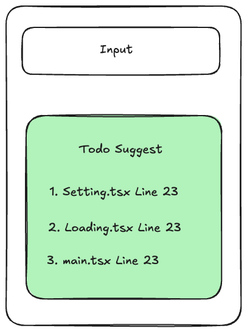

- [문제 해결 추천 기능](#문제-해결-추천-기능)
- [마크다운 추출 기능](#마크다운-추출-기능)

### 문제 해결 추천 기능
- 이름 : Todo Suggestion
- 설명 : 현재 코드 베이스에서 `TODO:`라고 작성된 부분을 찾아 해당 문제 해결을 제안하는 시스템  
- 동작 : Chat 화면을 오픈하면 화면에 바로 해결할 문제를 표시합니다.  
- 사용 케이스 : 잊고 있었던 기술 부채 혹은 추후 수정을 위해 표시해 놓은 것을 잊지 않도록 추천해주는 기능입니다.

### 마크다운 추출 기능
- 이름 : Markdown Export
- 설명 : AI의 답변을 마크다운 형식으로 다운로드하는 기능입니다. 
- 동작 : Chat 메시지 상단에 위치한 마크다운 다운도르 버튼을 클릭하면 마크다운 형식으로 응답 메시지를 저장합니다.
- 사용케이스 : AI 응답을 타인과 파일로 공유해야하는경우 유용합니다.