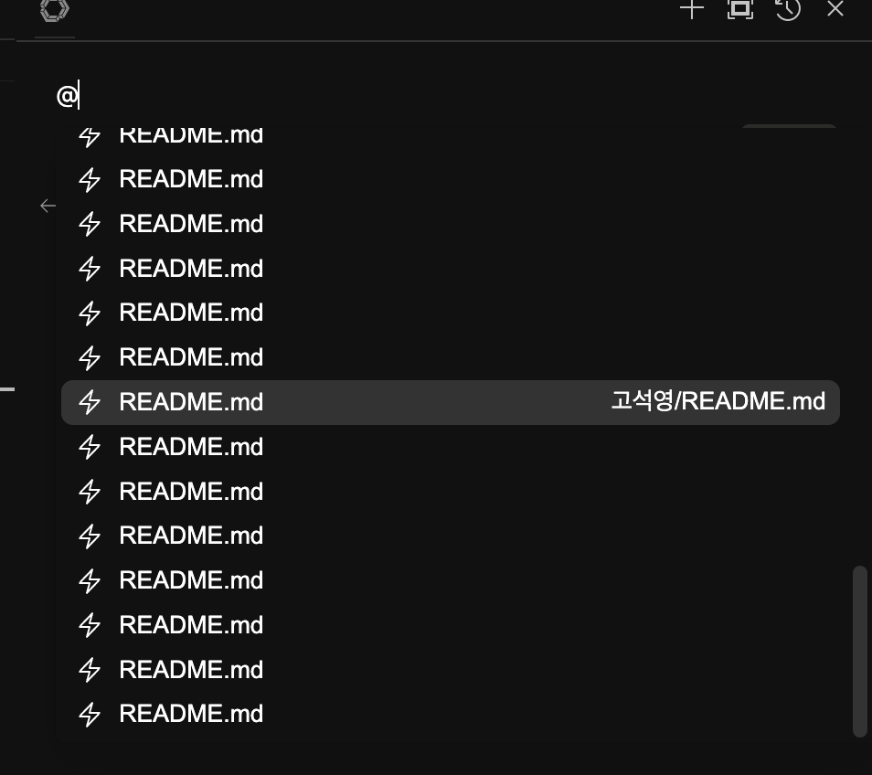
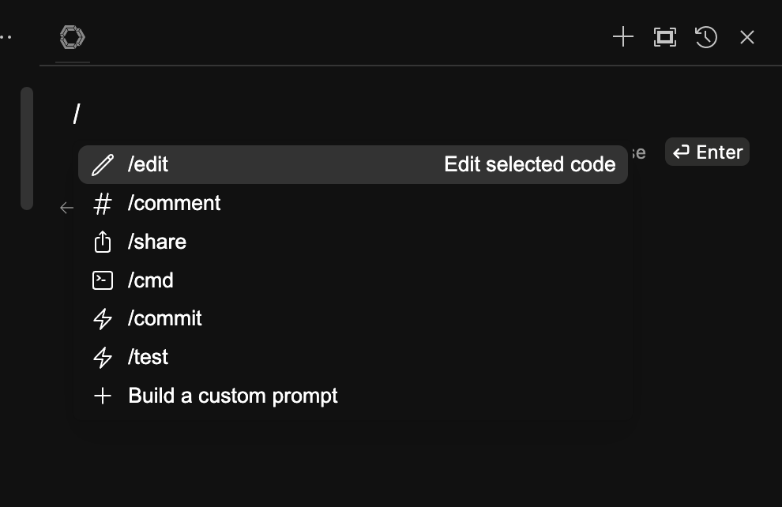
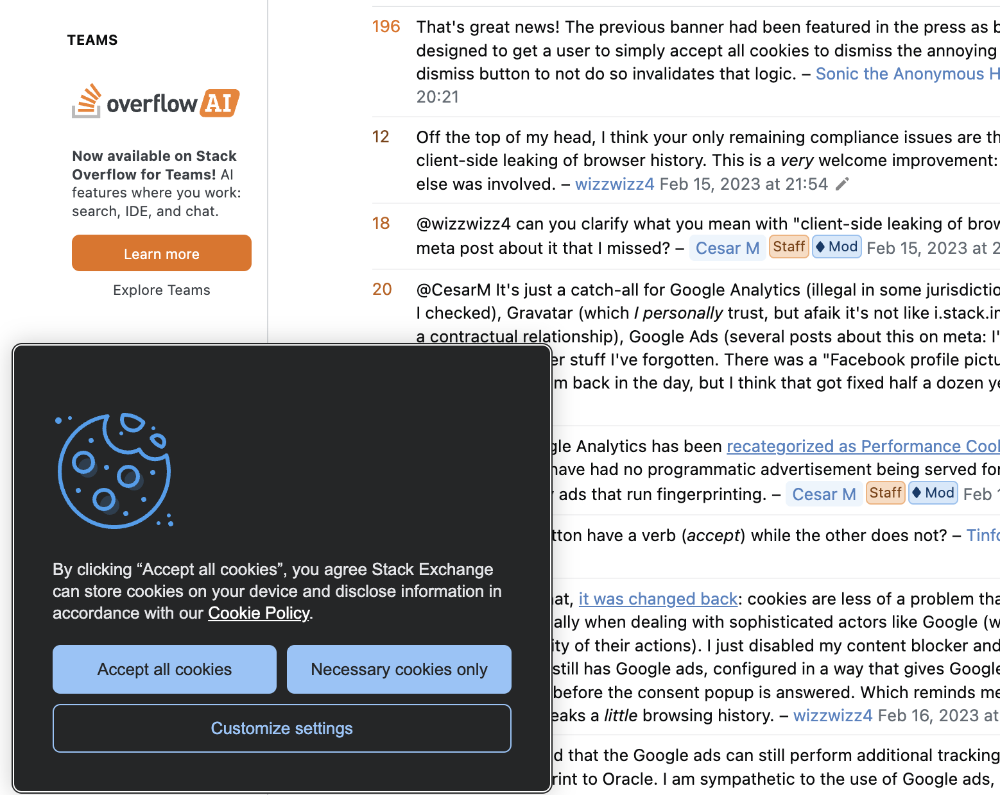
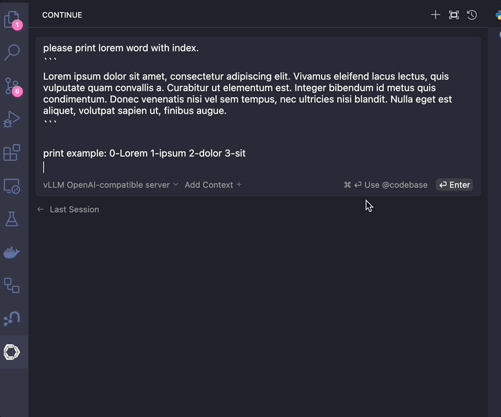

# ✅ 컨트리뷰션 아이디어 - 상기

아이디어: Continue 공식 문서의 리랭킹 모델 rerank-1 추천을 rerank-2로 변경

리랭크 모델에서 continue 공식 문서에서는 Voyage AI의 rerank-1 모델을 추천함.

> If you have the ability to use any model, we recommend rerank-1 by Voyage AI,

https://docs.continue.dev/customize/model-types/reranking

그런데 Voyage AI 에서는 rerank-2 모델을 추천함.

> The following are our earlier models, which are still accessible from our API. We recommend using the new models above for better quality and efficiency. Our latest models listed in the above table will be strictly better than the legacy models in all aspects, such as quality, context length, latency, and throughput.

https://docs.voyageai.com/docs/reranker

---

# ✅ 컨트리뷰션 아이디어 - 동환

1. 프론트엔드 UI 개발 도구 storybook에서 lodash를 토스의 es-toolkit으로 마이그레이션했어요.
   continue에서도 lodash를 사용하고 있는데 es-toolkit으로 마이그레이션하면 좋을 것 같다는 생각이 들었습니다.

[관련 storybook PR](https://github.com/storybookjs/storybook/pull/28981)

2. 전체적으로 테스트 코드가 적다고 느꼈습니다. jest나 vitest를 이용한 유닛테스트부터 react-testing-libaray를 사용한 통합 테스트 코드를 보완하면 좋을 것 같습니다.

---

# ✅ 컨트리뷰션 아이디어 - 호준

# Contribution Idea

## .gitignore 과 같은 .continueIgnore

### 기능

- `.gitignore`와 같은 방식으로 `.continueIgnore` 파일을 생성하여 특정 파일이나 디렉토리를 제외할 수 있도록 하는 기능을 추가한다.
- `.continueIgnore` 파일에 특정 파일이나 디렉토리를 추가하면 해당하는 것들은 vectorDB에 저장하지 않는다.

### 필요성

- 사용자가 가지고 있는 파일 중에 굳이 저장할 필요가 없는 것들이 있을 수 있기 때문에 메모리 절약 및 불필요한 Retrieve를 줄이기 위해 필요하다.
- 외부 API를 사용할 때 Codebase에서 외부로 유출되는 것을 방지할 수 있다.

---

# ✅ 컨트리뷰션 아이디어 - 석영

## Contribution Idea (팀 과제)

### 1. [공식 문서](https://docs.continue.dev/customize/tutorials/build-your-own-context-provider) 예제 코드 개선

#### 동기

`type:submenu` 예제 코드 적용 시 어려움이 있었습니다. 유사한 상황이 다른 유저들에게도 충분히 있었던 것으로 보이고 해당 유틸 함수가 IDE 내에서 제거된 것으로 보여 이에 맞게 문서를 업데이트하는 것이 좋을 것이라고 판단했습니다.

#### 목적

- 다른 사용자의 continue 학습 편의성 개선
- 빠르게 업데이트되는 프로덕트에 맞춘 공식 문서 업데이트

#### 주요 내용

제거된 `listWorkspaceContents` 대신 `getWorkspaceDir`를 사용해 `type:submenu` 예제 코드 정상 출력

| as-is                                          | to-be                                          |
| ---------------------------------------------- | ---------------------------------------------- |
|  |  |

### 2. Custom Context Provider

워크스페이스 안에서 `config.ts`로 이동 및 기본 가이드가 워크스페이스 내에서 동작하는 기능

#### 동기

Action(`/`)의 경우 드롭다운 최하단의 `Build a custom prompt`를 클릭 시 바로 `./prmopts`가 만들어지며, prompt 커스텀을 위한 기본 가이드가 자동으로 세팅됩니다.

Context(`@`)의 경우 드롭다운 최하단에 `Add more context providers`가 있지만 클릭하면 공식문서로 넘어가게 됩니다.

개인적으로 코드 작업 시 화면 스위칭이 없다는 점이 Continue를 사용했을 때 강력한 장점으로 보았기 때문에 Continue 사용 시 최대한 워크스페이스를 떠나지 않는 게 좋다고 봅니다.

이러한 이유로 Context Provider를 커스텀 및 관리를 위한 기능이 드롭다운에 숏컷으로 변경 혹은 추가되었으면 좋겠다고 생각되어 제안합니다.

#### 목적

- Actions의 커스텀 안내 기능과 기능 통일화
- 화면 스위칭 없이 워크 스페이스 작업 유지
- Context Provider 관리 및 커스터마이징 편의

#### 주요 내용

- Context Select에 Custom Context Provider 옵션 추가
- `config.json` 혹은 `config.ts`로 바로 이동
- 빌트인 / 커스텀 구분해서 이동이 필요할 수도 있음

---

# ✅ 컨트리뷰션 아이디어 - 강문

## 1. `@codebase` 코드베이스 제공 사용자 동의 기능

> 예상:: Issue 설득 난이도-상, 작업 규모-상, 난이도-중

- `@codebase` 사용 시, 내 repository codebase를 외부 기업에 제공하는 것을 꺼려하는 사용자가 있을 수 있습니다.
- 해당 케이스를 대응해, codebase를 외부 기업에 제공해도 괜찮을지 동의를 구하는 페이지(팝업?)이 있으면 좋을 듯 합니다.
- `@codebase` 를 context로 선택했을 때, `Accept all Cookies`와 같이 초기 동의를 구하도록 합니다.

  - 

- 고려사항 1. 기본 임베딩 세팅은 로컬 작업이기 때문에, `@codebase` 호출 시 감지해도 괜찮습니다.
  - 단, 임베딩 모델로 외부 API을 사용한다면 똑같이 사용자 동의 창을 띄울 수 있습니다.
- 고려사항 2. 외부 기업 LLM API를 연결했을 때만 체크하도록 할 수 있습니다.
  - 로컬 LLM을 사용하거나 프록시를 했을 때는 로직이 뜨지 않게 할 수 있습니다.
- 고려사항 3. "일부 동의"를 추가할지 고려할 수 있습니다.
  - "일부 동의"가 무엇인지를 정의하고, "일부 동의"를 눌렀을 때 어떻게 작동할지 고려해야 합니다.
- **고려사항 4**. 이건 사용자의 진입을 막는 기능이기 때문에, Issue로 올리면 CEO가 싫어할 수도 있습니다.

## 2. `Chat` 엔터 중복 사용 경험 개선

> 예상:: Issue 설득 난이도-하, 작업 규모-하, 난이도-하

- 문제 상황: Chat 답변 중 엔터를 누르면 누른 횟수만큼 stream이 추가로 전개됨
- 아래 이미지를 봐주세요 😀
  

    
<b>이미지 열기/접기</b>

  
  

- 해결 방안 1. `stop_token`이 오기 전까지 입력창과 `Enter` 키를 비활성화해둡니다.
  - 의도치 않은 종료에 대비한 예외 핸들링도 필요합니다. 입력 창이 평생 잠겨있지 않게...^^
- 해결 방안 2. 답변 생성 중 엔터를 누르면 이전 stream을 종료하고 새 stream으로 연결합니다.

## 3 FTS tokenizer 한중일 유니코드 개선

> 예상:: Issue 설득 난이도-중, 작업 규모-하, 난이도-상

### FTS Background

1. FTS

- 전문 검색(FTS, Full-Text Search)는 sentence를 작은 단위의 token으로 나눈 뒤 텍스트 단위 매칭을 하는 NLP 기법입니다.
- Continue에서는 RAG Reranking 과정에서 근거로 사용합니다.

2. 유니코드: UTF-8 문자 인코딩

- 새삼스럽지만 컴퓨터는 모든 정보를 0과 1로 된 비트로 저장합니다.
- 현실세계의 문자를 0-1 비트로 표현하기 위해, 문자를 0-1로 변환하는 방법 몇 가지를 모두가 약속했습니다.
- `UTF-8`이라는 인코딩 방법을 약속했고, UTF-8로 문자를 인코딩했을 때, `a`는 1Byte의 `\x61`로 인코딩됩니다.
  - `0x61`은 16진수 표현이고, 실제 컴퓨터에 올라가는 2진수로 표현하면 `0b01100001` 입니다.
- 1Byte로 전 세계 문자를 표현하기엔 저장공간이 부족하므로, 최대 4Byte까지 확장할 수 있게 약속했습니다.
- 한중일은 3Byte를 사용합니다. 한국어 `안`은 3Byte의 `\xEC\x95\x88`, `안녕`은 6Byte의 `\xEC\x95\x88\xEB\x85\x95`로 인코딩됩니다.
- `\xEC\x95\x88`을 예시로, `\xEC` 로 시작하는 3Byte는 한글 표현 밖에 없는데 만약 2바이트로 디코딩하면 문제가 생긴 겁니다.

### FTS 한중일 유니코드 버그 지적

- FTS 기본 세팅에서, 한중일 unicode를 제대로 인식하지 못할 `가능성`이 있는 버그가 있습니다.
- FTS를 하기 위해 sqlite의 `fts5` 세팅을 사용하는데, 이 세팅의 tokenizer가 한중일 유니코드를 제대로 자르지 않습니다.
- sqlite `fts5`는 trigram tokenizer를 사용합니다.
  - 영어의 경우 `hello` 단어를 `0hel`(1+3바이트), `0ell`(1+3바이트), `0llo`(1+3바이트)를 나눕니다.
  - 반면 한국어는 `안녕하세요`를 `0안녕하`(1+9바이트), `0녕하세`(1+9바이트), `0하세요`(1+9바이트)로 나누는 걸 기대하지만, 실제로는 유니코드를 인식을 못해 로직이 꼬입니다.
    - `0안??`(1+5바이트)와 같이 잘리는데, 비트를 까보면 3개 문자를 이상하게 자릅니다.
    - 예상 로직: `0안녕하` -> `\x30\xEC\x95\x88\xEB\x85\x95\xED\x95\x98` (10Byte, 1+3+3+3 이 적합)
    - 실제 저장: `0안??` -> `\x30\xEC\x95\x88\xEB\x85\` (6Byte, 아마 1+3+1+1 로 자르는듯)
- 이 부분을 고려해, Continue에서는 국제화 기능을 추가하거나 tokenizer를 직접 선택하도록 로직을 수정할 수 있습니다.
- 반면 sqlite extension인 fts5에 기여할 수도 있습니다.
- 고려사항 1. FTS 로직이 느려질 수 있습니다. 성능 저하가 일어나지 않게 조심히 작업해야 합니다.
- 고려사항 2. 영어권 maintainer 중, 이런 국제화 이슈를 나몰라라 하는 분들도 있습니다. CEO가 작업 규모에 비해 우선순위가 떨어진다 생각해 치울 수 있습니다.

---