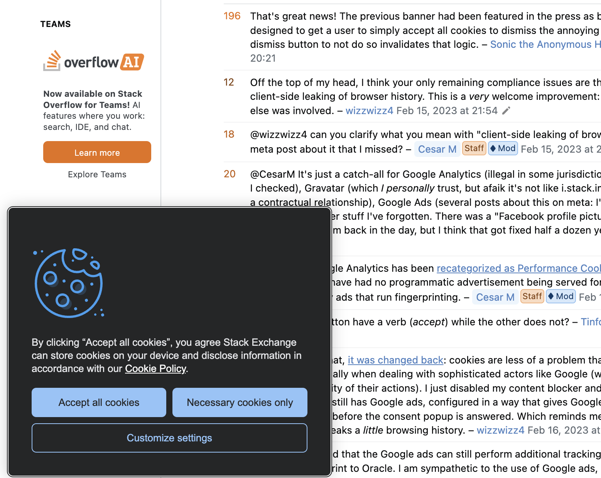
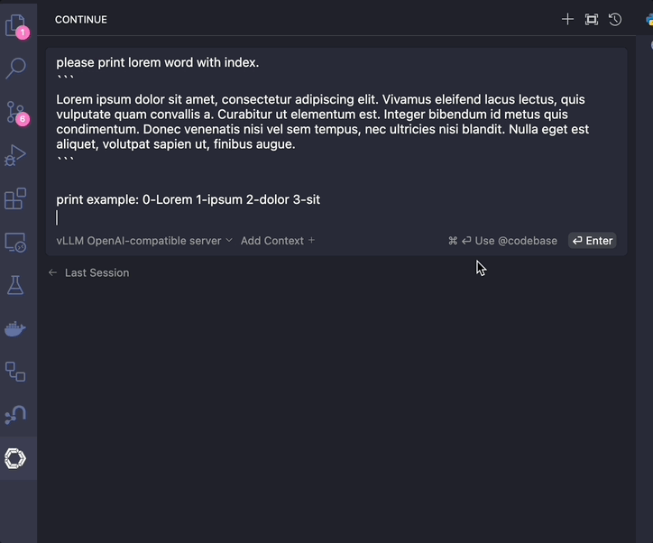

# contribution idea 브레인스토밍

## 1. `@codebase` 코드베이스 제공 사용자 동의 기능

> 예상:: Issue 설득 난이도-상, 작업 규모-상, 난이도-중

- `@codebase` 사용 시, 내 repository codebase를 외부 기업에 제공하는 것을 꺼려하는 사용자가 있을 수 있습니다.
- 해당 케이스를 대응해, codebase를 외부 기업에 제공해도 괜찮을지 동의를 구하는 페이지(팝업?)이 있으면 좋을 듯 합니다.
- `@codebase` 를 context로 선택했을 때, `Accept all Cookies`와 같이 초기 동의를 구하도록 합니다.

  - 

- 고려사항 1. 기본 임베딩 세팅은 로컬 작업이기 때문에, `@codebase` 호출 시 감지해도 괜찮습니다.
  - 단, 임베딩 모델로 외부 API을 사용한다면 똑같이 사용자 동의 창을 띄울 수 있습니다.
- 고려사항 2. 외부 기업 LLM API를 연결했을 때만 체크하도록 할 수 있습니다.
  - 로컬 LLM을 사용하거나 프록시를 했을 때는 로직이 뜨지 않게 할 수 있습니다.
- 고려사항 3. "일부 동의"를 추가할지 고려할 수 있습니다.
  - "일부 동의"가 무엇인지를 정의하고, "일부 동의"를 눌렀을 때 어떻게 작동할지 고려해야 합니다.
- **고려사항 4**. 이건 사용자의 진입을 막는 기능이기 때문에, Issue로 올리면 CEO가 싫어할 수도 있습니다.

## 2. FTS tokenizer 한중일 유니코드 개선

> 예상:: Issue 설득 난이도-중, 작업 규모-하, 난이도-상

### FTS Background

1. FTS

- 전문 검색(FTS, Full-Text Search)는 sentence를 작은 단위의 token으로 나눈 뒤 텍스트 단위 매칭을 하는 NLP 기법입니다.
- Continue에서는 RAG Reranking 과정에서 근거로 사용합니다.

2. 유니코드: UTF-8 문자 인코딩

- 새삼스럽지만 컴퓨터는 모든 정보를 0과 1로 된 비트로 저장합니다.
- 현실세계의 문자를 0-1 비트로 표현하기 위해, 문자를 0-1로 변환하는 방법 몇 가지를 모두가 약속했습니다.
- `UTF-8`이라는 인코딩 방법을 약속했고, UTF-8로 문자를 인코딩했을 때, `a`는 1Byte의 `\x61`로 인코딩됩니다.
  - `0x61`은 16진수 표현이고, 실제 컴퓨터에 올라가는 2진수로 표현하면 `0b01100001` 입니다.
- 1Byte로 전 세계 문자를 표현하기엔 저장공간이 부족하므로, 최대 4Byte까지 확장할 수 있게 약속했습니다.
- 한중일은 3Byte를 사용합니다. 한국어 `안`은 3Byte의 `\xEC\x95\x88`, `안녕`은 6Byte의 `\xEC\x95\x88\xEB\x85\x95`로 인코딩됩니다.
- `\xEC\x95\x88`을 예시로, `\xEC` 로 시작하는 3Byte는 한글 표현 밖에 없는데 만약 2바이트로 디코딩하면 문제가 생긴 겁니다.

### FTS 한중일 유니코드 버그 지적

- FTS 기본 세팅에서, 한중일 unicode를 제대로 인식하지 못할 `가능성`이 있는 버그가 있습니다.
- FTS를 하기 위해 sqlite의 `fts5` 세팅을 사용하는데, 이 세팅의 tokenizer가 한중일 유니코드를 제대로 자르지 않습니다.
- sqlite `fts5`는 trigram tokenizer를 사용합니다.
  - 영어의 경우 `hello` 단어를 `0hel`(1+3바이트), `0ell`(1+3바이트), `0llo`(1+3바이트)를 나눕니다.
  - 반면 한국어는 `안녕하세요`를 `0안녕하`(1+9바이트), `0녕하세`(1+9바이트), `0하세요`(1+9바이트)로 나누는 걸 기대하지만, 실제로는 유니코드를 인식을 못해 로직이 꼬입니다.
    - `0안??`(1+5바이트)와 같이 잘리는데, 비트를 까보면 3개 문자를 이상하게 자릅니다.
    - 예상 로직: `0안녕하` -> `\x30\xEC\x95\x88\xEB\x85\x95\xED\x95\x98` (10Byte, 1+3+3+3 이 적합)
    - 실제 저장: `0안??` -> `\x30\xEC\x95\x88\xEB\x85\` (6Byte, 아마 1+3+1+1 로 자르는듯)
- 이 부분을 고려해, Continue에서는 국제화 기능을 추가하거나 tokenizer를 직접 선택하도록 로직을 수정할 수 있습니다.
- 반면 sqlite extension인 fts5에 기여할 수도 있습니다.
- 고려사항 1. FTS 로직이 느려질 수 있습니다. 성능 저하가 일어나지 않게 조심히 작업해야 합니다.
- 고려사항 2. 영어권 maintainer 중, 이런 국제화 이슈를 나몰라라 하는 분들도 있습니다. CEO가 작업 규모에 비해 우선순위가 떨어진다 생각해 치울 수 있습니다.

## 3. `Chat` 엔터 중복 사용 경험 개선

> 예상:: Issue 설득 난이도-하, 작업 규모-하, 난이도-하

- 문제 상황: Chat 답변 중 엔터를 누르면 누른 횟수만큼 stream이 추가로 전개됨
- 아래 이미지를 봐주세요 😀
  

    
<b>이미지 열기/접기</b>

  
  

- 해결 방안 1. `stop_token`이 오기 전까지 입력창과 `Enter` 키를 비활성화해둡니다.
  - 의도치 않은 종료에 대비한 예외 핸들링도 필요합니다. 입력 창이 평생 잠겨있지 않게...^^
- 해결 방안 2. 답변 생성 중 엔터를 누르면 이전 stream을 종료하고 새 stream으로 연결합니다.

# Introducing Continue: A Narrative Script

> week3, week4 내용을 narrative하게 서술합니다.

## AI Assistant for Coding

- Copilot으로 대표되는 AI Assistant는 반복되는 코딩 작업을 자동화하는 등 개발자의 생산성을 높이는 도구입니다.
- 보통 in-IDE autocomplete 기능과 코딩 특화 LLM Chat 기능을 제공합니다.
- 현재 시장에는 구독형 IDE Extension인 MS Copilot, Amazon CodeWhisperer와, 독립적인 AI IDE인 Cursor 등이 있습니다.
- 한편, **오픈 소스**로 AI coding Assistant를 구현하고자 하는 움직임도 있습니다.

## Continue, open-source leading AI code assistant

- Continue는 오픈 소스 AI code assistant 분야를 leading하는 IDE Extension입니다. (17.8k stars)
- 언어 모델을 편의대로 연결할 수 있다는 점, Context 로직이 코드 질의에 최적화되었다는 점이 장점입니다.

## 기능 1. `Chat`

- `Chat`은 IDE 내부에서 코드 기반 LLM Chat을 사용할 수 있는 기능입니다.
- 코드를 하이라이팅하고, 질문 텍스트와 함께 LLM에 요청하면 답변을 얻는 멀티턴 챗입니다.
- 입력 심볼(`@`)을 통해 Context를 수동으로 선택해 제공할 수 있습니다.

### Context Provider에서의 RAG 사용

- `@codebase` 심볼 사용 시 로컬 codebase를 지식 베이스로 RAG를 실행합니다.
- 일반 RAG와 동일하게 `1. Indexing Process`, `2. Query Process` 워크플로를 가집니다.

1. Indexing Process

- codebase 모든 코드를 청킹해 로컬 임베딩 모델을 거쳐 VectorDB에 저장합니다.

2. Query Process

- 먼저 쿼리의 벡터와 Indexed VectorDB 간 유사도 검색을 거칩니다.
- 이후 검색 결과에 대응하는 코드를 가져와 질의에 첨부, Chat LLM의 답변을 얻습니다.
- 한편, `Raranking`을 활성화하여 RAG 정확도를 올릴 수도 있습니다.
  - BM25 기반 전문 검색, Repo-Map을 리랭킹 근거로 사용할 수 있습니다.

## 기능 2. `Autocomplete`

- `Autocomplete`는 개발자가 타이핑할 코드를 예측해 자동완성하는 기능입니다.
- 활성화 시 커서의 앞뒤 코드를 LLM에 문맥으로 제공해 중간을 채웁니다.(FIM, Fill-In-the-Middle)

## 기능 3. `Edit`

- `Edit`은 현재 파일을 벗어나지 않고 코드를 수정하는 기능입니다.
- 코드블록을 하이라이팅 한 뒤 요청을 제공하면, AI가 생성한 변경 사항을 Accept 또는 Reject합니다.
- 주석 추가, unit-test 생성, 함수 리팩터링에 사용하기 좋습니다.

## 기능 4. `Actions`

- `Actions`는 자주 사용하는 작업을 slash(`/`)를 통해 빠르게 호출하는 기능입니다.
- 코드를 수정하는 `/edit`, 주석을 생성하는 `/comment` 등 preset이 있습니다.
- 커스텀 프롬프트를 생성해(`.prompt`) 원하는 기능을 만들 수 있습니다.

## Model Types for Continue

1. `Chat Model`

- 멀티 턴 대화 형식으로 훈련된(Instructed) LLM입니다.
- 질문에 답하고 코드를 짜야 하기 때문에, 좋은 성능의 모델이 필요합니다. (400B+)
- `Claude 3.5 Sonnet`, `GPT-4o`, `Llama-3.1-405B`를 권장합니다.

2. `Autocomplete Model`

- 중간을 채우는 방식(Fill-In-the-Middle)으로 훈련된 LLM입니다.
- FIM task에 특화되었기 때문에, 작은 규모로도 괜찮은 성능을 보입니다. (3B)
- API는 `Codestral`, 로컬로는 `Starcoder2-3B` 을 권장합니다.

3. `Embedding Model`

- text sentence에서 특징을 추출해 벡터로 표현하는 언어 모델입니다.
- context provider RAG 인덱싱 단계에 사용합니다.
- 기본 모델은 로컬 `all-minilm-l6-v2`이며, `voyage-code-2` API를 권장합니다.

4. `Reranking Model`

- context 검색 결과에서 질의와의 관련성을 평가해 재정렬(Rerank)하는 모델입니다.
- context provider RAG 쿼리 단계에 사용합니다.
- `rerank-1`을 권장하며, Chat LLM 모델 또한 사용할 수 있습니다.
